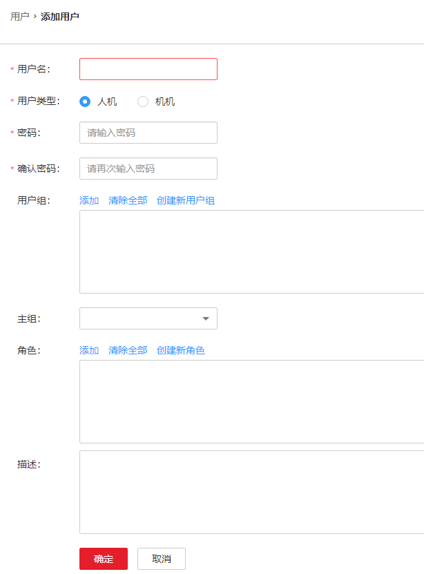

# 添加用户并绑定租户的角色

## 操作场景

创建好的租户不能直接登录集群访问资源，管理员需要通过FusionInsight Manager为已有租户创建新用户，通过绑定租户的角色继承其操作权限，以满足业务使用。

## 前提条件

管理员已明确业务需求，并已创建了租户。

## 操作步骤

1.  登录FusionInsight Manager，选择“系统  \>  权限  \>  用户“。
2.  若在系统中添加新的用户，请单击“添加用户”，打开添加用户的配置页面。

    **图 1**  添加用户  
    

    若为系统中已有的用户绑定租户权限，请单击该用户所在行的“修改”，打开修改用户的配置页面。

    参见[表1](#zh-cn_topic_0193195962_t2b6451d372c44135bf8473b6b2dc0fd4)为用户配置属性。 

    **表 1**  用户参数一览

    
    <table><thead align="left"><tr id="zh-cn_topic_0193195962_rd95158ad4fa6418fa1cb00232546e217"><th class="cellrowborder" valign="top" width="32.32%" id="mcps1.2.3.1.1">
参数名

    </th>
    <th class="cellrowborder" valign="top" width="67.67999999999999%" id="mcps1.2.3.1.2">
描述

    </th>
    </tr>
    </thead>
    <tbody><tr id="zh-cn_topic_0193195962_r931bd1d4508c44318fa1a30b0e7066eb"><td class="cellrowborder" valign="top" width="32.32%" headers="mcps1.2.3.1.1 ">
用户名

    </td>
    <td class="cellrowborder" valign="top" width="67.67999999999999%" headers="mcps1.2.3.1.2 ">
指定当前的用户名，长度为3~32个字符，可包含数字、字母、下划线（_）、中划线（-）和空格。

    <ul id="zh-cn_topic_0193195962_u4ea54b7b0a96415887b69f80ba7849e1"><li>“用户名”不能与集群各节点所有操作系统用户名相同，否则此用户无法正常使用。</li><li>不支持创建两个名称相同但大小写不同的用户。例如已创建用户“User1”，无法创建用户“user1”。使用“User1”时请输入正确的用户名。</li></ul>
    </td>
    </tr>
    <tr id="zh-cn_topic_0193195962_r93930b1268934781ae06818235d2717f"><td class="cellrowborder" valign="top" width="32.32%" headers="mcps1.2.3.1.1 ">
用户类型

    </td>
    <td class="cellrowborder" valign="top" width="67.67999999999999%" headers="mcps1.2.3.1.2 ">
可选值包括“人机”和“机机”。

    <ul id="zh-cn_topic_0193195962_u7806529fb2094f608d5795bba1fb32b6"><li>“人机”用户：用于在FusionInsight Manager的操作运维场景，以及在组件客户端操作的场景。选择该值需同时填写“密码”和“确认密码”。</li><li>“机机”用户：用于应用开发的场景。选择该值用户密码随机生成，无需填写。</li></ul>
    </td>
    </tr>
    <tr id="zh-cn_topic_0193195962_r56c85f5b347948fca612029c372bf4b2"><td class="cellrowborder" valign="top" width="32.32%" headers="mcps1.2.3.1.1 ">
密码

    </td>
    <td class="cellrowborder" valign="top" width="67.67999999999999%" headers="mcps1.2.3.1.2 ">
选择“人机”用户需填写“密码”。

    
密码必须包含8~64个字符，至少包含以下类型字符中的四种：大写字母、小写字母、数字、特殊字符和空格。不能与用户名或倒序的用户名相同。

    </td>
    </tr>
    <tr id="zh-cn_topic_0193195962_ra616a328873147e499b1890f00885aa9"><td class="cellrowborder" valign="top" width="32.32%" headers="mcps1.2.3.1.1 ">
确认密码

    </td>
    <td class="cellrowborder" valign="top" width="67.67999999999999%" headers="mcps1.2.3.1.2 ">
再次输入密码。

    </td>
    </tr>
    <tr id="zh-cn_topic_0193195962_rf6c318efe2824a0cb7984823e499dad8"><td class="cellrowborder" valign="top" width="32.32%" headers="mcps1.2.3.1.1 ">
用户组

    </td>
    <td class="cellrowborder" valign="top" width="67.67999999999999%" headers="mcps1.2.3.1.2 ">
单击“添加”，选择对应用户组将用户添加进去。

    <ul id="zh-cn_topic_0193195962_u59098241383840099f09bb3d4172ccfe"><li>如果用户组添加了角色，则用户可获得对应角色中的权限。</li><li>例如，为新用户分配Hive的权限，请将用户加入Hive组。</li></ul>
    </td>
    </tr>
    <tr id="zh-cn_topic_0193195962_rdb23582e05cc48a089c4ed944776b5e1"><td class="cellrowborder" valign="top" width="32.32%" headers="mcps1.2.3.1.1 ">
主组

    </td>
    <td class="cellrowborder" valign="top" width="67.67999999999999%" headers="mcps1.2.3.1.2 ">
选择一个组作为用户创建目录和文件时的主组。下拉列表包含“用户组”中勾选的全部组。

    </td>
    </tr>
    <tr id="zh-cn_topic_0193195962_row8253141818116"><td class="cellrowborder" valign="top" width="32.32%" headers="mcps1.2.3.1.1 ">
角色

    </td>
    <td class="cellrowborder" valign="top" width="67.67999999999999%" headers="mcps1.2.3.1.2 ">
单击“添加”为用户绑定租户的角色。

    
 说明： 
<ul id="ul1318124919107"><li>若一个用户想要获取使用“tenant1”租户包含的资源，且能够为“tenant1”租户添加/删除子租户，则需要同时绑定“Manager_tenant”和“tenant1_<em id="zh-cn_topic_0193195962_i8591124621511">集群ID</em>”两个角色。</li><li>如果租户关联了HBase服务且当前集群启用了Ranger鉴权，用户需要通过Ranger界面配置HBase相关执行权限。</li></ul>
    

    </td>
    </tr>
    <tr id="zh-cn_topic_0193195962_row427114316228"><td class="cellrowborder" valign="top" width="32.32%" headers="mcps1.2.3.1.1 ">
描述

    </td>
    <td class="cellrowborder" valign="top" width="67.67999999999999%" headers="mcps1.2.3.1.2 ">
配置当前用户的描述信息。

    </td>
    </tr>
    </tbody>
    </table>

3.  单击“确定”完成用户创建。

