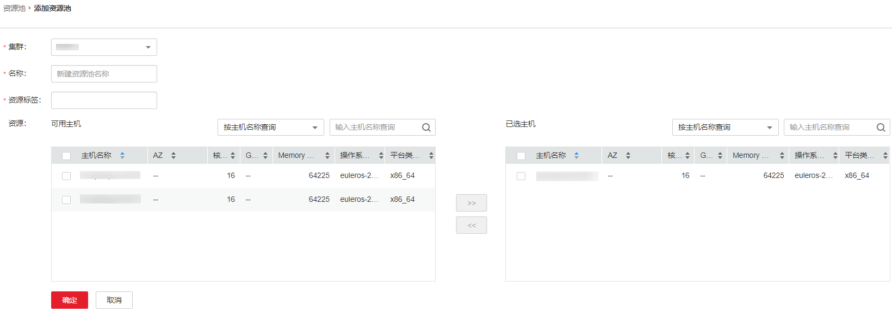

# 添加资源池

## 操作场景

在集群中，管理员可从逻辑上对所有Yarn的节点进行分区，使多个NodeManager形成一个Yarn资源池。每个NodeManager只能属于一个资源池。管理员通过FusionInsight Manager添加一个自定义的资源池，并将未加入自定义资源池的主机加入此资源池，便于指定的队列利用这些计算资源。

系统中默认包含了一个名为“default”的资源池，所有未加入用户自定义资源池的NodeManager属于此资源池。

## 操作步骤

1.  登录FusionInsight Manager。
2.  选择“租户资源  \>  资源池“。
3.  单击“添加资源池”。
4.  设置资源池的属性。

    **图 1**  添加资源  
    

    -   “集群”：选择待添加资源池的集群名称。
    -   “名称”：填写资源池的名称。长度为1\~50个字符，可包含数字、字母或下划线（\_），且不能以下划线（\_）开头。
    -   “资源标签”：配置资源池的资源标签，包括数字、字母、下划线（\_）或减号（-），长度为1\~50个字符，且只能以数字或者字母开头。
    -   “资源”：在界面左边可用主机列表中，勾选指定的主机，单击，将选中的主机加入已选主机列表。只支持选择本集群中的主机。资源池中的主机列表可以为空。

        > **说明：** 
        >根据业务需求，可以通过主机名称 、CPU、内存、操作系统和平台类型，筛选需要选取的资源主机。

5.  单击“确定”保存。

    完成资源池创建后，管理员可以在资源池的列表中查看资源池的名称、成员、类型。已加入自定义资源池的主机，不再是“default”资源池的成员。

