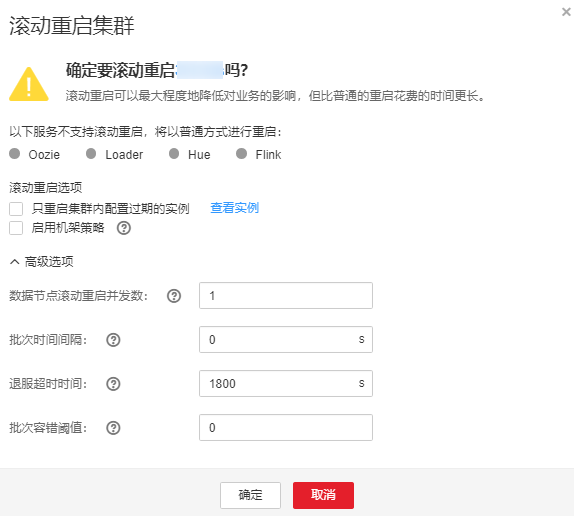

# 滚动重启集群

## 操作场景

滚动重启指当集群中服务角色升级更新或修改配置后，在尽可能不中断业务的前提下的重启操作。

如果需要批量为集群中所有服务进行重启且不中断业务，可执行集群滚动重启操作。

> **说明：** 
>-   部分服务不支持滚动重启，在执行滚动重启集群的过程中，不支持滚动重启的服务将进行普通重启，业务可能会中断。请根据界面提示是否可以执行操作。
>-   如果修改了端口类等需要尽快生效的配置（例如服务端的端口），则不建议通过滚动重启的方式使之生效，建议采用普通重启。

## 对系统的影响

与普通重启相比，滚动重启不会导致服务业务中断，但是滚动重启将比普通重启要花费更长的时间，且对应服务的吞吐量、性能等可能会受到影响。

## 操作步骤

1.  登录FusionInsight Manager。
2.  选择“集群  \>  _待操作集群的名称_  \> 概览 \> 更多  \>  滚动重启“。
3.  输入当前登录的用户密码确认身份，单击“确定“。
4.  根据实际情况调整相关参数，如[表1](#zh-cn_topic_0118210076_t65f951fcfc8a4a37b6c7f3481125fe35)所示。

    **图 1**  滚动重启  
    

    **表 1**  滚动重启参数

    
    <table><thead align="left"><tr id="zh-cn_topic_0118210076_rc85481c745524300bedbca2144a66df7"><th class="cellrowborder" valign="top" width="32.71%" id="mcps1.2.3.1.1">
参数名称

    </th>
    <th class="cellrowborder" valign="top" width="67.29%" id="mcps1.2.3.1.2">
描述

    </th>
    </tr>
    </thead>
    <tbody><tr id="zh-cn_topic_0118210076_r6847022d2bba48abaaccb49ad0717c44"><td class="cellrowborder" valign="top" width="32.71%" headers="mcps1.2.3.1.1 ">
“只重启集群内配置过期的实例”

    </td>
    <td class="cellrowborder" valign="top" width="67.29%" headers="mcps1.2.3.1.2 ">
是否只重启集群内修改过配置的实例。

    </td>
    </tr>
    <tr id="zh-cn_topic_0118210076_r067cff235d7d41448245883a5347ac1c"><td class="cellrowborder" valign="top" width="32.71%" headers="mcps1.2.3.1.1 ">
“启用机架策略”

    </td>
    <td class="cellrowborder" valign="top" width="67.29%" headers="mcps1.2.3.1.2 ">
是否启用机架并发滚动重启策略，只对满足机架策略滚动重启的角色（角色支持机架感知功能，且角色下的实例归属于2个或2个以上的机架）生效。

    
 说明： 

该参数仅在滚动重启HDFS、Yarn时可设置。

    

    </td>
    </tr>
    <tr id="zh-cn_topic_0118210076_r55197725e71845a0a99b408dfc8ab2d9"><td class="cellrowborder" valign="top" width="32.71%" headers="mcps1.2.3.1.1 ">
“数据节点滚动重启并发数”

    </td>
    <td class="cellrowborder" valign="top" width="67.29%" headers="mcps1.2.3.1.2 ">
采用分批并发滚动重启策略的数据节点实例每一个批次重启的实例数，默认为1。

    
 说明： 
<ul id="zh-cn_topic_0118210076_ul13747194221810"><li>该参数仅对同时满足“采用并发滚动策略”和“实例为数据节点”两个条件时才有效。</li><li>当启用机架策略时，该参数将失效，集群以机架策略默认配置的最大实例数（默认值为20）作为一个机架内分批并发重启的最大实例数。</li><li>该参数仅在滚动重启HDFS、HBase、Yarn、Kafka、Storm、Flume时可设置。</li><li>HBase的RegionServer滚动重启的并发数不支持手动配置，会根据RegionServer的节点数自行调整，调整规则为：30节点以内，每个批次1个节点；300节点以内，每个批次2个节点；300节点以上(含300节点)，每个批次1%(向下取整)个节点。</li></ul>
    

    </td>
    </tr>
    <tr id="zh-cn_topic_0118210076_r327da26d16da4552b831ff81bfc305a7"><td class="cellrowborder" valign="top" width="32.71%" headers="mcps1.2.3.1.1 ">
“批次时间间隔”

    </td>
    <td class="cellrowborder" valign="top" width="67.29%" headers="mcps1.2.3.1.2 ">
滚动重启实例批次之间的间隔时间，默认为0。

    </td>
    </tr>
    <tr id="zh-cn_topic_0118210076_rcd86d7ea78f4432faed15789f6955fa7"><td class="cellrowborder" valign="top" width="32.71%" headers="mcps1.2.3.1.1 ">
“退服超时时间”

    </td>
    <td class="cellrowborder" valign="top" width="67.29%" headers="mcps1.2.3.1.2 ">
角色实例在滚动重启过程中的退服等待时间，默认为1800s。

    
部分角色（例如HiveServer、JDBCServer）在滚动重启前会暂时停止提供服务，该状态下的实例不可再接入新的客户端连接，而已经存在的连接需要等待一段时间才能完成，配置合适的超时时间参数能尽可能地保证业务不中断。

    
 说明： 

该参数仅在滚动重启Hive、Spark2x时可设置。

    

    </td>
    </tr>
    <tr id="zh-cn_topic_0118210076_rc87535526c26449f94dce582eb93a314"><td class="cellrowborder" valign="top" width="32.71%" headers="mcps1.2.3.1.1 ">
“批次容错阈值”

    </td>
    <td class="cellrowborder" valign="top" width="67.29%" headers="mcps1.2.3.1.2 ">
滚动重启实例批次执行失败容错次数，默认为0，即表示任意一个批次的实例重启失败后，滚动重启任务终止。

    </td>
    </tr>
    </tbody>
    </table>

    > **说明：** 
    >“数据节点滚动重启并发数“、“批次时间间隔“、“批次容错阈值“等高级参数需要根据实际情况合理设置，否则可能导致服务业务中断或者严重影响性能，请谨慎调整。
    >例如：
    >-   “数据节点滚动重启并发数“过大，同时重启多个实例导致服务业务中断或者由于剩余工作实例较少严重影响性能。
    >-   “批次容错阈值“过大，某一批次实例失败后继续重启下一批次实例，导致服务业务中断。

5.  单击“确定“，等待滚动重启完成。

