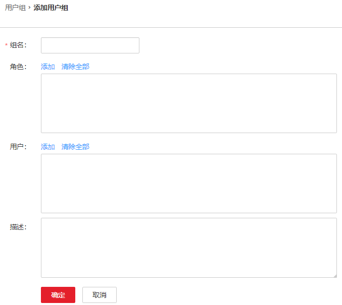

# 用户组管理

## 操作场景

FusionInsight Manager最大支持5000个用户组（包括系统内置用户组）。根据不同业务场景需要，管理员使用FusionInsight Manager创建并管理不同用户组。用户组通过绑定角色获取操作权限，用户加入用户组后，可获得用户组具有的操作权限。用户组同时可以达到对用户进行分类并统一管理多个用户。

## 前提条件

-   管理员已明确业务需求，并已创建业务场景需要的角色。
-   已登录FusionInsight Manager。

## 添加用户组

1.  选择“系统  \>  权限  \>  用户组“。
2.  在组列表上方，单击“添加用户组”。

    **图 1**  添加用户组  
    

3.  填写“组名”和“描述”。

    “组名”由数字、字母、或下划线、中划线（-）或空格组成，不区分大小写，长度为1～64位，不能与系统中已有的用户组名相同。

4.  在“角色”，单击“添加”选择指定的角色并添加。

    > **说明：** 
    >-   对于已启用Ranger授权的组件（HDFS与Yarn除外），Manager上非系统默认角色的权限将无法生效，需要通过配置Ranger策略为用户组赋权。
    >-   HDFS与Yarn的资源请求在Ranger中的策略条件未能覆盖的情况下，组件ACL规则仍将生效。

5.  在“用户”，单击“添加”选择指定的用户并添加。
6.  单击“确定”完成用户组创建。

## 查看用户组信息

用户组列表默认显示所有用户。单击指定用户组名称左侧的箭头展开详细信息，可以查看此用户组中的用户数、用户以及绑定的角色。

## 修改用户组信息

在要修改信息用户组所在的行，单击“修改“，修改用户组信息。

## 导出用户组信息

单击“导出全部”，可一次性导出所有用户组信息，可导出“TXT“或者“CSV“格式。

用户组信息包含以下几个字段：用户组名、描述、用户列表、角色列表。

## 删除用户组

在要删除用户组所在行，单击“删除“。如果需要批量删除多个用户组，勾选需要删除的用户组后再单击列表上方“删除”即可。用户组中包含用户时，不允许删除。如需删除，请先通过修改用户组删除其包含的所有用户，再删除该用户组。

