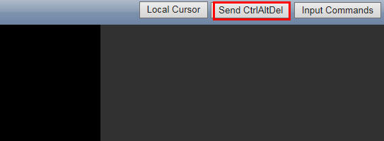

# 登录弹性云服务器（VNC方式）

本章节介绍如何使用弹性云服务器管理控制台上提供的远程登录（VNC方式）功能，该功能主要用于紧急运维场景，远程登录弹性云服务器进行相关维护操作。其他场景下，建议用户采用SSH方式登录。

## 登录弹性云服务器

1.  登录MapReduce服务管理控制台。
2.  选择“集群列表“  \>  “现有集群“，选中一个运行中的集群并单击集群名，进入集群基本信息页面。
3.  在“节点信息“中单击某一Master节点名称，登录到弹性云服务器管理控制台。
4.  单击右上角的“远程登录“。
5.  如果界面提示“Press CTRL+ALT+DELETE to log on“，请单击远程登录操作面板右上方的“Send CtrlAltDel“按钮进行登录。

    **图 1**  Send CtrlAltDel  
    

6.  根据界面提示，输入Master节点的用户名和密码。
    1.  针对MRS1.6.2版本（不包含）前的集群，创建集群时登录方式仅支持密钥对。首次登录使用用户名“linux”，密码默认“cloud.1234”，如果用户修改了默认密码请使用新密码。首次登录建议您修改密码。
    2.  针对MRS1.6.2版本（包含）及以后的集群，创建集群时登录方式选择了“密码“，如[图2](#fig22006389354)。此时，你需要输入的用户名、密码分别是root和创建集群时设置的密码。

        **图 2**  密码方式  
        

    3.  针对MRS1.6.2版本（包含）及以后的集群，创建集群时登录方式选择了密钥对，则使用如下方式登录：
        1.  创建集群成功后，参见“虚拟私有云  \>  用户指南  \>  网络组件  \>  弹性IP  \>  为弹性云服务器申请和绑定弹性IP“为集群的Master节点绑定一个弹性IP地址。
        2.  使用root用户名和密钥文件，SSH方式远程登录Master节点。
        3.  执行**passwd root**命令，设置root用户密码。
        4.  设置成功后，返回界面登录方式，输入root用户名和[6.c.iii](#li1197345672412)设置的密码，登录节点。

