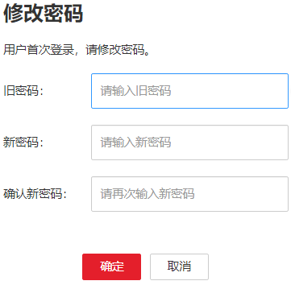

# 登录管理系统

## 操作场景

该任务指导用户在Manager安装后使用帐号登录FusionInsight Manager。

## 操作步骤

1.  获取FusionInsight Manager的网络地址。
2.  打开页面后，输入系统用户和密码。
3.  新用户登录需要修改密码。

    **图 1**  修改密码  
    

    用户密码策略：

    -   密码字符长度必须为8～64个字符。
    -   至少需要包含大写字母、小写字母、数字、空格、特殊字符\`\~!@\#$%^&\*\(\)-\_=+|\[\{\}\];',<.\>/\\?中的4种类型字符。
    -   不可和用户名相同或用户名的倒序字符相同。
    -   不可与当前密码相同。

4.  将光标移动到FusionInsight Manager右上角的，在弹出窗口中单击“注销“，单击“确定”后可退出当前登录用户。

