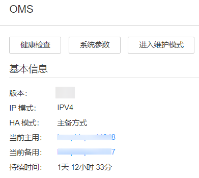
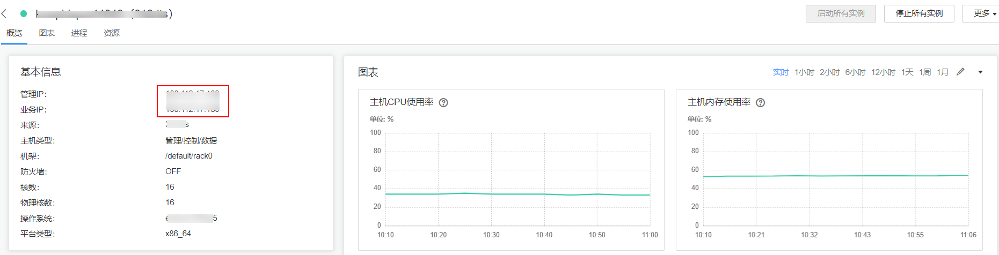

# 登录管理节点<a name="admin_guide_000005"></a>

## 操作场景<a name="zh-cn_topic_0263899455_s7128e8f6c7494cfeaa20079a5df01ff2"></a>

部分运维操作的脚本与命令需要或只支持在主管理节点上运行。管理员可以根据以下指导确认并登录主或备管理节点。

## 在Manager查看主备管理节点并登录<a name="zh-cn_topic_0263899455_section19247450185112"></a>

1.  登录FusionInsight Manager。
2.  选择“系统 \> OMS“。

    在“基本信息“区域，“当前主用“表示主管理节点的主机名，“当前备用“表示备管理节点的主机名。

    **图 1**  查看主备节点<a name="zh-cn_topic_0263899455_fig15916394463"></a>  
    

    单击主机名可进入对应的主机详情页面。记录主机的IP地址信息。

    **图 2**  主机详情<a name="zh-cn_topic_0263899455_fig1166186154718"></a>  
    

3.  以**omm**用户登录主或备管理节点。

## 执行脚本确定主备管理节点并登录<a name="zh-cn_topic_0263899455_section2041437195014"></a>

1.  以**omm**用户登录任意部署Manager的节点。
2.  执行以下命令确认主备管理节点。

    **sh $\{BIGDATA\_HOME\}/om-server/om/sbin/status-oms.sh**

    界面打印信息中“HAActive”参数值为“active”的节点为主管理节点（如下例中“Master1”为主管理节点），参数值为“standby”的节点为备管理节点（如下例中“Master2”为备管理节点）。

    ```
    HAMode 
    double 
    NodeName              HostName        HAVersion          StartTime                HAActive             HAAllResOK           HARunPhase  
    192-168-0-30          Master1         V100R001C01        2021-09-01 07:12:05      active               normal               Actived     
    192-168-0-24          Master2         V100R001C01        2021-09-01 07:14:02      standby              normal               Deactived 
    ```

3.  执行如下命令获取主备管理节点IP地址。

    **cat /etc/hosts**

    获取的主备管理节点IP地址示例如下：

    ```
    127.0.0.1      localhost
    192.168.0.30    Master1
    192.168.0.24    Master2
    ```

4.  以**omm**用户登录主或备管理节点。

