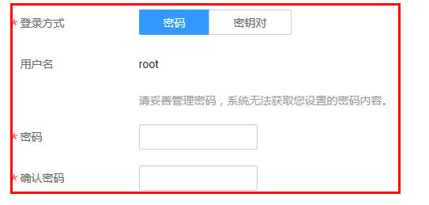
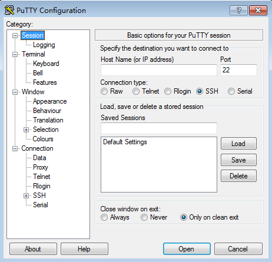
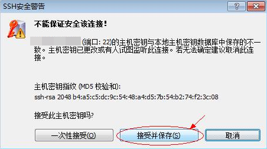

# 登录集群节点

本章节介绍如何使用弹性云服务器管理控制台上提供的远程登录（VNC方式）和如何使用密钥或密码方式远程登录弹性云服务器（SSH方式），远程登录（VNC方式）主要用于紧急运维场景，远程登录弹性云服务器进行相关维护操作。其他场景下，建议用户采用SSH方式登录。

## 登录弹性云服务器（VNC方式）

1.  登录MapReduce服务管理控制台。
2.  选择“集群列表 \> 现有集群“，选中一个运行中的集群并单击集群名，进入集群基本信息页面。
3.  在“节点管理“页签单击Master节点组中某一Master节点名称，登录到弹性云服务器管理控制台。
4.  单击右上角的“远程登录“。
5.  根据界面提示，输入Master节点的用户名和密码。
    1.  针对MRS1.6.2版本（不包含）前的集群，创建集群时登录方式仅支持密钥对。首次登录使用用户名“linux”，密码默认“cloud.1234”，如果用户修改了默认密码请使用新密码。首次登录建议您修改密码。
    2.  针对MRS1.6.2版本（包含）及以后的集群，创建集群时登录方式选择了“密码“，如[图1](#fig22006389354)。此时，你需要输入的用户名、密码分别是root和创建集群时设置的密码。

        **图 1**  密码方式  
        

    3.  针对MRS1.6.2版本（包含）及以后的集群，创建集群时登录方式选择了密钥对，则使用如下方式登录：
        1.  创建集群成功后，参见[为弹性云服务器申请和绑定弹性公网IP](https://support.huaweicloud.com/usermanual-vpc/zh-cn_topic_0013748738.html)为集群的Master节点绑定一个弹性IP地址。
        2.  使用root用户名和密钥文件，SSH方式远程登录Master节点。
        3.  执行**passwd root**命令，设置root用户密码。
        4.  设置成功后，返回界面登录方式，输入root用户名和[5.c.iii](#li1197345672412)设置的密码，登录节点。

## 登录弹性云服务器（SSH密钥方式）

**本地使用Windows操作系统**

如果您本地使用Windows操作系统登录Linux弹性云服务器，可以按照下面方式登录弹性云服务器。

-   方式一：使用PuTTY登录
    1.  登录MapReduce服务管理控制台。
    2.  选择“集群列表 \> 现有集群“，选中一个运行中的集群并单击集群名称，进入集群基本信息页面。
    3.  在“节点管理“页签单击Master节点组中某一Master节点名称，登录到弹性云服务器管理控制台。
    4.  选择“弹性公网IP”页签，单击“绑定弹性公网IP”为弹性云服务器绑定一个弹性公网IP并记录该IP地址，若已绑定弹性公网IP请跳过该步骤。
    5.  判断私钥文件是否为.ppk格式。
        -   是，执行[10](#li99981049191918)。
        -   否，执行[6](#li1090865924810)。

    6.  运行PuTTYgen。
    7.  在“Actions”区域，单击“Load”，并导入创建弹性云服务器时使用的密钥对的私钥文件。

        导入时注意确保导入的格式要求为“All files \(\*.\*\)”。

    8.  单击“Save private key”。
    9.  保存转化后的私钥到本地。例如：kp-123.ppk
    10. 运行PuTTY。
    11. 选择“Connection \> data”，在Auto-login username处输入镜像的用户名。

        > **说明：**   
        >-   MRS1.6.2版本（不包含）前的集群节点，镜像的用户名是Linux。  
        >-   MRS1.6.2版本（包含）及以后的集群节点，镜像的用户名是root。  

    12. 选择“Connection \> SSH \> Auth”，在最下面一个配置项“Private key file for authentication”中，单击“Browse”，选择[9](#li499810490191)转化的密钥。
    13. 单击“Session”。
        1.  Host Name \(or IP address\)：输入弹性云服务器所绑定的弹性公网IP。
        2.  Port：输入 22。
        3.  Connection Type：选择 SSH。
        4.  Saved Sessions：任务名称，在下一次使用putty时就可以单击保存的任务名称，即可打开远程连接。

            **图 2**  单击“Session”  
            

    14. 单击“Open”登录云服务器。

        如果首次登录云服务器，PuTTY会显示安全警告对话框，询问是否接受服务器的安全证书。单击“是”将证书保存到本地注册表中。

-   方式二：使用Xshell登录
    1.  登录MapReduce服务管理控制台。
    2.  选择“集群列表 \> 现有集群“，选中一个运行中的集群并单击集群名称，进入集群基本信息页面。
    3.  在“节点管理“页签单击Master节点组中某一Master节点名称，登录到弹性云服务器管理控制台。
    4.  选择“弹性公网IP”页签，单击“绑定弹性公网IP”为弹性云服务器绑定一个弹性公网IP并记录该IP地址，若已绑定弹性公网IP请跳过该步骤。
    5.  打开Xshell工具。
    6.  通过弹性公网IP，执行以下命令，SSH远程连接弹性云服务器。

        **ssh  _用户名@弹性公网IP_**

        示例：

        ssh root@192.168.0.1

    7.  （可选）如果系统弹窗提示“SSH安全警告”，此时需单击“接受并保存”。

        **图 3**  SSH安全警告  
        

    8.  选择“Public Key”，并单击“用户密钥\(K\)”栏的“浏览”。
    9.  在“用户密钥”窗口中，单击“导入”。
    10. 选择本地保存的密钥文件，并打击“打开”。
    11. 单击“确定”，登录弹性云服务器。

**本地使用Linux操作系统**

如果您本地使用Linux操作系统登录Linux弹性云服务器，可以按照下面方式登录。下面步骤以私钥文件是kp-123.pem为例进行介绍。

1.  在您的linux计算机的命令行中执行如下命令，变更权限。

    **chmod 400 /_path_/kp-123.pem**

    > **说明：**   
    >上述令的path为密钥文件的存放路径。  

2.  执行如下命令，登录弹性云服务器。

    **ssh -i /_path_/kp-123.pem_默认用户名_@**_**弹性公网IP**_

    假设Linux弹性云服务器的默认用户名是root，弹性公网IP为123.123.123.123，则命令如下：

    ssh -i /_path_/kp-123.pem root@123.123.123.123

    > **说明：**   
    >-   path为密钥文件的存放路径。  
    >-   弹性公网IP地址为弹性云服务器绑定的弹性公网IP地址。  
    >-   MRS1.6.2版本（不包含）前的集群节点，镜像的用户名是Linux。  
    >-   MRS1.6.2版本（包含）及以后的集群节点，镜像的用户名是root。  

## 登录弹性云服务器（SSH密码方式）

**本地使用Windows操作系统**

如果本地主机为Windows操作系统，可以按照下面方式登录弹性云服务器。下面步骤以PuTTY为例。

1.  登录MapReduce服务管理控制台。
2.  选择“集群列表 \> 现有集群“，选中一个运行中的集群并单击集群名称，进入集群基本信息页面。
3.  在“节点管理“页签单击Master节点组中某一Master节点名称，登录到弹性云服务器管理控制台。
4.  选择“弹性公网IP”页签，单击“绑定弹性公网IP”为弹性云服务器绑定一个弹性公网IP并记录该IP地址，若已绑定弹性公网IP请跳过该步骤。
5.  运行PuTTY。
6.  单击“Session”。
    1.  Host Name \(or IP address\)：输入弹性云服务器所绑定的弹性公网IP。
    2.  Port：输入 22。
    3.  Connection Type：选择 SSH。
    4.  Saved Sessions：任务名称，在下一次使用putty时就可以单击保存的任务名称，即可打开远程连接。

        **图 4**  单击Session  
        

7.  单击“Window”，在“Translation”下的“Remote character set:”选择“UTF-8”。
8.  单击“Open”登录云服务器。

    如果首次登录云服务器，PuTTY会显示安全警告对话框，询问是否接受服务器的安全证书。单击“是”将证书保存到本地注册表中。

9.  建立到云服务器的SSH连接后，根据提示输入用户名和密码登录弹性云服务器。

    > **说明：**   
    >-   MRS1.6.2版本（不包含）前的集群节点不支持密码方式访问Linux弹性云服务器（SSH方式）。  
    >-   MRS1.6.2版本（包含）及以后的集群节点，这里对应的用户名、密码分别是root和创建集群时设置的密码。  

**本地使用Linux操作系统**

如果本地主机为Linux操作系统，您可以参考[1](#li14711112144819)\~[4](#li21321459164813)为弹性云服务器绑定弹性公网IP后，在计算机的命令行中运行如下命令登录弹性云服务器。**ssh  _弹性云服务器__绑定的_**_**弹性公网IP**_

