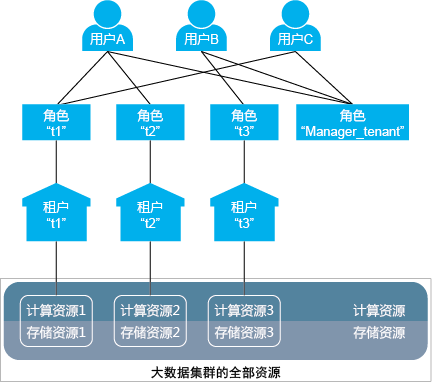
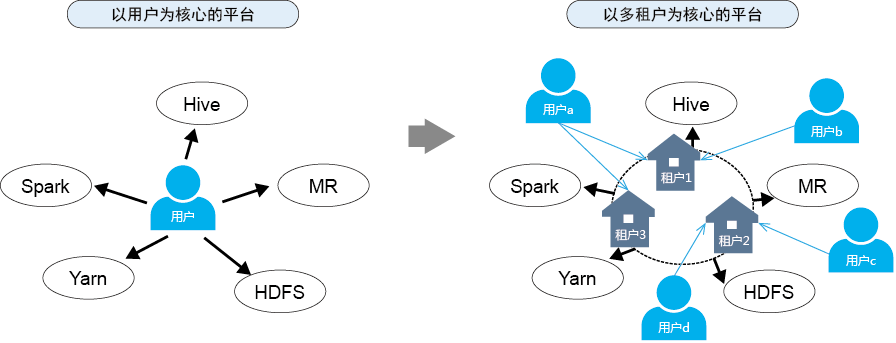

# 相关模型

## 多租户相关模型

多租户相关模型如下图所示。

**图 1**  多租户相关模型  

[图1](#zh-cn_topic_0263899470_f486ae0dbdc8a4d6285e9d6e8ac5cbde0)中涉及的概念如[表1](#zh-cn_topic_0263899470_t8493e085f6bc470eb314c82866f86756)所示。

**表 1**  相关概念说明

<table><thead align="left"><tr id="zh-cn_topic_0263899470_rb9782b0653c3414ab874f7513133ebf3"><th class="cellrowborder" valign="top" width="10%" id="mcps1.2.3.1.1">
概念

</th>
<th class="cellrowborder" valign="top" width="90%" id="mcps1.2.3.1.2">
说明

</th>
</tr>
</thead>
<tbody><tr id="zh-cn_topic_0263899470_r8dde87adc1ad4ec7ac8652f67fb26d56"><td class="cellrowborder" valign="top" width="10%" headers="mcps1.2.3.1.1 ">
用户

</td>
<td class="cellrowborder" valign="top" width="90%" headers="mcps1.2.3.1.2 ">
用户是拥有用户名，密码等帐号信息的自然人，是大数据集群的使用者。

<a href="#zh-cn_topic_0263899470_f486ae0dbdc8a4d6285e9d6e8ac5cbde0">图1</a>中有三个不同的用户：用户A、用户B和用户C。

</td>
</tr>
<tr id="zh-cn_topic_0263899470_r1bc23fd575e04058b4622f02c40d6208"><td class="cellrowborder" valign="top" width="10%" headers="mcps1.2.3.1.1 ">
角色

</td>
<td class="cellrowborder" valign="top" width="90%" headers="mcps1.2.3.1.2 ">
角色是承载一个或多个权限的载体。权限是限定在具体对象上的，例如对HDFS中的“/tenant”目录的访问权限，这里权限就限定在“/tenant”目录这个具体对象上。

<a href="#zh-cn_topic_0263899470_f486ae0dbdc8a4d6285e9d6e8ac5cbde0">图1</a>中有四个不同的角色：角色“t1”、角色“t2”、角色“t3”和角色“Manager_tenant”。

<ul id="zh-cn_topic_0263899470_u48fcff351ffd46f3854012a0f27cc3f4"><li>角色“t1”、角色“t2”和角色“t3”为创建租户时，集群自动生成的角色，角色名和租户名相同，分别对应租户“t1”、租户“t2”和租户“t3”，不能单独使用。</li><li>角色“Manager_tenant”为集群中本身存在的角色，不能单独使用。</li></ul>
</td>
</tr>
<tr id="zh-cn_topic_0263899470_rf513e59ba73945dd83c9ee5b11bf598a"><td class="cellrowborder" valign="top" width="10%" headers="mcps1.2.3.1.1 ">
租户

</td>
<td class="cellrowborder" valign="top" width="90%" headers="mcps1.2.3.1.2 ">
租户是从大数据集群中划分出的资源集合。多个不同的租户统称为多租户，租户内部进一步划分出的资源集合是子租户。

<a href="#zh-cn_topic_0263899470_f486ae0dbdc8a4d6285e9d6e8ac5cbde0">图1</a>中有三个不同的租户：租户“t1”、租户“t2”和租户“t3”。

</td>
</tr>
<tr id="zh-cn_topic_0263899470_r7831f83fca8f412da944400871a53502"><td class="cellrowborder" valign="top" width="10%" headers="mcps1.2.3.1.1 ">
资源

</td>
<td class="cellrowborder" valign="top" width="90%" headers="mcps1.2.3.1.2 "><ul id="zh-cn_topic_0263899470_u7fc693502d7843d0807104a738cb6491"><li>计算资源包括CPU和内存。
租户的计算资源是从集群总计算资源中划分出的，租户之间不可以互占计算资源。

<a href="#zh-cn_topic_0263899470_f486ae0dbdc8a4d6285e9d6e8ac5cbde0">图1</a>中：计算资源1、计算资源2和计算资源3分别是租户“t1”、租户“t2”和租户“t3”从集群中划分出的计算资源。

</li><li>存储资源包括磁盘或第三方存储系统。
租户的存储资源是从集群总存储资源中划分出的，租户之间不可以互占存储资源。

<a href="#zh-cn_topic_0263899470_f486ae0dbdc8a4d6285e9d6e8ac5cbde0">图1</a>中：存储资源1、存储资源2和存储资源3分别是租户“t1”、租户“t2”和租户“t3”从集群中划分出的存储资源。

</li></ul>
</td>
</tr>
</tbody>
</table>

若用户想要使用租户资源或为租户添加/删除子租户，则需要同时绑定该租户对应的角色和角色“Manager\_tenant“。在[图1](#zh-cn_topic_0263899470_f486ae0dbdc8a4d6285e9d6e8ac5cbde0)中，各用户绑定的角色如[表2](#zh-cn_topic_0263899470_tc4dc7a31593b48ab9ea2b09ea1bfc64d)所示。

**表 2**  各用户绑定的角色

<table><thead align="left"><tr id="zh-cn_topic_0263899470_rb1f22c27e6bb4d3bb9b36fdd319c1ecd"><th class="cellrowborder" valign="top" width="14.510000000000002%" id="mcps1.2.4.1.1">
用户

</th>
<th class="cellrowborder" valign="top" width="32.800000000000004%" id="mcps1.2.4.1.2">
绑定的角色

</th>
<th class="cellrowborder" valign="top" width="52.690000000000005%" id="mcps1.2.4.1.3">
权限

</th>
</tr>
</thead>
<tbody><tr id="zh-cn_topic_0263899470_r5a1218cacc4142c091bf127994830d28"><td class="cellrowborder" valign="top" width="14.510000000000002%" headers="mcps1.2.4.1.1 ">
用户A

</td>
<td class="cellrowborder" valign="top" width="32.800000000000004%" headers="mcps1.2.4.1.2 "><ul id="zh-cn_topic_0263899470_uf42aee74ce5441e0b508114dce0c1e7b"><li>角色“t1”</li><li>角色“t2”</li><li>角色“Manager_tenant”</li></ul>
</td>
<td class="cellrowborder" valign="top" width="52.690000000000005%" headers="mcps1.2.4.1.3 "><ul id="zh-cn_topic_0263899470_u3f210e8de7774aba91b83725c075ce07"><li>使用租户“t1”和租户“t2”的资源。</li><li>为租户“t1”和租户“t2”添加/删除子租户。</li></ul>
</td>
</tr>
<tr id="zh-cn_topic_0263899470_r6377cb3842b34693be71a110309ab6f7"><td class="cellrowborder" valign="top" width="14.510000000000002%" headers="mcps1.2.4.1.1 ">
用户B

</td>
<td class="cellrowborder" valign="top" width="32.800000000000004%" headers="mcps1.2.4.1.2 "><ul id="zh-cn_topic_0263899470_u0094bc28fb6d497dbbf14d72e41e4ad9"><li>角色“t3”</li><li>角色“Manager_tenant”</li></ul>
</td>
<td class="cellrowborder" valign="top" width="52.690000000000005%" headers="mcps1.2.4.1.3 "><ul id="zh-cn_topic_0263899470_u0c86c329eabd487d82424b99c8b07551"><li>使用租户“t3”的资源。</li><li>为租户“t3”添加/删除子租户。</li></ul>
</td>
</tr>
<tr id="zh-cn_topic_0263899470_r1bbbb11361234fc5bd4490a246a20510"><td class="cellrowborder" valign="top" width="14.510000000000002%" headers="mcps1.2.4.1.1 ">
用户C

</td>
<td class="cellrowborder" valign="top" width="32.800000000000004%" headers="mcps1.2.4.1.2 "><ul id="zh-cn_topic_0263899470_uebe1817600364e1590cec06eabf9b93e"><li>角色“t1”</li><li>角色“Manager_tenant”</li></ul>
</td>
<td class="cellrowborder" valign="top" width="52.690000000000005%" headers="mcps1.2.4.1.3 "><ul id="zh-cn_topic_0263899470_u6732e87b76234e09b2657f785407c00d"><li>使用租户“t1”的资源。</li><li>为租户“t1”添加/删除子租户。</li></ul>
</td>
</tr>
</tbody>
</table>

用户和角色是多对多的关系，一个用户可以绑定多个角色，一个角色可以被多个用户绑定。用户通过绑定角色和租户建立关系，因此用户和租户也是多对多的关系。一个用户可以使用多个租户的资源，多个用户也可以使用同一个租户的资源，例如[图1](#zh-cn_topic_0263899470_f486ae0dbdc8a4d6285e9d6e8ac5cbde0)中，用户A使用租户“t1“和租户“t2“的资源，用户A和用户C都使用租户“t1“的资源。

> **说明：** 
>“父租户”、“子租户”、“一级租户”、“二级租户”的概念是针对客户的多租户业务场景设定的，注意与FusionInsight Manager上的“叶子租户资源”和“非叶子租户资源”的概念区别。
>-   一级租户：按照租户所在层级确定名称，如最初创建的租户为一级租户，一级租户的子租户为二级租户。
>-   父租户与子租户：用来表述租户间上下层级关系的称呼。
>-   非叶子租户资源：创建租户时，选择的租户资源类型，该类型可以创建子租户。
>-   叶子租户资源：创建租户时，选择的租户资源类型，该类型不可以创建子租户。

## 多租户平台

租户是FusionInsight大数据平台的核心概念，使传统的以用户为核心的大数据平台向以多租户为核心的大数据平台转变，更好的适应现代企业多租户应用环境，如[图2](#zh-cn_topic_0263899470_f0b6aaf15c16f487fa23a1a04eb45754f)所示。

**图 2**  以用户为核心的平台和以多租户为核心的平台  

对于以用户为核心的大数据平台，用户直接访问并使用全部的资源和服务。

-   用户的应用可能只用到集群的部分资源，资源利用效率低。
-   不同用户的数据可能存放在一起，难以保证数据安全。

对于以租户为核心的大数据平台，用户通过访问租户来使用需要的资源和服务。

-   按照应用需求分配和调度出需要的资源，以租户来统一使用，资源利用效率高。
-   用户通过分配不同的角色获得使用不同租户资源的权限，以保障访问安全。
-   不同的租户之间数据隔离，以保证数据安全。

