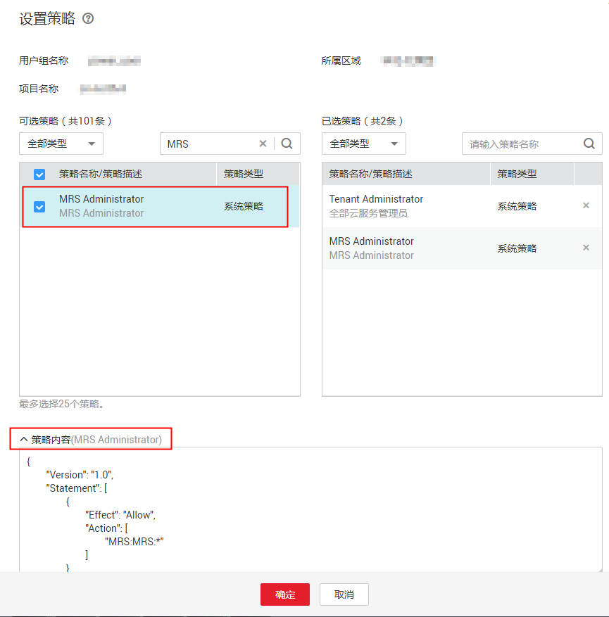

# 策略语法：RBAC<a name="ZH-CN_TOPIC_0173179007"></a>

## 策略结构<a name="section16371838578"></a>

策略结构包括：策略版本号（Version）、策略授权语句（Statement）和策略依赖（Depends）。

**图 1**  RBAC策略结构<a name="f77554e0c1b514151957a17ff9f6027db"></a>  


## 策略语法<a name="s9a405c39a4e74ccfa7102cf8ab813bfd"></a>

给用户组选择策略时，单击策略下方的，可以查看策略的详细内容，以“MRS Administrator”为例，说明RBAC策略的语法。

**图 2**  查看策略的详细内容<a name="fig1214413588109"></a>  


```
{
        "Version": "1.0",
        "Statement": [
                {
                        "Effect": "Allow",
                        "Action": [
                                "MRS:MRS:*"
                        ]
                }
        ],
        "Depends": [
                {
                        "catalog": "BASE",
                        "display_name": "Server Administrator"
                },
                {
                        "catalog": "BASE",
                        "display_name": "Tenant Guest"
                }
        ]
}
```

**表 1**  参数说明

<a name="table11474349175819"></a>
<table><thead align="left"><tr id="row175641749135815"><th class="cellrowborder" colspan="2" valign="top" id="mcps1.2.5.1.1"><p id="p12564649175818"><a name="p12564649175818"></a><a name="p12564649175818"></a>参数</p>
</th>
<th class="cellrowborder" valign="top" id="mcps1.2.5.1.2"><p id="p1456413494589"><a name="p1456413494589"></a><a name="p1456413494589"></a>含义</p>
</th>
<th class="cellrowborder" valign="top" id="mcps1.2.5.1.3"><p id="p17564164925813"><a name="p17564164925813"></a><a name="p17564164925813"></a>值</p>
</th>
</tr>
</thead>
<tbody><tr id="row6564349185813"><td class="cellrowborder" colspan="2" valign="top" headers="mcps1.2.5.1.1 "><p id="p7564134925817"><a name="p7564134925817"></a><a name="p7564134925817"></a>Version</p>
</td>
<td class="cellrowborder" valign="top" headers="mcps1.2.5.1.2 "><p id="p185641491586"><a name="p185641491586"></a><a name="p185641491586"></a>策略的版本</p>
</td>
<td class="cellrowborder" valign="top" headers="mcps1.2.5.1.3 "><p id="p1456413497589"><a name="p1456413497589"></a><a name="p1456413497589"></a>固定为“1.0”</p>
</td>
</tr>
<tr id="row15641949125810"><td class="cellrowborder" rowspan="2" valign="top" width="17.17171717171717%" headers="mcps1.2.5.1.1 "><p id="p4564104925816"><a name="p4564104925816"></a><a name="p4564104925816"></a>Statement</p>
</td>
<td class="cellrowborder" valign="top" width="17.17171717171717%" headers="mcps1.2.5.1.1 "><p id="p10564104912588"><a name="p10564104912588"></a><a name="p10564104912588"></a>Action</p>
</td>
<td class="cellrowborder" valign="top" width="28.28282828282828%" headers="mcps1.2.5.1.2 "><p id="p155641649135815"><a name="p155641649135815"></a><a name="p155641649135815"></a>定义对服务的具体操作。</p>
</td>
<td class="cellrowborder" valign="top" width="37.37373737373737%" headers="mcps1.2.5.1.3 "><p id="p156484935819"><a name="p156484935819"></a><a name="p156484935819"></a>格式为：服务名:资源类型:操作</p>
<p id="p115643497589"><a name="p115643497589"></a><a name="p115643497589"></a>"MRS:MRS:*，表示对MRS的所有操作，其中MRS为服务名称；“*”为通配符，表示对所有MRS资源类型可以执行所有操作。</p>
</td>
</tr>
<tr id="row256464965819"><td class="cellrowborder" valign="top" headers="mcps1.2.5.1.1 "><p id="p1856534916586"><a name="p1856534916586"></a><a name="p1856534916586"></a>Effect</p>
</td>
<td class="cellrowborder" valign="top" headers="mcps1.2.5.1.1 "><p id="p95656492585"><a name="p95656492585"></a><a name="p95656492585"></a>定义Action中所包含的具体操作是否允许执行。</p>
</td>
<td class="cellrowborder" valign="top" headers="mcps1.2.5.1.2 "><a name="ul16565124985810"></a><a name="ul16565124985810"></a><ul id="ul16565124985810"><li>Allow：允许执行。</li><li>Deny：不允许执行。</li></ul>
</td>
</tr>
<tr id="row115651149205817"><td class="cellrowborder" rowspan="2" valign="top" width="17.17171717171717%" headers="mcps1.2.5.1.1 "><p id="p756518493580"><a name="p756518493580"></a><a name="p756518493580"></a>Depends</p>
</td>
<td class="cellrowborder" valign="top" width="17.17171717171717%" headers="mcps1.2.5.1.1 "><p id="p85651549165814"><a name="p85651549165814"></a><a name="p85651549165814"></a>catalog</p>
</td>
<td class="cellrowborder" valign="top" width="28.28282828282828%" headers="mcps1.2.5.1.2 "><p id="p65651149185815"><a name="p65651149185815"></a><a name="p65651149185815"></a>依赖的策略的所属服务。</p>
</td>
<td class="cellrowborder" valign="top" width="37.37373737373737%" headers="mcps1.2.5.1.3 "><p id="p11565164914583"><a name="p11565164914583"></a><a name="p11565164914583"></a>服务名称</p>
<p id="p20565449105815"><a name="p20565449105815"></a><a name="p20565449105815"></a>例如：BASE</p>
</td>
</tr>
<tr id="row856524985819"><td class="cellrowborder" valign="top" headers="mcps1.2.5.1.1 "><p id="p135651749195814"><a name="p135651749195814"></a><a name="p135651749195814"></a>display_name</p>
</td>
<td class="cellrowborder" valign="top" headers="mcps1.2.5.1.1 "><p id="p6565184911585"><a name="p6565184911585"></a><a name="p6565184911585"></a>依赖的策略的名称。</p>
</td>
<td class="cellrowborder" valign="top" headers="mcps1.2.5.1.2 "><p id="p0565164917586"><a name="p0565164917586"></a><a name="p0565164917586"></a>策略名称</p>
<p id="p2565449145811"><a name="p2565449145811"></a><a name="p2565449145811"></a>例如：Tenant Administrator</p>
</td>
</tr>
</tbody>
</table>

