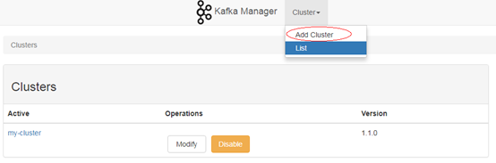
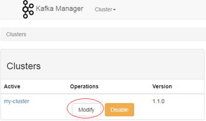
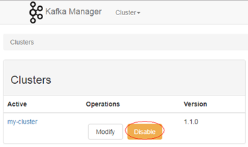
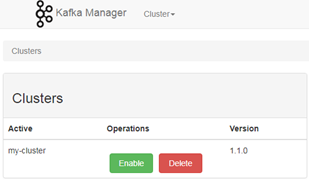

# 管理Kafka集群

管理Kafka集群包含以下内容：

-   [添加集群到KafkaManager的WebUI界面](#section8713185103014)
-   [更新集群参数](#section776745110472)
-   [删除KafkaManager的WebUI界面的集群](#section656918369521)

## 添加集群到KafkaManager的WebUI界面

首次创建Kafka集群后会在KafkaManager的WebUI界面创建名为my-cluster的默认Kafka集群，用户也可以在KafkaManager的WebUI界面自行添加已经通过MRS控制台创建的Kafka集群，用于管理多个Kafka集群。

1.  登录KafkaManager的WebUI界面。
2.  在页面上方选择“Cluster \> Add Cluster“  。

    **图 1**  添加集群  
    

3.  设置待添加集群的参数，如下参数请参考样例，其他参数默认不需要修改。

    **表 1**  需修改的集群参数

    
    <table><thead align="left"><tr id="row142881620161613"><th class="cellrowborder" valign="top" width="33.33333333333333%" id="mcps1.2.4.1.1">
参数名称

    </th>
    <th class="cellrowborder" valign="top" width="33.33333333333333%" id="mcps1.2.4.1.2">
取值样例

    </th>
    <th class="cellrowborder" valign="top" width="33.33333333333333%" id="mcps1.2.4.1.3">
说明

    </th>
    </tr>
    </thead>
    <tbody><tr id="row1328842018161"><td class="cellrowborder" valign="top" width="33.33333333333333%" headers="mcps1.2.4.1.1 ">
Cluster Name

    </td>
    <td class="cellrowborder" valign="top" width="33.33333333333333%" headers="mcps1.2.4.1.2 ">
mrs-demo

    </td>
    <td class="cellrowborder" valign="top" width="33.33333333333333%" headers="mcps1.2.4.1.3 ">
待添加集群在KafkaManager的WebUI界面中显示的名称。

    </td>
    </tr>
    <tr id="row428816206164"><td class="cellrowborder" valign="top" width="33.33333333333333%" headers="mcps1.2.4.1.1 ">
Cluster Zookeeper Hosts

    </td>
    <td class="cellrowborder" valign="top" width="33.33333333333333%" headers="mcps1.2.4.1.2 ">
zk1_ip:zk1_port, zk2_ip:zk2_port/kafka

    </td>
    <td class="cellrowborder" valign="top" width="33.33333333333333%" headers="mcps1.2.4.1.3 ">
待添加集群的Zookeeper地址。

    </td>
    </tr>
    <tr id="row192882020131615"><td class="cellrowborder" valign="top" width="33.33333333333333%" headers="mcps1.2.4.1.1 ">
Kafka Version

    </td>
    <td class="cellrowborder" valign="top" width="33.33333333333333%" headers="mcps1.2.4.1.2 ">
1.1.0

    </td>
    <td class="cellrowborder" valign="top" width="33.33333333333333%" headers="mcps1.2.4.1.3 ">
待添加集群的Kafka版本，默认1.1.0。

    </td>
    </tr>
    <tr id="row1225617469305"><td class="cellrowborder" valign="top" width="33.33333333333333%" headers="mcps1.2.4.1.1 ">
Enable JMX Polling (Set JMX_PORT env variable before starting kafka server)

    </td>
    <td class="cellrowborder" valign="top" width="33.33333333333333%" headers="mcps1.2.4.1.2 ">
勾选

    </td>
    <td class="cellrowborder" valign="top" width="33.33333333333333%" headers="mcps1.2.4.1.3 ">
-

    </td>
    </tr>
    <tr id="row162881620111612"><td class="cellrowborder" valign="top" width="33.33333333333333%" headers="mcps1.2.4.1.1 ">
Poll consumer information (Not recommended for large # of consumers)

    </td>
    <td class="cellrowborder" valign="top" width="33.33333333333333%" headers="mcps1.2.4.1.2 ">
勾选

    </td>
    <td class="cellrowborder" valign="top" width="33.33333333333333%" headers="mcps1.2.4.1.3 ">
-

    </td>
    </tr>
    <tr id="row228922016166"><td class="cellrowborder" valign="top" width="33.33333333333333%" headers="mcps1.2.4.1.1 ">
Enable Active OffsetCache (Not recommended for large # of consumers)

    </td>
    <td class="cellrowborder" valign="top" width="33.33333333333333%" headers="mcps1.2.4.1.2 ">
勾选

    </td>
    <td class="cellrowborder" valign="top" width="33.33333333333333%" headers="mcps1.2.4.1.3 ">
-

    </td>
    </tr>
    <tr id="row79341058112113"><td class="cellrowborder" valign="top" width="33.33333333333333%" headers="mcps1.2.4.1.1 ">
Display Broker and Topic Size (only works after applying this patch)

    </td>
    <td class="cellrowborder" valign="top" width="33.33333333333333%" headers="mcps1.2.4.1.2 ">
勾选

    </td>
    <td class="cellrowborder" valign="top" width="33.33333333333333%" headers="mcps1.2.4.1.3 ">
-

    </td>
    </tr>
    <tr id="row201616212229"><td class="cellrowborder" valign="top" width="33.33333333333333%" headers="mcps1.2.4.1.1 ">
Security Protocol

    </td>
    <td class="cellrowborder" valign="top" width="33.33333333333333%" headers="mcps1.2.4.1.2 ">
PLAINTEXT

    </td>
    <td class="cellrowborder" valign="top" width="33.33333333333333%" headers="mcps1.2.4.1.3 "><ul id="ul1533223923116"><li>开启Kerberos的Kafka集群选择SASL_PLAINTEXT</li><li>未开启Kerberos集群选择PLAINTEXT</li></ul>
    </td>
    </tr>
    </tbody>
    </table>

4.  单击“Save“完成添加集群。

## 更新集群参数

1.  登录KafkaManager的WebUI界面。
2.  在对应集群的“Operations“列单击“Modify“。

    **图 2**  更新集群参数  
    

3.  进入集群配置参数页面，修改集群参数。

## 删除KafkaManager的WebUI界面的集群

1.  登录KafkaManager的WebUI界面。
2.  在对应集群的“Operations“列单击“Disable“。

    **图 3**  停用集群  
    

3.  等待集群列表页面的“Operations“列出现“Delete“或“Enable“时，单击“Delete“删除集群。也可以单击“Enable“启用集群。

    **图 4**  启用或删除集群  
    

