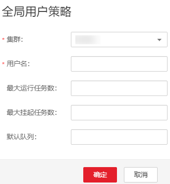

# 管理全局用户策略

## 操作场景

如果租户配置使用Superior调度器，那么系统可以控制具体用户使用资源调度器的行为，包含：

-   最大运行任务数
-   最大挂起任务数
-   默认队列

## 操作步骤

-   添加策略
    1.  在FusionInsight Manager，单击“租户资源”。
    2.  单击“动态资源计划”页签。
    3.  单击“全局用户策略”页签。

        > **说明：** 
        >defaults\(default setting\)表示如果一个用户未配置全局用户策略，则默认使用defaults所指定的策略。该策略不可删除。

    4.  单击“添加全局用户策略”，在弹出窗口中填写以下参数。

        **图 1**  全局用户策略  
        

        -   集群：选择需要操作的集群。
        -   用户名：表示需要控制资源调度的用户，请输入当前集群中已存在用户的名称。
        -   最大运行任务数：表示该用户在当前集群中能运行的最大任务数量。
        -   最大挂起任务数：表示该用户在当前集群中能挂起的最大任务数量。
        -   默认队列：表示用户的队列，请输入当前集群中已存在队列的名称。

-   修改策略
    1.  在FusionInsight Manager，单击“租户资源”。
    2.  单击“动态资源计划”页签。
    3.  单击“全局用户策略”页签。
    4.  在指定用户策略所在行，单击“操作”列中的“修改”。
    5.  调整相关参数后，单击“确定”。

-   删除策略
    1.  在FusionInsight Manager，单击“租户资源”。
    2.  单击“动态资源计划”页签。
    3.  单击“全局用户策略”页签。
    4.  在指定用户策略所在行，单击“操作”列中的“删除”。

        在弹出窗口单击“确定”。

