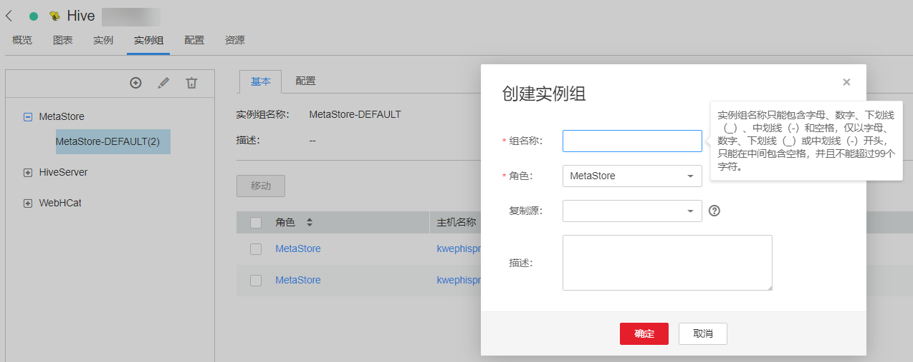

# 管理实例组

## 操作场景

FusionInsight Manager支持对多个实例组的管理功能，即用户可以按照具有相同硬件配置的节点或者其他原则将同一角色内的多个实例进行分组。针对实例组进行的配置参数修改，将同时对组内所有的实例生效。

在大集群场景中，通过实例组将提升大集群下异构环境批量实例的管理能力，分配好实例组后，后续可反复配置，减少实例配置项的冗余，提升系统性能。

## 创建实例组

1.  登录FusionInsight Manager。
2.  选择“集群 \>  _待操作集群的名称_   \> 服务”。
3.  单击服务视图中指定的服务名称。
4.  选择“实例组“。

    单击，按照界面提示填写参数。

    **图 1**  创建实例组  
    

    **表 1**  实例组配置参数

    
    <table><thead align="left"><tr id="row827815567271"><th class="cellrowborder" valign="top" width="25%" id="mcps1.2.3.1.1">
参数名

    </th>
    <th class="cellrowborder" valign="top" width="75%" id="mcps1.2.3.1.2">
说明

    </th>
    </tr>
    </thead>
    <tbody><tr id="row1027895652712"><td class="cellrowborder" valign="top" width="25%" headers="mcps1.2.3.1.1 ">
组名称

    </td>
    <td class="cellrowborder" valign="top" width="75%" headers="mcps1.2.3.1.2 ">
实例组名称只能包含字母、数字、下划线（_）、中划线（-）和空格，仅以字母、数字、下划线（_）或中划线（-）开头，只能在中间包含空格，并且不能超过99个字符。

    </td>
    </tr>
    <tr id="row8206606295"><td class="cellrowborder" valign="top" width="25%" headers="mcps1.2.3.1.1 ">
角色

    </td>
    <td class="cellrowborder" valign="top" width="75%" headers="mcps1.2.3.1.2 ">
表示实例组包含哪个角色的实例。

    </td>
    </tr>
    <tr id="row427845611272"><td class="cellrowborder" valign="top" width="25%" headers="mcps1.2.3.1.1 ">
复制源

    </td>
    <td class="cellrowborder" valign="top" width="75%" headers="mcps1.2.3.1.2 ">
指从指定的实例组复制配置值到新组，若为空，则新组对应的各配置值为系统默认值。

    </td>
    </tr>
    <tr id="row935681513291"><td class="cellrowborder" valign="top" width="25%" headers="mcps1.2.3.1.1 ">
描述

    </td>
    <td class="cellrowborder" valign="top" width="75%" headers="mcps1.2.3.1.2 ">
只可以包含汉字、英文字母、数字、中英文逗号、中英文句号、下划线（_）、空格和换行符，并且不能超过200个字符。

    </td>
    </tr>
    </tbody>
    </table>

    > **说明：** 
    >-   每个实例必须且只能属于一个实例组，实例首次安装时默认属于的实例组为“_角色名_-DEFAULT”。
    >-   多余或者不再使用的实例组可以删除，删除前需要将组内的实例全部迁移至其他实例组，然后参照[删除实例组](#section10369132812451)对实例组进行删除，系统默认的实例组不可删除。

5.  单击“确定“完成创建实例组。

## 修改实例组属性

1.  登录FusionInsight Manager。
2.  选择“集群 \>  _待操作集群的名称_   \> 服务”。
3.  单击服务视图中指定的服务名称。
4.  在“实例组“页签定位到指定的实例组。

    单击，按照界面提示填写参数。

5.  单击“确定“完成修改。

    默认实例组不支持修改。

## 删除实例组

1.  登录FusionInsight Manager。
2.  选择“集群 \>  _待操作集群的名称_   \> 服务”。
3.  单击服务视图中指定的服务名称。
4.  在“实例组“页签定位到指定的实例组。
5.  单击。
6.  在弹出窗口单击“确定“。

    默认实例组不支持删除。

