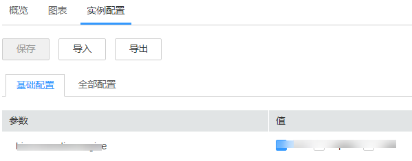

# 管理实例配置

## 操作场景

每个单独的角色实例可以修改配置参数在迁移实例到新集群场景或者重新部署相同服务的场景下，管理员可以在FusionInsight Manager中将某服务所有配置数据导入或者导出，实现配置结果的快速复制。

FusionInsight Manager支持管理单个角色实例的配置参数，修改配置参数、导出实例配置或导入实例配置时不影响其他实例。

## 对系统的影响

修改角色实例配置后，需要重启此实例。重启时对应的实例不可用。如果不重启，则实例“配置状态“为“配置过期“。

## 修改实例配置

1.  登录FusionInsight Manager。
2.  选择“集群 \>  _待操作的集群名称_  \> 服务”。
3.  单击服务视图中指定的服务名称，并选择“实例“页签。
4.  单击指定的实例，选择“实例配置“。

    默认显示“基础配置”，如果需要修改更多参数，请选择“全部配置”，界面上将显示该实例支持的所有参数分类。

    **图 1**  实例配置  
    

5.  在导航树选择指定的参数分类，并在右侧修改参数值。

    不确定参数的具体位置时，支持在右上角输入参数名，Manager将实时进行搜索并显示结果。

6.  单击“保存”，并在确认对话框中单击“确定”。

    等待界面提示“操作成功”，单击“完成”，配置已修改。

## 导出导入实例配置

1.  登录FusionInsight Manager。
2.  选择“集群 \>  _待操作集群的名称_   \> 服务”。
3.  单击服务视图中指定的服务名称，并选择“实例“页签。
4.  单击指定的实例，选择“实例配置“。
5.  单击“导出“，导出配置参数文件到本地。
6.  在实例配置页面单击“导入”，在弹出的配置文件选择框中定位到实例的配置参数文件，即可导入所有配置。

