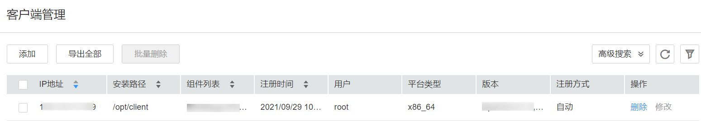

# 管理客户端

## 操作场景

FusionInsight Manager支持统一管理集群的客户端安装信息，用户下载并安装客户端后，界面可自动记录已安装（注册）客户端的信息，方便查询管理。同时系统支持手动添加、修改未自动注册的客户端信息（如历史版本已安装的客户端）。

## 操作步骤

**查看客户端信息**

1.  登录FusionInsight Manager。
2.  选择“集群 \>_待操作集群的名称_  \> 客户端管理”，即可查看当前集群已安装的客户端信息。

    用户可查看客户端所在节点的IP地址、安装路径、组件列表、注册时间及安装用户等信息。

    在当前最新版本集群下载并安装客户端时，客户端信息会自动注册。

    **图 1**  客户端信息  
    

**添加客户端信息**

1.  如需手动添加已安装好的客户端信息，单击“添加”，根据界面提示手动添加客户端的IP地址、安装路径、用户、平台信息、注册信息等内容。
2.  配置好客户端信息，单击“确定”，添加成功。

**修改客户端信息**

1.  手动注册的客户端信息可以手动修改。

    在“客户端管理”界面选择待修改的客户端，单击“修改”。修改信息后，单击“确定”完成修改。

**删除客户端信息**

1.  在“客户端管理”界面选择待删除的客户端，单击“删除”，在弹出的窗口中单击“确定”，即可删除客户端信息。

    如需删除多个客户端信息，勾选待删除的客户端，单击“批量删除”，在弹出的窗口中单击“确定”，即可删除客户端信息。

**导出客户端信息**

1.  在“客户端管理”界面选择待操作的客户端，单击“导出全部”可导出所有已注册的客户端信息到本地。

    > **说明：** 
    >客户端管理界面上组件列表栏只展示有真实客户端的组件，因此部分没有客户端的组件和客户端特殊的组件不会显示在组件列表栏。
    >不显示的组件有：
    >LdapServer、KrbServer、DBService、Hue、Mapreduce、Flume

