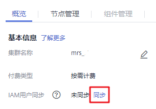

# 管理服务操作

用户可以在MRS：

-   添加和删除服务。添加和删除服务仅在MRS 3.1.2及之后版本的**自定义**类型集群支持。
-   启动操作状态为“已停止”、“停止失败”或“启动失败”服务，以使用该服务。
-   停止不再使用或异常服务。
-   重启异常或配置过期的服务，以恢复或生效服务功能。

## 前提条件

-   已完成IAM用户同步（在集群详情页的“概览”页签，单击“IAM用户同步“右侧的“同步”进行IAM用户同步）。

    **图 1**  IAM用户同步  
    

-   添加新服务时，请确保待添加服务依赖的相关底层服务的角色实例全部运行正常，否则服务可能无法添加成功或添加后启动失败。

## 对系统影响

-   添加、删除服务过程中，集群状态不再处于“运行中”状态，此时无法在集群的作业管理页面中新提交作业。
-   在Task节点组无法添加stateful的组件。

## 添加服务

1.  在集群详情页，选择“组件管理 \> 添加服务”。
2.  在服务列表中，勾选需要添加的服务，单击“下一步”。

    > **说明：** 
    >-   添加服务时，该服务依赖的下层服务也会自动勾选，可以同时添加多个服务。
    >-   只能在状态正常的节点上添加服务。
    >-   未安装Hadoop的集群，在添加Hadoop后，需要刷新MRS控制台的集群详情页面，并进行IAM用户同步后，才能在作业管理中成功提交作业。
    >-   集群不支持添加Hadoop服务的单个组件，只能添加Hadoop服务，Hadoop服务包含MapReduce、Yarn和HDFS。

3.  在“拓扑调整”页面勾选服务部署的节点，部署方案可参考[表3](购买自定义拓扑集群.md#table985254743313)。
4.  单击“确认”。服务添加完成后，在“组件管理”页面可以查看所添加的服务。

    > **说明：** 
    >在Console上添加服务会自动同步到Manager页面。

## 删除服务

1.  在集群详情页，单击“组件管理”。
2.  在指定服务所在行，单击“删除”操作。

    > **说明：** 
    >-   如果需要删除的服务存在上层依赖，则不可删除，每次只能删除一个服务。
    >-   不支持删除Hadoop（HDFS、Yarn、MapReduce）、Ranger、DBService、KrbServer、LdapServer和meta服务，其他已安装服务可删除。

3.  在弹出的对话框中单击“是”，删除该服务。

    > **注意：** 
    >-   在Console上删除服务会自动同步到Manager页面。
    >-   删除服务前，请先备份该服务的数据，避免数据丢失。

## 其他操作

1.  在集群详情页，单击“组件管理”。
2.  在指定服务所在行，单击“启动“、“停止“和“重启“执行启动、停止和重启操作。

    服务之间存在依赖关系。对某服务执行启动、停止和重启操作时，与该服务存在依赖关系的服务将受到影响。

    具体影响如下：

    -   启动某服务，该服务依赖的下层服务需先启动，服务功能才可生效。
    -   停止某服务，依赖该服务的上层服务将无法提供功能。
    -   重启某服务，依赖该服务且启动的上层服务需重启后才可生效。

