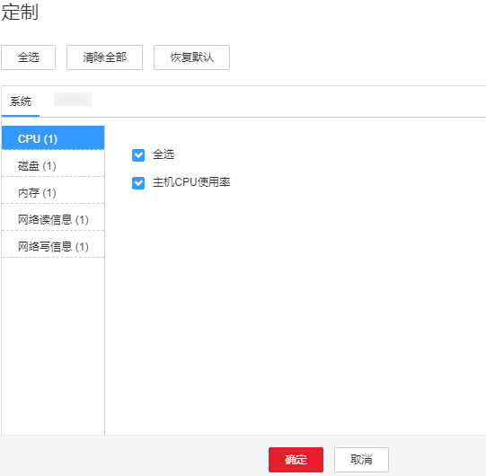
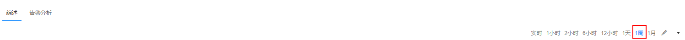
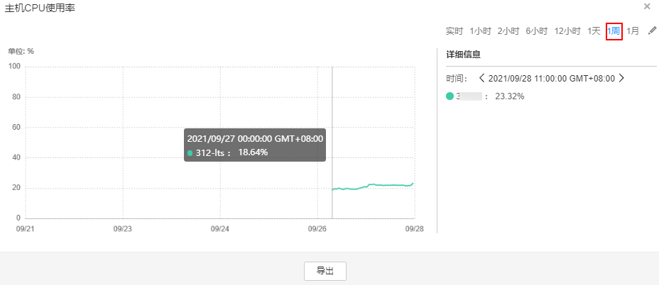

# 管理监控指标数据报表

## 操作场景

FusionInsight Manager支持用户自定义在主页进行展示的监控项，也可以导出监控数据。

> **说明：** 
>历史报表根据所自定义的时间长度不同，图表横轴中每个时间间隔也会不同，具体监控数据的规则如下：
>-   0～25小时：每个间隔5分钟，要求集群至少安装10分钟以上，最多保留15天监控数据。
>-   25小时～150小时：每个间隔30分钟，要求集群至少安装30分钟以上，最多保留3个月监控数据。
>-   150小时～300小时：每个间隔1小时，要求集群至少安装1小时以上，最多保留3个月监控数据。
>-   300小时～300天：每个间隔1天，要求集群至少安装1天以上，最多保留6个月监控数据。
>-   300天以上：每个间隔7天，要求集群安装7天以上，最多保留一年的监控数据。
>-   如果FusionInsight Manager存储所用的GaussDB所在分区的磁盘使用率超过80%时，会清理实时监控数据和周期为5分钟的监控数据。
>-   若为“租户资源”下的“存储资源\(HDFS\)”表，0小时～300小时：每个间隔1小时，要求集群至少安装1小时以上，最多保留3个月监控数据。

## 自定义监控指标报表

1.  登录FusionInsight Manager。
2.  单击“主页“。
3.  在图表区的右上角，单击，在弹出菜单中选择“定制“。

    > **说明：** 
    >监控时段以5分钟为单位，显示最近1小时的监控数据；从进入“实时监控”页面后，在监控图右侧以5分钟为单位显示实时监控数据。

4.  在窗口左侧分类中，选择一项监控资源主体。
5.  在右侧监控列表勾选一个或多个监控指标。

    **图 1**  自定义监控指标报表  
    

6.  单击“确定“。

## 导出全部监控数据

1.  登录FusionInsight Manager。
2.  单击“主页“。
3.  在所需要操作的集群的图表区的右上角，选择一个时间范围获取监控数据，例如“1周“。

    默认为实时数据，无法导出。单击可以自定义监控数据时间范围。

    **图 2**  自定义时间范围  
    

4.  在图表区的右上角，单击，在弹出菜单中选择“导出“。

## 导出指定监控项数据

1.  登录FusionInsight Manager。
2.  单击“主页“。
3.  在所需要操作的集群的图表区任意一个监控报表窗格的右上角，单击。
4.  选择一个时间范围获取监控数据，例如“1周“。

    默认为实时数据，无法导出。单击可以自定义监控数据时间范围。

    **图 3**  指定监控项自定义时间范围  
    

5.  单击“导出“。

