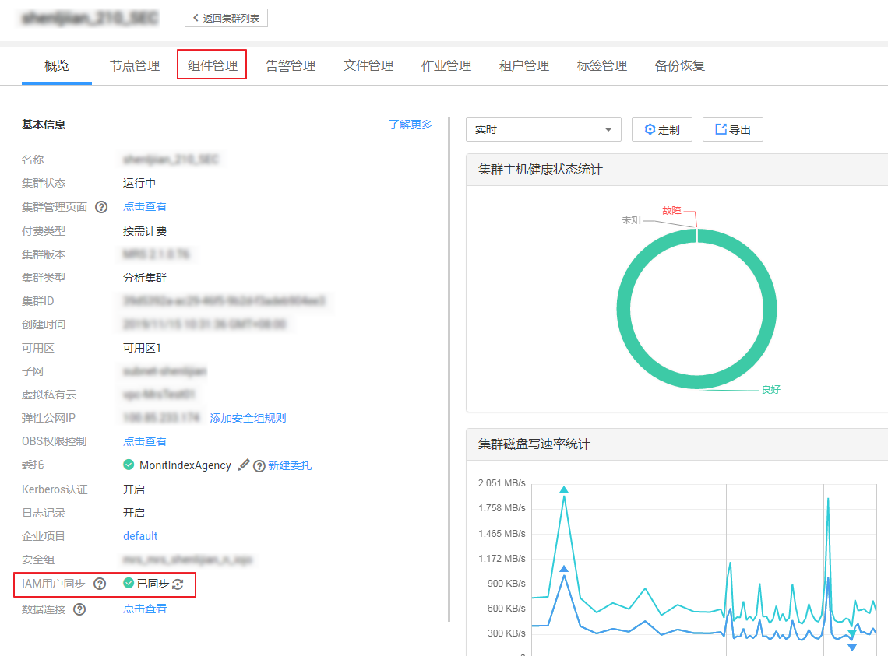
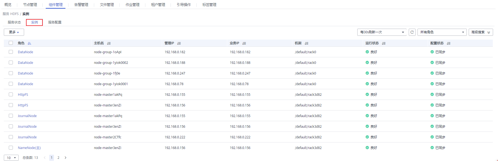

# 管理组件和主机监控

用户在日常使用中，可以在MRS管理所有组件（含角色实例）和主机的状态及指标信息：

-   状态信息，包括运行、健康、配置及角色实例状态统计。
-   指标信息，各组件的主要监控指标项。
-   导出监控指标（MRS 3.x及之后版本暂不支持）。

> **说明：** 
>-   MRS 3.x之前版本操作方法请参考[管理服务和主机监控](管理服务和主机监控.md)。
>-   MRS 3.x及之后版本操作方法请参考[操作方法](#section18139102419196)。
>-   用户可以选择页面自动刷新间隔的设置，也可以单击马上刷新。
>-   组件管理支持三种参数值：
>    -   “每30秒刷新一次“：刷新间隔30秒。
>    -   “每60秒刷新一次“：刷新间隔60秒。
>    -   “停止“：停止刷新。

## 前提条件

已完成IAM用户同步（在集群详情页的“概览”页签，单击“IAM用户同步“右侧的“同步”进行IAM用户同步）。

## 操作方法

**管理组件监控**

> **说明：** 
>MRS Manager操作，请参考[管理服务监控](管理服务和主机监控.md#zh-cn_topic_0035209600_section37246995143046)操作。

1.  在MRS集群详情页面，单击“组件管理”。

    组件列表中标题包含“服务“、“操作状态“、“健康状态“、“配置状态“、“角色数“和“操作“。

    -   服务操作状态描述如[表1](#table4726131425215)所示。

        **表 1**  服务操作状态

        
        <table><thead align="left"><tr id="row147271014155215"><th class="cellrowborder" valign="top" width="30.080000000000002%" id="mcps1.2.3.1.1">
<strong id="b6727414105217">状态</strong>

        </th>
        <th class="cellrowborder" valign="top" width="69.92%" id="mcps1.2.3.1.2">
<strong id="b16727161445214">描述</strong>

        </th>
        </tr>
        </thead>
        <tbody><tr id="row4727314105217"><td class="cellrowborder" valign="top" width="30.080000000000002%" headers="mcps1.2.3.1.1 ">
已启动

        </td>
        <td class="cellrowborder" valign="top" width="69.92%" headers="mcps1.2.3.1.2 ">
服务已启动。

        </td>
        </tr>
        <tr id="row197277143527"><td class="cellrowborder" valign="top" width="30.080000000000002%" headers="mcps1.2.3.1.1 ">
已停止

        </td>
        <td class="cellrowborder" valign="top" width="69.92%" headers="mcps1.2.3.1.2 ">
服务已停止。

        </td>
        </tr>
        <tr id="row77270144525"><td class="cellrowborder" valign="top" width="30.080000000000002%" headers="mcps1.2.3.1.1 ">
启动失败

        </td>
        <td class="cellrowborder" valign="top" width="69.92%" headers="mcps1.2.3.1.2 ">
用户启动操作失败。

        </td>
        </tr>
        <tr id="row672731495210"><td class="cellrowborder" valign="top" width="30.080000000000002%" headers="mcps1.2.3.1.1 ">
停止失败

        </td>
        <td class="cellrowborder" valign="top" width="69.92%" headers="mcps1.2.3.1.2 ">
用户停止操作失败。

        </td>
        </tr>
        <tr id="row57271714165213"><td class="cellrowborder" valign="top" width="30.080000000000002%" headers="mcps1.2.3.1.1 ">
未知

        </td>
        <td class="cellrowborder" valign="top" width="69.92%" headers="mcps1.2.3.1.2 ">
后台系统重启后，服务的初始状态。

        </td>
        </tr>
        </tbody>
        </table>

    -   服务健康状态如[表2](#table1972816146524)所示。

        **表 2**  服务健康状态

        
        <table><thead align="left"><tr id="row20728714135210"><th class="cellrowborder" valign="top" width="30.080000000000002%" id="mcps1.2.3.1.1">
<strong id="b37281514155214">状态</strong>

        </th>
        <th class="cellrowborder" valign="top" width="69.92%" id="mcps1.2.3.1.2">
<strong id="b137281414175218">描述</strong>

        </th>
        </tr>
        </thead>
        <tbody><tr id="row1472861411528"><td class="cellrowborder" valign="top" width="30.080000000000002%" headers="mcps1.2.3.1.1 ">
良好

        </td>
        <td class="cellrowborder" valign="top" width="69.92%" headers="mcps1.2.3.1.2 ">
该服务中所有角色实例正常运行。

        </td>
        </tr>
        <tr id="row2728121405211"><td class="cellrowborder" valign="top" width="30.080000000000002%" headers="mcps1.2.3.1.1 ">
故障

        </td>
        <td class="cellrowborder" valign="top" width="69.92%" headers="mcps1.2.3.1.2 ">
至少一个角色实例运行状态为“故障”或被依赖的服务状态不正常。

        </td>
        </tr>
        <tr id="row1728181455212"><td class="cellrowborder" valign="top" width="30.080000000000002%" headers="mcps1.2.3.1.1 ">
未知

        </td>
        <td class="cellrowborder" valign="top" width="69.92%" headers="mcps1.2.3.1.2 ">
该服务中所有角色实例状态为“未知”。

        </td>
        </tr>
        <tr id="row19728714135213"><td class="cellrowborder" valign="top" width="30.080000000000002%" headers="mcps1.2.3.1.1 ">
正在恢复

        </td>
        <td class="cellrowborder" valign="top" width="69.92%" headers="mcps1.2.3.1.2 ">
后台系统正在尝试自动启动服务。

        </td>
        </tr>
        <tr id="row197284146521"><td class="cellrowborder" valign="top" width="30.080000000000002%" headers="mcps1.2.3.1.1 ">
亚健康

        </td>
        <td class="cellrowborder" valign="top" width="69.92%" headers="mcps1.2.3.1.2 ">
该服务所依赖的服务状态不正常，异常服务的相关接口无法被外部调用。

        </td>
        </tr>
        </tbody>
        </table>

    -   服务配置状态如[表3](#table1172913145524)所示。

        **表 3**  服务配置状态

        
        <table><thead align="left"><tr id="row6729101425219"><th class="cellrowborder" valign="top" width="30.080000000000002%" id="mcps1.2.3.1.1">
<strong id="b5729814165214">状态</strong>

        </th>
        <th class="cellrowborder" valign="top" width="69.92%" id="mcps1.2.3.1.2">
<strong id="b87291514195212">描述</strong>

        </th>
        </tr>
        </thead>
        <tbody><tr id="row9729214195219"><td class="cellrowborder" valign="top" width="30.080000000000002%" headers="mcps1.2.3.1.1 ">
已同步

        </td>
        <td class="cellrowborder" valign="top" width="69.92%" headers="mcps1.2.3.1.2 ">
系统中最新的配置信息已生效。

        </td>
        </tr>
        <tr id="row072920148524"><td class="cellrowborder" valign="top" width="30.080000000000002%" headers="mcps1.2.3.1.1 ">
配置超期

        </td>
        <td class="cellrowborder" valign="top" width="69.92%" headers="mcps1.2.3.1.2 ">
参数修改后，最新的配置未生效。需重启相应服务生效最新配置信息。

        </td>
        </tr>
        <tr id="row17291514165219"><td class="cellrowborder" valign="top" width="30.080000000000002%" headers="mcps1.2.3.1.1 ">
配置失败

        </td>
        <td class="cellrowborder" valign="top" width="69.92%" headers="mcps1.2.3.1.2 ">
参数配置过程中出现通信或读写异常。尝试使用“同步配置”恢复。

        </td>
        </tr>
        <tr id="row47292145529"><td class="cellrowborder" valign="top" width="30.080000000000002%" headers="mcps1.2.3.1.1 ">
配置中

        </td>
        <td class="cellrowborder" valign="top" width="69.92%" headers="mcps1.2.3.1.2 ">
参数配置进行中。

        </td>
        </tr>
        <tr id="row10729814135213"><td class="cellrowborder" valign="top" width="30.080000000000002%" headers="mcps1.2.3.1.1 ">
未知

        </td>
        <td class="cellrowborder" valign="top" width="69.92%" headers="mcps1.2.3.1.2 ">
无法获取当前配置状态。

        </td>
        </tr>
        </tbody>
        </table>

    默认以“服务“列按升序排列，单击**服务**、**操作状态**、**健康状态**或**配置状态**可修改排列方式。

1.  单击列表中指定服务名称，查看服务状态及指标信息。
2.  定制、查看监控图表。
    1.  在“图表”区域框中，单击“定制”自定义服务监控指标。
    2.  在“时间区间”选择查询时间，单击“查看”显示该时间段内的监控数据。

**管理角色实例监控**

> **说明：** 
>针对MRS 3.x之前版本，请参考[管理角色实例监控](管理服务和主机监控.md#zh-cn_topic_0035209600_section65508505145118)操作。

1.  在MRS集群详情页面，单击“组件管理”，在组件列表中单击服务指定名称。

    **图 1**  组件管理  
    

2.  单击“实例”，查看角色状态。

    **图 2**  实例  
    

    角色实例列表中包含实例信息的**角色、主机名**、**管理IP**、**业务IP**、**机架**、**运行状态**及**配置状态**。

    -   角色实例的运行状态如[表4](#table1573318141522)所示。

        **表 4**  角色实例运行状态

        
        <table><thead align="left"><tr id="row7733191425211"><th class="cellrowborder" valign="top" width="30.080000000000002%" id="mcps1.2.3.1.1">
<strong id="b9733141418524">状态</strong>

        </th>
        <th class="cellrowborder" valign="top" width="69.92%" id="mcps1.2.3.1.2">
<strong id="b177335142524">描述</strong>

        </th>
        </tr>
        </thead>
        <tbody><tr id="row117331414105217"><td class="cellrowborder" valign="top" width="30.080000000000002%" headers="mcps1.2.3.1.1 ">
良好

        </td>
        <td class="cellrowborder" valign="top" width="69.92%" headers="mcps1.2.3.1.2 ">
表示实例当前运行正常。

        </td>
        </tr>
        <tr id="row3733514145219"><td class="cellrowborder" valign="top" width="30.080000000000002%" headers="mcps1.2.3.1.1 ">
故障

        </td>
        <td class="cellrowborder" valign="top" width="69.92%" headers="mcps1.2.3.1.2 ">
表示实例当前无法正常工作。

        </td>
        </tr>
        <tr id="row473819121214"><td class="cellrowborder" valign="top" width="30.080000000000002%" headers="mcps1.2.3.1.1 ">
已退服

        </td>
        <td class="cellrowborder" valign="top" width="69.92%" headers="mcps1.2.3.1.2 ">
表示实例处于退服状态。

        </td>
        </tr>
        <tr id="row19903183014125"><td class="cellrowborder" valign="top" width="30.080000000000002%" headers="mcps1.2.3.1.1 ">
未启动

        </td>
        <td class="cellrowborder" valign="top" width="69.92%" headers="mcps1.2.3.1.2 ">
表示实例已停止。

        </td>
        </tr>
        <tr id="row654938151211"><td class="cellrowborder" valign="top" width="30.080000000000002%" headers="mcps1.2.3.1.1 ">
未知

        </td>
        <td class="cellrowborder" valign="top" width="69.92%" headers="mcps1.2.3.1.2 ">
表示实例的初始状态信息无法检测。

        </td>
        </tr>
        <tr id="row19205175141214"><td class="cellrowborder" valign="top" width="30.080000000000002%" headers="mcps1.2.3.1.1 ">
正在启动

        </td>
        <td class="cellrowborder" valign="top" width="69.92%" headers="mcps1.2.3.1.2 ">
表示实例正在执行启动过程。

        </td>
        </tr>
        <tr id="row4146411141313"><td class="cellrowborder" valign="top" width="30.080000000000002%" headers="mcps1.2.3.1.1 ">
正在停止

        </td>
        <td class="cellrowborder" valign="top" width="69.92%" headers="mcps1.2.3.1.2 ">
表示实例正在执行停止过程。

        </td>
        </tr>
        <tr id="row20370122061310"><td class="cellrowborder" valign="top" width="30.080000000000002%" headers="mcps1.2.3.1.1 ">
正在恢复

        </td>
        <td class="cellrowborder" valign="top" width="69.92%" headers="mcps1.2.3.1.2 ">
表示实例可能存在异常正在自动修复。

        </td>
        </tr>
        <tr id="row17491239201311"><td class="cellrowborder" valign="top" width="30.080000000000002%" headers="mcps1.2.3.1.1 ">
正在退服

        </td>
        <td class="cellrowborder" valign="top" width="69.92%" headers="mcps1.2.3.1.2 ">
表示实例正在执行退服过程。

        </td>
        </tr>
        <tr id="row1173311141523"><td class="cellrowborder" valign="top" width="30.080000000000002%" headers="mcps1.2.3.1.1 ">
正在入服

        </td>
        <td class="cellrowborder" valign="top" width="69.92%" headers="mcps1.2.3.1.2 ">
表示实例正在执行入服过程。

        </td>
        </tr>
        <tr id="row16454114083118"><td class="cellrowborder" valign="top" width="30.080000000000002%" headers="mcps1.2.3.1.1 ">
启动失败

        </td>
        <td class="cellrowborder" valign="top" width="69.92%" headers="mcps1.2.3.1.2 ">
表示实例启动操作失败。

        </td>
        </tr>
        <tr id="row164803210310"><td class="cellrowborder" valign="top" width="30.080000000000002%" headers="mcps1.2.3.1.1 ">
停止失败

        </td>
        <td class="cellrowborder" valign="top" width="69.92%" headers="mcps1.2.3.1.2 ">
表示实例停止操作失败。

        </td>
        </tr>
        </tbody>
        </table>

    -   角色实例的配置状态如[表5](#table07347145524)所示。

        **表 5**  角色实例配置状态

        
        <table><thead align="left"><tr id="row17734181412528"><th class="cellrowborder" valign="top" width="30.080000000000002%" id="mcps1.2.3.1.1">
<strong id="b1473491419522">状态</strong>

        </th>
        <th class="cellrowborder" valign="top" width="69.92%" id="mcps1.2.3.1.2">
<strong id="b27341514115216">描述</strong>

        </th>
        </tr>
        </thead>
        <tbody><tr id="row207341014125214"><td class="cellrowborder" valign="top" width="30.080000000000002%" headers="mcps1.2.3.1.1 ">
已同步

        </td>
        <td class="cellrowborder" valign="top" width="69.92%" headers="mcps1.2.3.1.2 ">
系统中最新的配置信息已生效。

        </td>
        </tr>
        <tr id="row173531465219"><td class="cellrowborder" valign="top" width="30.080000000000002%" headers="mcps1.2.3.1.1 ">
配置超期

        </td>
        <td class="cellrowborder" valign="top" width="69.92%" headers="mcps1.2.3.1.2 ">
参数修改后，最新的配置未生效。需重启相应服务生效最新配置信息。

        </td>
        </tr>
        <tr id="row15735171412526"><td class="cellrowborder" valign="top" width="30.080000000000002%" headers="mcps1.2.3.1.1 ">
配置失败

        </td>
        <td class="cellrowborder" valign="top" width="69.92%" headers="mcps1.2.3.1.2 ">
参数配置过程中出现通信或读写异常。尝试使用“同步配置”恢复。

        </td>
        </tr>
        <tr id="row7739121445213"><td class="cellrowborder" valign="top" width="30.080000000000002%" headers="mcps1.2.3.1.1 ">
配置中

        </td>
        <td class="cellrowborder" valign="top" width="69.92%" headers="mcps1.2.3.1.2 ">
参数配置进行中。

        </td>
        </tr>
        <tr id="row17739121413522"><td class="cellrowborder" valign="top" width="30.080000000000002%" headers="mcps1.2.3.1.1 ">
未知

        </td>
        <td class="cellrowborder" valign="top" width="69.92%" headers="mcps1.2.3.1.2 ">
无法获取当前配置状态。

        </td>
        </tr>
        </tbody>
        </table>

    默认以“角色“列按升序排列，单击**角色、主机名、管理IP、业务IP、机架**、**运行状态**或**配置状态**可修改排列方式。

    支持在“角色“筛选相同角色的全部实例。

    单击“高级搜索“，在角色搜索区域中设置搜索条件，单击“搜索“，查看指定的角色信息。单击“重置“清除输入的搜索条件。支持模糊搜索条件的部分字符。

3.  单击列表中指定角色实例名称，查看角色实例状态及指标信息。
4.  定制、查看监控图表。
    1.  在“图表”区域框中，单击“定制”自定义服务监控指标。
    2.  在“时间区间”选择查询时间，单击“查看”显示该时间段内的监控数据。

**管理主机监控**

> **说明：** 
>针对MRS 3.x之前版本，请参考[管理主机监控](管理服务和主机监控.md#zh-cn_topic_0035209600_section47168733145426)操作。

1.  在MRS集群详情页面，单击“节点管理”并展开节点组信息，查看所有主机状态。

    主机列表中包括**节点名称**、**IP**、**机架**、**操作状态**、**健康状态**、**CPU使用率**、**内存使用率**、**磁盘使用率**、**网络速度**、**规格名**、**规格**、**付费类型**、**可用区**。

    -   主机操作状态如[表6](#table107411314105212)所示。

        **表 6**  主机操作状态

        
        <table><thead align="left"><tr id="row117414142525"><th class="cellrowborder" valign="top" width="30.080000000000002%" id="mcps1.2.3.1.1">
<strong id="b174111445219">状态</strong>

        </th>
        <th class="cellrowborder" valign="top" width="69.92%" id="mcps1.2.3.1.2">
<strong id="b9741514125217">描述</strong>

        </th>
        </tr>
        </thead>
        <tbody><tr id="row7741151415525"><td class="cellrowborder" valign="top" width="30.080000000000002%" headers="mcps1.2.3.1.1 ">
正常

        </td>
        <td class="cellrowborder" valign="top" width="69.92%" headers="mcps1.2.3.1.2 ">
主机及主机上的服务角色正常运行。

        </td>
        </tr>
        <tr id="row167422149525"><td class="cellrowborder" valign="top" width="30.080000000000002%" headers="mcps1.2.3.1.1 ">
已隔离

        </td>
        <td class="cellrowborder" valign="top" width="69.92%" headers="mcps1.2.3.1.2 ">
主机被用户隔离，主机上的服务角色停止运行。

        </td>
        </tr>
        </tbody>
        </table>

    -   主机健康状态描述如[表7](#table1774281415526)所示。

        **表 7**  主机健康状态

        
        <table><thead align="left"><tr id="row1874201419521"><th class="cellrowborder" valign="top" width="30.259999999999998%" id="mcps1.2.3.1.1">
<strong id="b2074213148525">状态</strong>

        </th>
        <th class="cellrowborder" valign="top" width="69.74000000000001%" id="mcps1.2.3.1.2">
<strong id="b3742101475220">描述</strong>

        </th>
        </tr>
        </thead>
        <tbody><tr id="row3742101435220"><td class="cellrowborder" valign="top" width="30.259999999999998%" headers="mcps1.2.3.1.1 ">
良好

        </td>
        <td class="cellrowborder" valign="top" width="69.74000000000001%" headers="mcps1.2.3.1.2 ">
主机心跳检测正常。

        </td>
        </tr>
        <tr id="row874251475220"><td class="cellrowborder" valign="top" width="30.259999999999998%" headers="mcps1.2.3.1.1 ">
故障

        </td>
        <td class="cellrowborder" valign="top" width="69.74000000000001%" headers="mcps1.2.3.1.2 ">
主机心跳超时未上报。

        </td>
        </tr>
        <tr id="row1274361412521"><td class="cellrowborder" valign="top" width="30.259999999999998%" headers="mcps1.2.3.1.1 ">
未知

        </td>
        <td class="cellrowborder" valign="top" width="69.74000000000001%" headers="mcps1.2.3.1.2 ">
执行添加操作时，主机的初始状态。

        </td>
        </tr>
        </tbody>
        </table>

    默认以“节点名称“列按升序排列，单击**节点名称**、**IP**、**机架**、**操作状态**、**健康状态**、**CPU使用率**、**内存使用率**、**磁盘使用率**、**网络速度**、**规格名**或**规格**可修改排列方式。

2.  单击列表中指定的节点名称，查看单个节点状态及指标。

