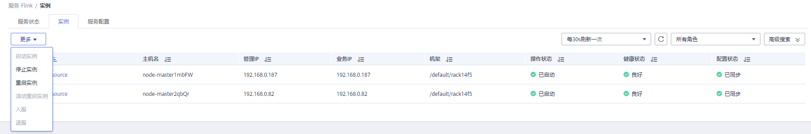

# 管理角色实例操作

## 操作场景

用户可以在MRS启动操作状态为“停止”、“停止失败”或“启动失败”角色实例，以使用该角色实例，也可以停止不再使用或异常的角色实例，或者重启异常的角色实例，以恢复角色实例功能。

## 前提条件

已完成IAM用户同步（在集群详情页的“概览”页签，单击“IAM用户同步“右侧的“单击同步”进行IAM用户同步）。

**图 1**  IAM用户同步（以MRS 1.9.2版本为例）  

## 操作步骤

1.  在集群详情页，单击“组件管理”。

    **图 2**  组件管理（以MRS 1.9.2版本为例）  
    

2.  单击服务列表中指定的服务名称。
3.  单击“实例”页签。
4.  勾选待操作角色实例前的复选框。
5.  选择“更多 \> 启动实例”、“停止实例”、“重启实例”或“滚动重启实例”等，执行相应操作。

    

