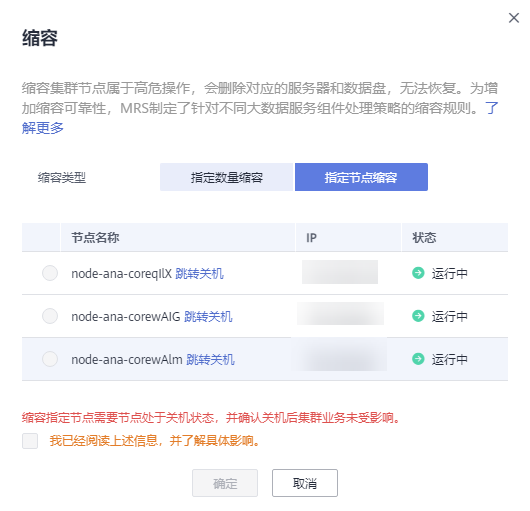
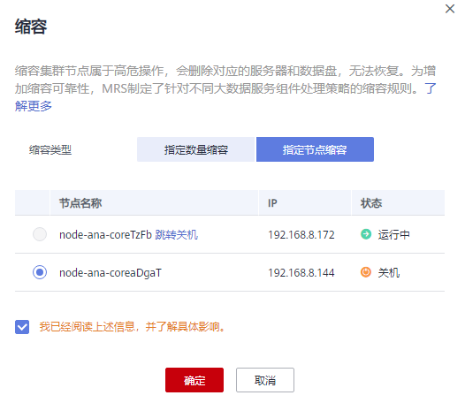

# 缩容集群

用户可以根据业务需求量，通过简单的缩减Core节点或者Task节点，对集群进行缩容，以使MRS拥有更优的存储、计算能力，降低运维成本。

当集群正在进行主备同步操作时，不允许进行缩容操作。

## 背景信息

目前支持缩容Core节点和Task节点，不支持缩容Master节点。对集群进行缩容时，只需要在界面调整节点个数，MRS会自动选择缩容节点，完成缩容任务。

自动选择缩容节点的策略如下：

-   不允许缩容安装了基础组件（Zookeeper，DBService，KrbServer，LdapServer等）的节点，MRS不会选择这些节点进行缩容。因为这些基础组件是集群运行的基础。
-   Core节点是存放集群业务数据的节点，在缩容时必须保证待缩容节点上的数据被完整迁移到其他节点，即完成各个组件的退服之后，才会执行缩容的后续操作（节点退出Manager和删除ECS等）。在选择Core节点时，会优先选择存储数据量较小，且可退服实例健康状态良好的节点，避免节点退服失败。例如在分析集群上，Core节点安装了DataNode，缩容时会优先选择DataNode存储数据量较小且健康状态良好的节点。

    Core节点在缩容的时候，会对原节点上的数据进行迁移。业务上如果对数据位置做了缓存，客户端自动刷新位置信息可能会影响时延。缩容节点可能会影响部分HBase on HDFS数据的第一次访问响应时长，可以重启HBase或者对相关的表Disable/Enable来避免。

-   Task节点本身不存储集群数据，属于计算节点，不存在节点数据迁移的问题。因此在选择Task节点时，优先选择健康状态为故障、未知、亚健康的节点进行缩容。这些节点实例的健康状态信息可以在MRS上的“实例”管理界面查看。

## 缩容校验策略

缩容节点选择完成后，为了避免组件退服失败，不同组件提供了不同的退服约束规则，只有满足了所有安装组件的退服约束规则才允许缩容。缩容校验策略如[表1](#table53894796105039)所示。

**表 1**  组件退服约束规则

<table><thead align="left"><tr id="row42511592105039"><th class="cellrowborder" valign="top" width="20.3%" id="mcps1.2.3.1.1">
组件名称

</th>
<th class="cellrowborder" valign="top" width="79.7%" id="mcps1.2.3.1.2">
退服约束规则

</th>
</tr>
</thead>
<tbody><tr id="row2747297105039"><td class="cellrowborder" valign="top" width="20.3%" headers="mcps1.2.3.1.1 ">
HDFS/DataNode

</td>
<td class="cellrowborder" valign="top" width="79.7%" headers="mcps1.2.3.1.2 ">
规则：缩容后节点数不小于当前HDFS的副本数且HDFS数据总量不超过缩容后HDFS集群总容量的80%，可以执行缩容操作。

原因：确保缩容后剩余空间足够存放现有数据，并预留一部分空间。

 说明： 

为了保证数据的可靠性，HDFS中每保存一个文件则自动生成1个备份文件，即默认共2个副本。

</td>
</tr>
<tr id="row23019148105039"><td class="cellrowborder" valign="top" width="20.3%" headers="mcps1.2.3.1.1 ">
HBase/RegionServer

</td>
<td class="cellrowborder" valign="top" width="79.7%" headers="mcps1.2.3.1.2 ">
规则：除缩容节点外，其他节点RegionServer剩余可用内存的总和，大于所选缩容节点RegionServer当前使用内存的1.2倍。

原因：当一个节点退服时，这个节点上的Region会迁移到其他节点，所以其他节点的可用内存必须足够才能负担起退服节点的Region。

</td>
</tr>
<tr id="row47718974105039"><td class="cellrowborder" valign="top" width="20.3%" headers="mcps1.2.3.1.1 ">
Storm/ Supervisor

</td>
<td class="cellrowborder" valign="top" width="79.7%" headers="mcps1.2.3.1.2 ">
规则：缩容后集群slot数足够运行当前已提交的任务。

原因：防止缩容后没有充足的资源运行流处理任务。

</td>
</tr>
<tr id="row417588611836"><td class="cellrowborder" valign="top" width="20.3%" headers="mcps1.2.3.1.1 ">
Flume/FlumeServer

</td>
<td class="cellrowborder" valign="top" width="79.7%" headers="mcps1.2.3.1.2 ">
规则：节点安装了FlumeServer，并且已经配置了Flume任务，则该节点不能删除。

原因：防止误删了已部署的业务程序。

</td>
</tr>
<tr id="row133113107231"><td class="cellrowborder" valign="top" width="20.3%" headers="mcps1.2.3.1.1 ">
IoTDB/IoTDBServer

</td>
<td class="cellrowborder" valign="top" width="79.7%" headers="mcps1.2.3.1.2 ">
规则：除缩容节点外，其他IoTDBServer实例至少保留3个。

原因：防止实例少于3个，导致IoTDB服务不可用。保障退服节点数据迁移到未退服节点。

</td>
</tr>
</tbody>
</table>

## 指定数量缩容

1.  登录MRS管理控制台。
2.  选择“集群列表 \> 现有集群”，选中一个运行中的集群并单击集群名称，进入集群信息页面。
3.  选择“节点管理”页签，在需要缩容的节点组的“操作”列，单击“缩容”，进入缩容集群页面。

    只有运行中的集群且集群中的节点都在运行中才能进行该操作。

4.  “缩容类型”选择“指定数量缩容”。
5.  设置“缩容节点数量“，并单击“确定“。

    

    > **说明：** 
    >-   缩容集群前需要检查集群安全组是否配置正确，要确保集群入方向安全组规则中有一条全部协议，全部端口，源地址为可信任的IP访问范围的规则。
    >-   若HDFS存在损坏的数据块，则缩容集群可能出现失败，请联系华为云支持人员处理。

6.  页面右上角弹出缩容节点提交成功提示框。

    集群缩容过程说明如下：

    -   缩容中：集群正在缩容时集群状态为“缩容中“。已提交的作业会继续执行，也可以提交新的作业，但不允许继续缩容和删除集群，也不建议重启集群和修改集群配置。
    -   缩容成功：集群缩容成功后集群状态为“运行中“，计费按照缩容后所使用的资源计算。
    -   缩容失败：集群缩容失败时集群状态为“运行中“。用户可以执行作业，也可以重新进行缩容操作。

    缩容成功后，可以在集群详情的“节点管理”页签查看集群的节点信息。

## 指定节点缩容

当节点不再需要时，使用该功能删除节点，删除节点时组件的角色实例不会执行退服操作，删除前请确保节点中的数据已完成备份。缩容指定节点仅支持缩容按需计费类型的节点。如需缩容包周期计费类型的节点，请参考[退订包周期集群指定节点](退订包周期集群指定节点.md)进行操作。

1.  登录Manager页面，选择“主机”。
2.  勾选待缩容主机，并选择“更多 \> 隔离”完成主机隔离。

    对于MRS 3.x之前版本集群请参考[隔离主机](隔离主机-14.md)隔离待缩容主机。

    隔离主机过程的时长取决于节点中数据量，数据量越大则时间越长，请耐心等待。

    节点隔离成功后，节点状态显示为“已隔离”。

    > **说明：** 
    >-   若主机隔离失败，请登录Manager，单击在任务列表中查询并单击隔离主机失败的任务名，根据界面提示信息处理。
    >-   隔离主机步骤可以帮您完成节点退服操作，若已确保节点中的数据已完成备份，可跳过“隔离主机”的操作，直接在ECS控制台将主机关机再进行缩容。
    >-   在主机故障场景下，请直接进行强制指定节点缩容。

3.  登录MRS控制台。
4.  单击集群名称进入集群详情页面。
5.  单击“节点管理”。
6.  单击对应节点组“操作”列的“缩容”，进入缩容页面。
7.  “缩容类型”选择“指定节点缩容”，勾选待缩容节点。

    仅处于“关机”或“失联”状态的节点可以被指定缩容。若节点无法勾选，请单击“跳转关机”进入ECS页面将对应节点关机，并在MRS集群详情页面单击“告警管理”，观察关机后是否有影响业务的告警出现，若无影响业务的告警则回到缩容页面选择对应的节点进行缩容，若有影响业务的告警请处理告警后再进行缩容。

    **图 1**  缩容指定节点  
    

8.  勾选“我已经阅读上述信息，并了解具体影响。”并单击“确定”。
9.  单击“组件管理”观察各个组件是否存在异常，若存在异常等待5\~10分钟后再次观察组件，依然存在异常则联系华为云技术支持处理。
10. 单击“告警管理”观察是否存在异常告警，若存在请清除告警后再进行其他操作。

