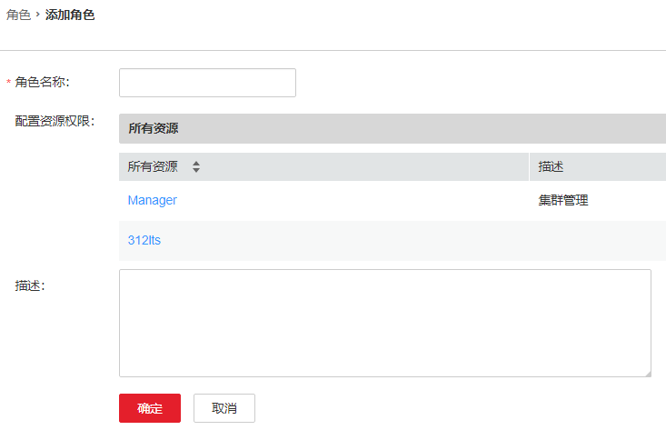

# 角色管理

## 操作场景

FusionInsight Manager最大支持5000个角色（包括系统内置角色，不包括租户自动创建的角色）。根据不同业务场景需要，管理员使用FusionInsight Manager创建并管理不同角色，通过角色对Manager和组件进行授权管理。

## 前提条件

-   管理员已明确业务需求。
-   登录FusionInsight Manager。

## 添加角色

1.  选择“系统  \>  权限  \>  角色“。
2.  单击“添加角色”，然后在“角色名称”和“描述”输入角色名字与描述。

    “角色名称”由数字、字母、或下划线组成，长度为3～50位，不能与系统中已有的角色名相同。

    **图 1**  添加角色  
    

3.  在“配置资源权限”列表，选择待增加权限的集群，为角色选择服务权限。

    在设置组件的权限时，可通过右上角的“搜索”框输入资源名称，然后单击搜索图标显示搜索结果。

    搜索范围仅包含当前权限目录，无法搜索子目录。搜索关键字支持模糊搜索，不区分大小写。

    > **说明：** 
    >-   对于已启用Ranger授权的组件（HDFS与Yarn除外），Manager上非系统默认角色的权限将无法生效，需要通过配置Ranger策略为用户组赋权。
    >-   HDFS与Yarn的资源请求在Ranger中的策略条件未能覆盖的情况下，组件ACL规则仍将生效。
    >-   设置组件的权限时，每次最大支持1000条权限。

4.  单击“确定”完成。

## 修改角色信息

在要修改信息角色所在的行，单击“修改“。

## 导出角色信息

单击“导出全部“，可一次性导出所有角色信息，可导出“TXT“或者“CSV“格式文件。

角色信息包含以下几个字段：角色名、描述、是否默认角色。

## 删除角色

在要删除角色所在行，单击“删除“。如果需要批量删除多个角色，勾选需要删除的角色后单击列表上方“删除“即可。角色被用户绑定时不可删除；如需删除，请先通过修改用户解除角色和用户之间的关联，再删除该角色。

## 任务示例（创建Manager角色）

1.  选择“系统  \>  权限  \>  角色“。
2.  单击“添加角色”，在“角色名称”和“描述”输入角色名字与描述。
3.  在“配置资源权限”区域选择“Manager”，按照以下说明设置角色“权限”。

    **图 2**  设置权限  
    

    Manager权限：

    -   Cluster：
        -   查看权限：“集群“页面查看权限、“运维 \> 告警“页面下“告警“、“事件“的查看权限。
        -   管理权限：“集群“、“运维“页面的管理权限。

    -   User：
        -   查看权限：“系统“页面下“权限“区域中内容的查看权限。
        -   管理权限：“系统“页面下“权限“区域中内容的管理权限。

    -   Audit ：

        管理权限：“审计“页面信息的管理权限。

    -   Tenant：

        管理权限：“租户“页面管理权限；“运维 \> 告警“页面下“告警“、“事件“的查看权限。

    -   System：

        管理权限：“系统“页面除“权限“区域外，其他区域的管理权限；“运维 \> 告警“页面下“告警“、“事件“的查看权限。

4.  单击“确定”完成。

