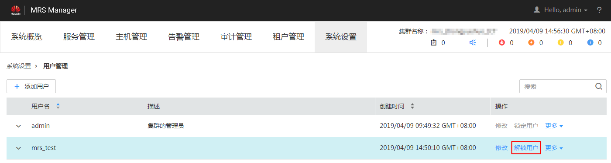

# 解锁用户

在用户输入错误密码次数大于允许输入错误次数，造成用户被锁定或者用户被管理员手动锁定后需要解锁用户的场景下，管理员用户可以通过MRS Manager为锁定的用户解锁。

## 操作步骤

1.  在MRS Manager，单击“系统设置”。
2.  在“权限配置”区域，单击“用户管理”。

    **图 1**  用户管理  
    

3.  在要解锁用户所在行，选择“解锁用户“，解锁用户。

    **图 2**  解锁用户  
    

4.  在弹出的提示窗口，单击“确定”完成解锁操作。

