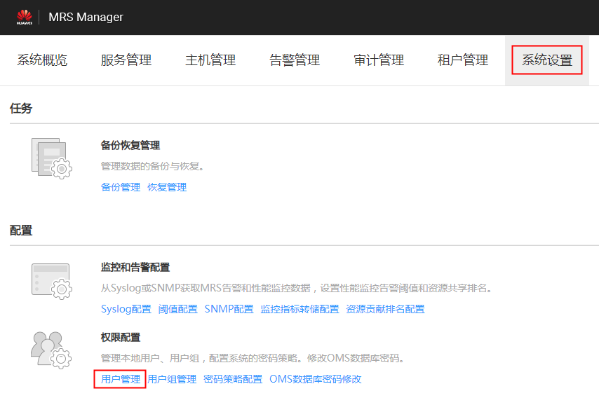
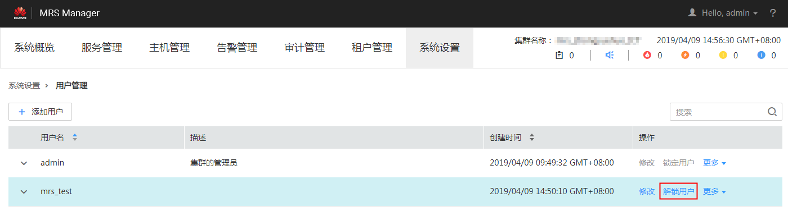

# 解锁用户

在用户输入错误密码次数大于允许输入错误次数，造成用户被锁定或者用户被管理员手动锁定后需要解锁用户的场景下，管理员用户可以通过Manager为锁定的用户解锁。开启Kerberos认证的集群或开启弹性公网IP功能的普通集群支持该操作。

> **说明：** 
>该章节操作仅适用于**MRS 3.x**之前版本集群。
>**MRS 3.x**及之后版本集群请参考[解锁用户](解锁用户-104.md)章节。

## 操作步骤

1.  访问MRS Manager，详细操作请参见[访问Manager](访问Manager-2.md)。
2.  在MRS Manager，单击“系统设置”。
3.  在“权限配置”区域，单击“用户管理”。

    **图 1**  用户管理  
    

4.  在要解锁用户所在行，选择“解锁用户“，解锁用户。

    **图 2**  解锁用户  
    

5.  在弹出的提示窗口，单击“确定”完成解锁操作。

