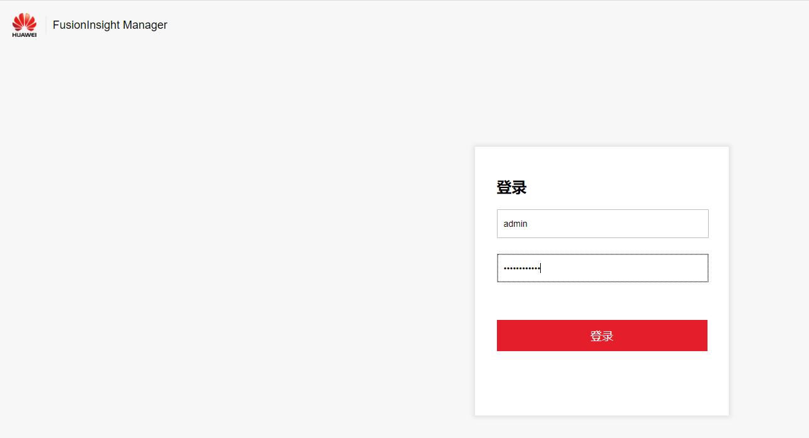

# 访问FusionInsight Manager（MRS 3.x及之后版本）

## 操作场景

MRS 3.x及之后版本的集群使用FusionInsight Manager对集群进行监控、配置和管理。用户在集群安装后可使用帐号登录FusionInsight Manager。

> **说明：** 
>如过不能正常登录组件的WebUI页面，请参考[通过ECS访问FusionInsight Manager](#section20880102283115)方式访问FusionInsight Manager。

## 通过弹性IP访问FusionInsight Manager

1.  登录MRS管理控制台页面。
2.  单击“集群列表 \> 现有集群”，在集群列表中单击指定的集群名称，进入集群信息页面。
3.  单击“集群管理页面 ”后的“前往 Manager”，在弹出的窗口中配置弹性IP信息。
    1.  若创建MRS集群时暂未绑定弹性公网IP，在“弹性公网IP”下拉框中选择可用的弹性公网IP或单击“管理弹性公网IP“新购买一个弹性公网IP。若用户创建集群时已经绑定弹性公网IP，直接执行[3.b](#li59591846143810)
    2.  在“安全组”中选择待添加的安全组规则所在安全组，该安全组在创建群时配置。
    3.  添加安全组规则，默认填充的是用户访问弹性IP地址的规则，如需开放多个IP段为可信范围用于访问Manager页面，请参考[6](#zh-cn_topic_0035209594_li1049410469610)～[9](#zh-cn_topic_0035209594_li035723593115)。如需对安全组规则进行查看，修改和删除操作，请单击“管理安全组规则“。
    4.  勾选确认信息后，单击“确定”。

4.  单击“确定“，进入Manager登录页面。
5.  输入默认用户名“admin“及创建集群时设置的密码，单击“登录“进入Manager页面。

    

6.  在MRS管理控制台，在“现有集群“ 列表，单击指定的集群名称，进入集群信息页面。

    > **说明：** 
    >如需给其他用户开通访问Manager的权限，请执行[6](#zh-cn_topic_0035209594_li1049410469610)～[9](#zh-cn_topic_0035209594_li035723593115)，添加对应用户访问公网的IP地址为可信范围。

7.  单击弹性公网IP后边的“添加安全组规则“，如[图1](#zh-cn_topic_0035209594_fig131193614465)所示。

    **图 1**  集群详情  
    

8.  进入“添加安全组规则“页面，添加需要开放权限用户访问公网的IP地址段并勾选“我确认这里设置的_公网IP_/_端口号_是可信任的公网访问IP范围，我了解使用0.0.0.0/0会带来安全风险”如[图2](#zh-cn_topic_0035209594_fig10985182312493)所示。

    **图 2**  添加安全组规则  
    

    默认填充的是用户访问公网的IP地址，用户可根据需要修改IP地址段，如需开放多个IP段为可信范围，请重复执行[6](#zh-cn_topic_0035209594_li1049410469610)-[9](#zh-cn_topic_0035209594_li035723593115)。如需对安全组规则进行查看，修改和删除操作，请单击“管理安全组规则“。

9.  单击“确定“完成安全组规则添加。

## 通过ECS访问FusionInsight Manager

1.  在MRS管理控制台，单击“集群列表“。
2.  在“现有集群“列表中，单击指定的集群名称。

    记录集群的“可用区“、“虚拟私有云“、“集群管理页面“、“安全组“。

3.  在管理控制台首页服务列表中选择“弹性云服务器”，进入ECS管理控制台，创建一个新的弹性云服务器。

    -   弹性云服务器的“可用区“、“虚拟私有云“、“安全组“，需要和待访问集群的配置相同。
    -   选择一个Windows系统的公共镜像。例如，选择一个标准镜像“Windows Server 2012 R2 Standard 64bit\(40GB\)“。
    -   其他配置参数详细信息，请参见[购买弹性云服务器](https://support.huaweicloud.com/qs-ecs/zh-cn_topic_0021831611.html)。

    > **说明：** 
    >如果ECS的安全组和Master节点的“默认安全组“不同，用户可以选择以下任一种方法修改配置：
    >-   将ECS的安全组修改为Master节点的默认安全组，请参见[更改安全组](https://support.huaweicloud.com/usermanual-ecs/ecs_03_0606.html)。
    >-   在集群Master节点和Core节点的安全组添加两条安全组规则使ECS可以访问集群，“协议“需选择为“TCP“，“端口“需分别选择“28443“和“20009“。请参见[创建安全组](https://support.huaweicloud.com/usermanual-vpc/zh-cn_topic_0013748715.html)。

4.  在VPC管理控制台，申请一个弹性IP地址，并与ECS绑定。

    具体请参见[为弹性云服务器申请和绑定弹性公网IP](https://support.huaweicloud.com/usermanual-vpc/zh-cn_topic_0013748738.html)。

5.  登录弹性云服务器。

    登录ECS需要Windows系统的帐号、密码，弹性IP地址以及配置安全组规则。具体请参见[Windows云服务器登录方式](https://support.huaweicloud.com/usermanual-ecs/zh-cn_topic_0092494943.html)。

6.  在Windows的远程桌面中，打开浏览器访问Manager。

    例如Windows 2012操作系统可以使用Internet Explorer 11。

    Manager访问地址为“集群管理页面”地址。访问时需要输入集群的用户名和密码，例如“admin“用户。

    

    > **说明：** 
    >-   如果使用其他集群用户访问Manager，第一次访问时需要修改密码。新密码需要满足集群当前的用户密码复杂度策略。请咨询管理员。
    >-   默认情况下，在登录时输入5次错误密码将锁定用户，需等待5分钟自动解锁。

7.  注销用户退出Manager时移动鼠标到右上角  ，然后单击“注销“。

