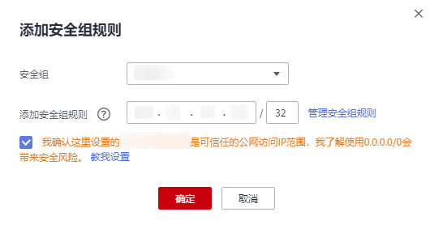

# 访问MRS Manager

## 操作场景

MRS Manager支持监控、配置和管理MRS集群，用户可以在MRS管理控制台页面打开Manager管理页面。

本章节介绍未启用Kerberos认证的集群，用户打开MRS Manager方法。启用了Kerberos认证的集群，请参见[访问支持Kerberos认证的Manager](访问支持Kerberos认证的Manager.md)访问MRS Manager。

## 操作步骤

当集群版本为**MRS 1.8.0**及以后版本时，执行如下操作：

1.  登录MRS管理控制台页面。
2.  单击“集群列表“，在“现有集群“ 列表，单击指定的集群名称，进入集群信息页面。
3.  单击“点击查看“，打开“访问MRS Manager页面“。
    -   若用户创建集群时已经绑定弹性公网IP，如[图1](#fig1768919558220)所示。
        1.  添加安全组规则，默认填充的是用户访问公网IP地址9022端口的规则，如需开放多个IP段为可信范围用于访问MRS Manager页面，请参考[6](#li1049410469610)-[9](#li035723593115)。如需对安全组规则进行查看，修改和删除操作，请单击“管理安全组规则“。

            > **说明：**   
            >-   自动获取的访问公网IP与用户本机IP不一致，属于正常现象，无需处理。  
            >-   9022端口为knox的端口，需要开启访问knox的9022端口权限，才能访问MRS Manager服务。  

        2.  勾选“我确认xx.xx.xx.xx为可信任的公网访问IP，并允许从该IP访问MRS Manager页面。“

            **图 1**  添加访问MRS Manager的安全组规则  
            

    -   若用户创建集群时暂未绑定弹性公网IP，如[图2](#fig7968172954416)所示。

        1.  在弹性公网IP下拉框中选择可用的弹性公网IP或单击“管理弹性公网IP“购买弹性公网IP。
        2.  添加安全组规则，默认填充的是用户访问公网IP地址9022端口的规则，如需开放多个IP段为可信范围用于访问MRS Manager页面，请参考[6](#li1049410469610)-[9](#li035723593115)。如需对安全组规则进行查看，修改和删除操作，请点击“管理安全组规则“。

            > **说明：**   
            >-   自动获取的访问公网IP与用户本机IP不一致，属于正常现象，无需处理。  
            >-   9022端口为knox的端口，需要开启访问knox的9022端口权限，才能访问MRS Manager服务。  

        3.  勾选“我确认xx.xx.xx.xx为可信任的公网访问IP，并允许从该IP访问MRS Manager页面。“

        **图 2**  绑定弹性公网IP  
        

4.  单击“确定“，进入MRS Manager登录页面。
5.  输入创建集群时默认的用户名“admin“及设置的密码，单击“登录“进入MRS Manager页面。
6.  在MRS管理控制台，在“现有集群“ 列表，单击指定的集群名称，进入集群信息页面。

    > **说明：**   
    >如需给其他用户开通访问MRS Manager的权限，请执行[6](#li1049410469610)-[9](#li035723593115)，添加对应用户访问公网的IP地址为可信范围。  

7.  单击弹性公网IP后边的“添加安全组规则“，如[图3](#fig131193614465)所示。

    **图 3**  集群详情  
    

8.  进入“添加安全组规则“页面，添加需要开放权限用户访问公网的IP地址段并勾选“我确认这里设置的授权对象是可信任的公网访问IP范围，禁止使用0.0.0.0/0,否则会有安全风险。“如[图4](#fig10985182312493)所示。

    **图 4**  添加安全组规则  
    

    默认填充的是用户访问公网的IP地址，用户可根据需要修改IP地址段，如需开放多个IP段为可信范围，请重复执行[6](#li1049410469610)-[9](#li035723593115)。如需对安全组规则进行查看，修改和删除操作，请点击“管理安全组规则“。

9.  单击“确定“完成安全组规则添加。

当集群版本为**MRS 1.8.0**以前版本时，执行如下操作：

1.  登录MRS管理控制台页面。
2.  单击“集群列表“，在“现有集群“ 列表，单击指定的集群名称，进入集群信息页面。
3.  单击“点击查看“，打开MRS Manager。

    成功登录MRS控制台页面后访问MRS Manager，系统默认使用“admin“用户登录，无需重新输入密码。

