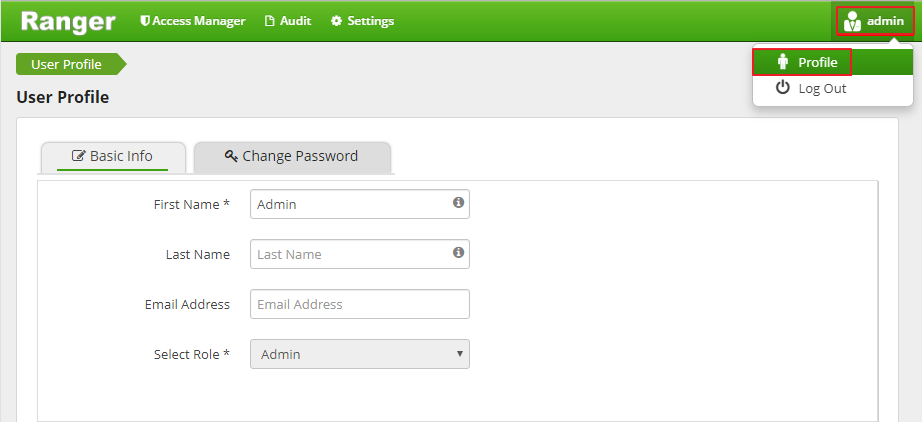
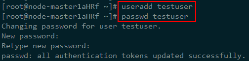
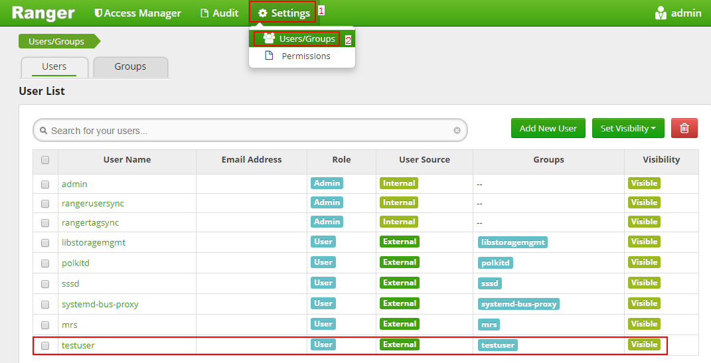

# 访问Ranger WebUI及同步Unix用户到Ranger WebUI

用户可以通过Ranger WebUI，在图形化界面上对Ranger进行管理。

## 访问Ranger Admin WebUI

1.  在MRS控制台，单击集群名称进入集群详情页面。
2.  选择“组件管理”。
3.  选择“Ranger”，在“Ranger 概述”中单击“Ranger WebUI”对应的“RangerAdmin”。
4.  进入Ranger WebUI登录界面，默认用户名/密码为admin/admin@12345。

    首次登录Ranger WebUI界面后请修改用户密码并妥善保存。

5.  用户可以单击右上角的用户名，选择下拉菜单中的“Profile”，并选择“Change Password”修改用户密码。

    **图 1**  修改Ranger WebUI登录密码  
    

6.  修改完用户密码后，单击右上角用户名，选择下拉菜单中的“Log Out”，并使用新的密码重新进行登录。

## 使用Ranger UserSync同步集群节点上的Unix操作系统用户

Ranger UserSync是Ranger中一个重要的组件，它支持将Unix系统用户或LDAP用户同步到Ranger WebUI中，目前MRS服务只支持同步Ranger UserSync进程所在节点上的Unix用户。

1.  登录到UserSync进程所在的节点。
2.  执行useradd命令新增系统用户，例如“testuser”。

    **图 2**  新增系统用户testuser  
    

3.  用户添加完成后等待1分钟左右，登录到Ranger WebUI，即可查看到该用户已经同步成功。

    **图 3**  用户同步完成  
    

