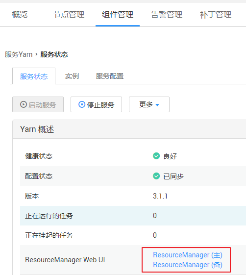
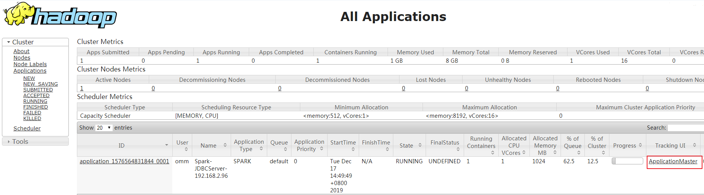
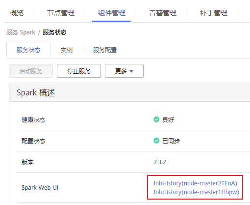
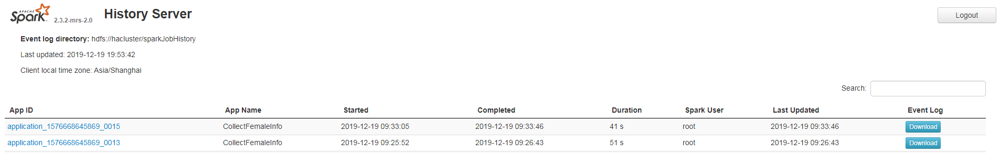

# 访问Spark Web UI界面

Spark Web UI界面主要用于查看Spark应用程序运行情况。

Spark主要有两个Web页面。

-   Spark UI页面，用于展示正在执行的应用的运行情况。

    页面主要包括了Jobs、Stages、Storage、Environment、Executors、SQL、JDBC/ODBC Server等部分。Streaming应用会多一个Streaming标签页。

-   History Server页面，用于展示已经完成的和未完成的Spark应用的运行情况。

    页面包括了应用ID、应用名称、开始时间、结束时间、执行时间、所属用户等信息。

## Spark UI

1.  登录集群详情页面，选择“组件管理”。

    > **说明：**   
    >-   若集群详情页面没有“组件管理”页签，请先完成IAM用户同步（在集群详情页的“概览”页签，单击“IAM用户同步“右侧的“点击同步”进行IAM用户同步）。  
    >-   针对MRS 1.8.10及之前版本，登录MRS Manager页面，具体请参见[访问MRS Manager](访问MRS-Manager.md)，然后选择“服务管理”。  

2.  选择“Yarn”并在“Yarn 概述“中“ResourceManager Web UI“中单击“ResourceManager Web UI”对应的“ResourceManager”进入Web界面。

    **图 1**  ResourceManager Web UI  
    

3.  查找到对应的Spark应用程序，单击应用信息的最后一列“ApplicationMaster“，即可进入Spark UI页面。

    **图 2**  ApplicationMaster  
    

    **图 3**  Spark UI页面  
    

## History Server

1.  登录集群详情页面，选择“组件管理”。

    > **说明：**   
    >-   若集群详情页面没有“组件管理”页签，请先完成IAM用户同步（在集群详情页的“概览”页签，单击“IAM用户同步“右侧的“点击同步”进行IAM用户同步）。  
    >-   针对MRS 1.8.10及之前版本，登录MRS Manager页面，具体请参见[访问MRS Manager](访问MRS-Manager.md)，然后选择“服务管理”。  

2.  选择“Spark”并在“Spark 概述“中“Spark Web UI“中单击“Spark Web UI”对应的“JobHistory”进入Web界面。

    **图 4**  ResourceManager Web UI  
    

    **图 5**  Spark History Server  
    

