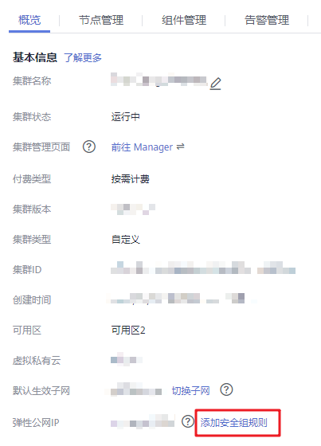

# 访问支持Kerberos认证的Manager<a name="ZH-CN_TOPIC_0050661066"></a>

## 操作场景<a name="zh-cn_topic_0046344332_section946489710657"></a>

用户在创建了支持Kerberos认证的MRS集群之后，可以使用MRS Manager管理运行中的集群。

该任务指导用户访问MRS Manager。

## 对系统的影响<a name="zh-cn_topic_0046344332_section61564112104752"></a>

第一次访问MRS Manager，需要在浏览器中添加站点信任以继续打开Manager。

## 前提条件<a name="zh-cn_topic_0046344332_section66680320101755"></a>

获取管理员用户“admin“帐号密码。“admin“密码在创建MRS集群时由用户指定。

## 操作步骤<a name="zh-cn_topic_0046344332_section27773980101848"></a>

当集群版本为**MRS 1.8.0**及以后版本时，执行如下操作：

1.  登录MRS管理控制台页面。
2.  单击“集群列表“，在“现有集群“ 列表，单击指定的集群名称，进入集群信息页面。
3.  单击“点击查看“，打开“访问MRS Manager页面“。
    -   若用户创建集群时已经绑定弹性公网IP，如[图1](#zh-cn_topic_0035209594_fig1768919558220)所示。
        1.  添加安全组规则，默认填充的是用户访问公网IP地址9022端口的规则，如需开放多个IP段为可信范围用于访问MRS Manager页面，请参考[6](#zh-cn_topic_0035209594_li1049410469610)-[9](#zh-cn_topic_0035209594_li035723593115)。如需对安全组规则进行查看，修改和删除操作，请单击“管理安全组规则“。

            > **说明：**   
            >-   自动获取的访问公网IP与用户本机IP不一致，属于正常现象，无需处理。  
            >-   9022端口为knox的端口，需要开启访问knox的9022端口权限，才能访问MRS Manager服务。  

        2.  勾选“我确认xx.xx.xx.xx为可信任的公网访问IP，并允许从该IP访问MRS Manager页面。“

            **图 1**  添加访问MRS Manager的安全组规则<a name="zh-cn_topic_0035209594_fig1768919558220"></a>  
            


    -   若用户创建集群时暂未绑定弹性公网IP，如[图2](#zh-cn_topic_0035209594_fig7968172954416)所示。

        1.  在弹性公网IP下拉框中选择可用的弹性公网IP或单击“管理弹性公网IP“购买弹性公网IP。
        2.  添加安全组规则，默认填充的是用户访问公网IP地址9022端口的规则，如需开放多个IP段为可信范围用于访问MRS Manager页面，请参考[6](#zh-cn_topic_0035209594_li1049410469610)-[9](#zh-cn_topic_0035209594_li035723593115)。如需对安全组规则进行查看，修改和删除操作，请点击“管理安全组规则“。

            > **说明：**   
            >-   自动获取的访问公网IP与用户本机IP不一致，属于正常现象，无需处理。  
            >-   9022端口为knox的端口，需要开启访问knox的9022端口权限，才能访问MRS Manager服务。  

        3.  勾选“我确认xx.xx.xx.xx为可信任的公网访问IP，并允许从该IP访问MRS Manager页面。“

        **图 2**  绑定弹性公网IP<a name="zh-cn_topic_0035209594_fig7968172954416"></a>  
        


4.  单击“确定“，进入MRS Manager登录页面。
5.  输入创建集群时默认的用户名“admin“及设置的密码，单击“登录“进入MRS Manager页面。
6.  <a name="zh-cn_topic_0035209594_li1049410469610"></a>在MRS管理控制台，在“现有集群“ 列表，单击指定的集群名称，进入集群信息页面。

    > **说明：**   
    >如需给其他用户开通访问MRS Manager的权限，请执行[6](#zh-cn_topic_0035209594_li1049410469610)-[9](#zh-cn_topic_0035209594_li035723593115)，添加对应用户访问公网的IP地址为可信范围。  

7.  单击弹性公网IP后边的“添加安全组规则“，如[图3](#zh-cn_topic_0035209594_fig131193614465)所示。

    **图 3**  集群详情<a name="zh-cn_topic_0035209594_fig131193614465"></a>  
    

8.  进入“添加安全组规则“页面，添加需要开放权限用户访问公网的IP地址段并勾选“我确认这里设置的授权对象是可信任的公网访问IP范围，禁止使用0.0.0.0/0,否则会有安全风险。“如[图4](#zh-cn_topic_0035209594_fig10985182312493)所示。

    **图 4**  添加安全组规则<a name="zh-cn_topic_0035209594_fig10985182312493"></a>  
    

    默认填充的是用户访问公网的IP地址，用户可根据需要修改IP地址段，如需开放多个IP段为可信范围，请重复执行[6](#zh-cn_topic_0035209594_li1049410469610)-[9](#zh-cn_topic_0035209594_li035723593115)。如需对安全组规则进行查看，修改和删除操作，请点击“管理安全组规则“。

9.  <a name="zh-cn_topic_0035209594_li035723593115"></a>单击“确定“完成安全组规则添加。

当集群版本为**MRS 1.8.0**以前版本时，执行如下操作：

1.  在MRS管理控制台，单击“集群列表“。

    > **说明：**   
    >-   访问支持Kerberos认证的Manager方法请参考[步骤2](#li5015950919196)-[步骤7](#li50039481113739)，或者请参考[创建连接MRS集群的SSH隧道并配置浏览器](创建连接MRS集群的SSH隧道并配置浏览器.md)。  
    >-   分析集群和流式集群访问支持Kerberos认证的Manager方法相同。  

2.  <a name="li5015950919196"></a>在  “现有集群“  列表中，单击指定的集群名称。

    记录集群的“可用分区“、“虚拟私有云“、“集群控制台地址“，以及Master节点的“默认安全组“。

3.  在ECS管理控制台，创建一个新的弹性云服务器。

    -   弹性云服务器的“可用分区“、“虚拟私有云“、“安全组“，需要和待访问集群的配置相同。
    -   选择一个Windows系统的公共镜像。例如，选择一个标准镜像“Windows Server 2012 R2 Standard 64bit\(40GB\)“。
    -   其他配置参数详细信息，请参见“弹性云服务器 \> 快速入门 \> 购买并登录Windows弹性云服务器“

    > **说明：**   
    >如果ECS的安全组和Master节点的“默认安全组“不同，用户可以选择以下任一种方法修改配置：  
    >-   将ECS的安全组修改为Master节点的默认安全组，请参见“弹性云服务器  \>  用户指南  \>  网络  \>  更改安全组“。  
    >-   在集群Master节点和Core节点的安全组添加两条安全组规则使ECS可以访问集群，“协议“需选择为“TCP“，“端口“需分别选择“28443“和“20009“。请参见“虚拟私有云 \> 用户指南 \> 安全性 \> 安全组 \> 添加安全组规则“。  

4.  在VPC管理控制台，申请一个弹性IP地址，并与ECS绑定。

    具体请参见“虚拟私有云  \>  用户指南  \>  弹性公网IP  \>  为弹性云服务器申请和绑定弹性公网IP“。

5.  登录弹性云服务器。

    登录ECS需要Windows系统的帐号、密码，弹性IP地址以及配置安全组规则。具体请参见“弹性云服务器 \> 用户指南 \> 实例 \> 登录Windows弹性云服务器“。

6.  在Windows的远程桌面中，打开浏览器访问Manager。

    例如Windows 2012操作系统可以使用Internet Explorer 11。

    Manager访问地址形式为**https://_集群控制台地址_:28443/web**。访问时需要输入MRS集群的用户名和密码，例如“admin“用户。

    > **说明：**   
    >-   如果使用其他MRS集群用户访问Manager，第一次访问时需要修改密码。新密码需要满足集群当前的用户密码复杂度策略。请咨询管理员。  
    >-   默认情况下，在登录时输入5次错误密码将锁定用户，需等待5分钟自动解锁。  

7.  <a name="li50039481113739"></a>注销用户退出Manager时移动鼠标到右上角  ，然后单击“注销“。

## 相关任务<a name="section5824002417933"></a>

**配置集群节点名称与IP地址映射**

1.  登录MRS Manager，单击“主机管理“。

    记录集群中所有节点的“主机名称“和“管理IP“。

2.  在工作环境使用“记事本“打开“hosts“文件，将节点名称与IP地址的对应关系填写到文件中。

    每个对应关系填写一行，填写效果例如：

    ```
    192.168.4.127 node-core-Jh3ER
    192.168.4.225 node-master2-PaWVE
    192.168.4.19 node-core-mtZ81
    192.168.4.33 node-master1-zbYN8
    192.168.4.233 node-core-7KoGY
    ```

    保存修改。


