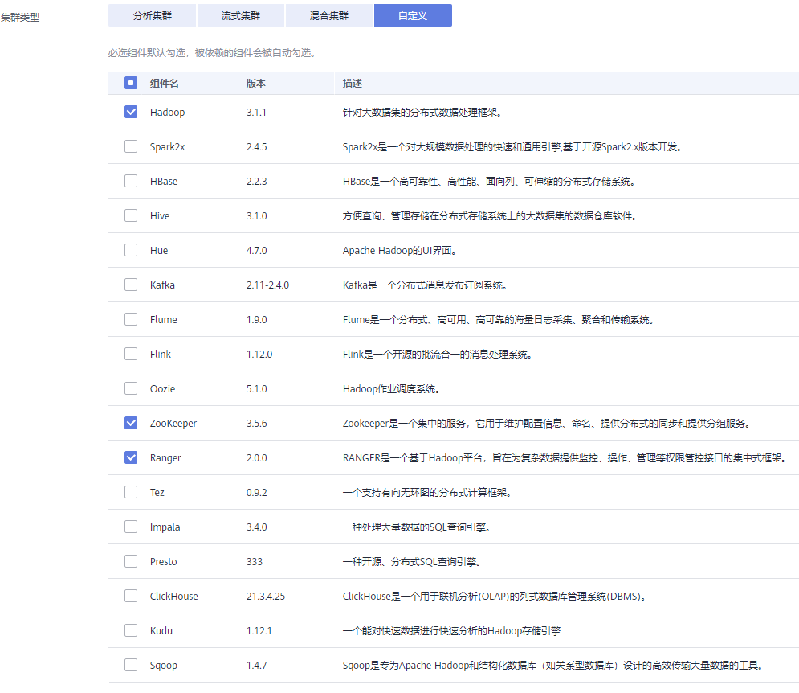

# 购买自定义拓扑集群

MRS当前提供的“分析集群”、“流式集群”和“混合集群”采用固定模板进行部署集群的进程，无法满足用户自定义部署管理角色和控制角色在集群节点中的需求。如需自定义集群部署方式，可在创建集群时的“集群类型”选择“自定义”，实现用户自主定义集群的进程实例在集群节点中的部署方式。仅MRS 3.x及之后版本支持创建自定义拓扑集群。

自定义集群可实现以下功能：

-   管控分离部署，管理角色和控制角色分别部署在不同的Master节点中。
-   管控合设部署，管理角色和控制角色共同部署在Master节点中。
-   ZooKeeper单独节点部署，增加可靠性。
-   组件分开部署，避免资源争抢。

MRS集群中角色类型：

-   管理角色：Management Node\(MN\)，安装Manager，即MRS集群的管理系统，提供统一的访问入口。Manager对部署在集群中的节点及服务进行集中管理。
-   控制角色：Control Node\(CN\)，控制监控数据角色执行存储数据、接收数据、发送进程状态及完成控制节点的公共功能。 MRS的控制节点包括HMaster、HiveServer、ResourceManager、NameNode、JournalNode、SlapdServer等。
-   数据角色：Data Node\(DN\)，执行管理角色发出的指示，上报任务状态、存储数据，以及执行数据节点的公共功能。MRS的数据节点包括DataNode、RegionServer、NodeManager等。

## 创建自定义集群

1.  登录MRS管理控制台。
2.  单击“购买集群“，进入“购买集群“页面。
3.  在购买集群页面，选择“自定义购买”页签。
4.  参考下列参数说明配置集群软件信息，参数详细信息请参考[软件配置](购买自定义集群.md#section48591411155214)。
    -   区域：默认即可。
    -   集群名称：可以设置为系统默认名称，但为了区分和记忆，建议带上项目拼音缩写或者日期等。例如：“mrs\_20180321”。
    -   集群版本：目前仅MRS 3.x版本支持。
    -   集群类型：选择“自定义”并根据需要勾选对应组件。

        

5.  单击“下一步”，并配置硬件信息。
    -   计费模式：默认即可。
    -   可用区：默认即可。
    -   虚拟私有云：默认即可。如果没有虚拟私有云，请单击“查看虚拟私有云”进入虚拟私有云，创建一个新的虚拟私有云。
    -   子网：默认即可。
    -   安全组：选择“自动创建”。
    -   弹性公网IP：选择“暂不绑定”。
    -   企业项目：默认即可。
    -   CPU架构：默认即可。MRS 3.x版本无该参数。
    -   常用模板：具体说明请参见[自定义集群模板说明](#section126281336123311)。
    -   实例规格：单击配置实例规格、系统盘和数据盘存储类型和存储空间。
    -   实例数量：请根据业务量调整集群实例数量。具体可参考[表2](#net)。
    -   拓扑调整：若常用模板中的部署方式不满足需求，请设置“拓扑调整”为“开启”，然后根据业务需要调整实例部署方式，具体说明请参见[自定义集群拓扑调整说明](#section1948791193417)。

6.  单击“下一步“进入高级配置页签。

    参数说明请参见[高级配置（可选）](购买自定义集群.md#section15766698552)。

7.  单击“立即购买”。

    当集群开启Kerberos认证时，需要确认是否需要开启Kerberos认证，若确认开启请单击“继续”，若无需开启Kerberos认证请单击“返回”关闭Kerberos认证后再创建集群。

8.  单击“返回集群列表”，可以查看到集群创建的状态。

    集群创建需要时间，所创集群的初始状态为“启动中”，创建成功后状态更新为“运行中”，请您耐心等待。

## 自定义集群模板说明

**表 1**  自定义集群常用模板说明

<table><thead align="left"><tr id="row374312716349"><th class="cellrowborder" valign="top" width="20%" id="mcps1.2.4.1.1">
常用模板

</th>
<th class="cellrowborder" valign="top" width="40%" id="mcps1.2.4.1.2">
说明

</th>
<th class="cellrowborder" valign="top" width="40%" id="mcps1.2.4.1.3">
节点数量范围

</th>
</tr>
</thead>
<tbody><tr id="row4743727143413"><td class="cellrowborder" valign="top" width="20%" headers="mcps1.2.4.1.1 ">
管控合设

</td>
<td class="cellrowborder" valign="top" width="40%" headers="mcps1.2.4.1.2 ">
管理角色和控制角色共同部署在Master节点中，数据实例合设在同一节点组。该部署方式适用于100个以下的节点，可以减少成本。

</td>
<td class="cellrowborder" valign="top" width="40%" headers="mcps1.2.4.1.3 "><ul id="ul2720205124212"><li>Master节点数量大于等于3个，小于等于11个。</li><li>节点组数量总和小于等于10个，非Master节点组中节点数量总和小于等于10000个。</li></ul>
</td>
</tr>
<tr id="row197436270343"><td class="cellrowborder" valign="top" width="20%" headers="mcps1.2.4.1.1 ">
管控分设

</td>
<td class="cellrowborder" valign="top" width="40%" headers="mcps1.2.4.1.2 ">
管理角色和控制角色分别部署在不同的Master节点中，数据实例合设在同一节点组。该部署方式适用于100-500个节点，在高并发负载情况下表现更好。

</td>
<td class="cellrowborder" valign="top" width="40%" headers="mcps1.2.4.1.3 "><ul id="ul163484153427"><li>Master节点数量大于等于5个，小于等于11个。</li><li>节点组数量总和小于等于10个，非Master节点组中节点数量总和小于等于10000个。</li></ul>
</td>
</tr>
<tr id="row37431727143410"><td class="cellrowborder" valign="top" width="20%" headers="mcps1.2.4.1.1 ">
数据分设

</td>
<td class="cellrowborder" valign="top" width="40%" headers="mcps1.2.4.1.2 ">
管理角色和控制角色分别部署在不同的Master节点中，数据实例分设在不同节点组。该部署方式适用于500个以上的节点，可以将各组件进一步分开部署，适用于更大的集群规模。

</td>
<td class="cellrowborder" valign="top" width="40%" headers="mcps1.2.4.1.3 "><ul id="ul1817091724212"><li>Master节点数量大于等于9个，小于等于11个。</li><li>节点组数量总和小于等于10个，非Master节点组中节点数量总和小于等于10000个。</li></ul>
</td>
</tr>
</tbody>
</table>

**表 2**  MRS自定义集群节点部署方案

<table><thead align="left"><tr id="row10039559"><th class="cellrowborder" colspan="2" valign="top" id="mcps1.2.5.1.1">
节点部署原则

</th>
<th class="cellrowborder" valign="top" id="mcps1.2.5.1.2">
适用场景

</th>
<th class="cellrowborder" valign="top" id="mcps1.2.5.1.3">
组网规则

</th>
</tr>
</thead>
<tbody><tr id="row44239936145543"><td class="cellrowborder" rowspan="3" valign="top" width="12.41%" headers="mcps1.2.5.1.1 ">
管理节点、控制节点和数据节点分开部署

（此方案至少需要8个节点）

</td>
<td class="cellrowborder" valign="top" width="16.85%" headers="mcps1.2.5.1.1 ">
MN × 2 + CN × 9 + DN  × n

</td>
<td class="cellrowborder" valign="top" width="34.150000000000006%" headers="mcps1.2.5.1.2 ">
（推荐）数据节点数500-2000时采用此方案

</td>
<td class="cellrowborder" rowspan="3" valign="top" width="36.59%" headers="mcps1.2.5.1.3 "><ul id="ul6299583717377"><li>集群节点数超过200时，各节点划分到不同子网，各子网通过核心交换机三层互联，每个子网的节点数控制在200个以内，不同子网中节点数量请保持均衡。</li><li>集群节点数低于200时，各节点部署在同一子网，集群内通过汇聚交换机二层互联。</li></ul>
</td>
</tr>
<tr id="row7662382145535"><td class="cellrowborder" valign="top" headers="mcps1.2.5.1.1 ">
MN × 2 + CN × 5 + DN  × n

</td>
<td class="cellrowborder" valign="top" headers="mcps1.2.5.1.1 ">
（推荐）数据节点数100-500时采用此方案

</td>
</tr>
<tr id="row55569377145557"><td class="cellrowborder" valign="top" headers="mcps1.2.5.1.1 ">
MN × 2 + CN × 3 + DN  × n

</td>
<td class="cellrowborder" valign="top" headers="mcps1.2.5.1.1 ">
（推荐）数据节点数30-100时采用此方案

</td>
</tr>
<tr id="row63016113"><td class="cellrowborder" valign="top" width="12.41%" headers="mcps1.2.5.1.1 ">
管理节点和控制节点合并部署，数据节点单独部署

</td>
<td class="cellrowborder" valign="top" width="16.85%" headers="mcps1.2.5.1.1 ">
(MN+CN) × 3 + DN  × n

</td>
<td class="cellrowborder" valign="top" width="34.150000000000006%" headers="mcps1.2.5.1.2 ">
（推荐）数据节点数3-30时采用此方案

</td>
<td class="cellrowborder" valign="top" width="36.59%" headers="mcps1.2.5.1.3 ">
集群内节点部署在同一子网，集群内通过汇聚交换机二层互联。

</td>
</tr>
<tr id="row23700453"><td class="cellrowborder" colspan="2" valign="top" headers="mcps1.2.5.1.1 ">
管理节点、控制节点和数据节点合并部署

</td>
<td class="cellrowborder" valign="top" headers="mcps1.2.5.1.2 "><ul id="ul65677640"><li>节点数小于6的集群使用此方案</li><li>此方案至少需要3个节点</li></ul>

 说明： 

生产环境或商用环境不推荐使用此场景：

<ul id="ul44847690"><li>管理节点、控制节点和数据节点合并部署时，集群性能和可靠性都会产生较大影响。</li><li>如节点数量满足需求，建议将数据节点单独部署。</li><li>如节点数量不满足将数据节点单独部署的要求，必须使用此场景时，需要使用双平面组网方式。将管理网络与业务网络流量隔离，防止业务平面的数据量过大，导致管理操作不能正常下发。</li></ul>

</td>
<td class="cellrowborder" valign="top" headers="mcps1.2.5.1.3 ">
集群内节点部署在同一子网，集群内通过汇聚交换机二层互联。

</td>
</tr>
</tbody>
</table>

## 自定义集群拓扑调整说明

**表 3**  拓扑调整说明

<table><thead align="left"><tr id="row585414719337"><th class="cellrowborder" valign="top" width="15.000000000000002%" id="mcps1.2.6.1.1">
服务名称

</th>
<th class="cellrowborder" valign="top" width="15.000000000000002%" id="mcps1.2.6.1.2">
依赖关系

</th>
<th class="cellrowborder" valign="top" width="15.000000000000002%" id="mcps1.2.6.1.3">
角色名称

</th>
<th class="cellrowborder" valign="top" width="27.480000000000004%" id="mcps1.2.6.1.4">
角色业务部署建议

</th>
<th class="cellrowborder" valign="top" width="27.520000000000007%" id="mcps1.2.6.1.5">
说明

</th>
</tr>
</thead>
<tbody><tr id="row138541947133317"><td class="cellrowborder" valign="top" width="15.000000000000002%" headers="mcps1.2.6.1.1 ">
OMSServer

</td>
<td class="cellrowborder" valign="top" width="15.000000000000002%" headers="mcps1.2.6.1.2 ">
-

</td>
<td class="cellrowborder" valign="top" width="15.000000000000002%" headers="mcps1.2.6.1.3 ">
OMSServer

</td>
<td class="cellrowborder" valign="top" width="27.480000000000004%" headers="mcps1.2.6.1.4 ">
部署在Master节点上，不支持修改。

</td>
<td class="cellrowborder" valign="top" width="27.520000000000007%" headers="mcps1.2.6.1.5 ">
-

</td>
</tr>
<tr id="row432418118472"><td class="cellrowborder" rowspan="2" valign="top" width="15.000000000000002%" headers="mcps1.2.6.1.1 ">
ClickHouse

</td>
<td class="cellrowborder" rowspan="2" valign="top" width="15.000000000000002%" headers="mcps1.2.6.1.2 ">
依赖ZooKeeper

</td>
<td class="cellrowborder" valign="top" width="15.000000000000002%" headers="mcps1.2.6.1.3 ">
ClickHouseServer

</td>
<td class="cellrowborder" valign="top" width="27.480000000000004%" headers="mcps1.2.6.1.4 ">
所有节点均可部署。

角色实例部署数量范围：偶数个，2~256。

</td>
<td class="cellrowborder" valign="top" width="27.520000000000007%" headers="mcps1.2.6.1.5 ">
部署了该角色的非Master节点组会被认为是Core节点类型。

</td>
</tr>
<tr id="row208672478610"><td class="cellrowborder" valign="top" headers="mcps1.2.6.1.1 ">
ClickHouseBalancer

</td>
<td class="cellrowborder" valign="top" headers="mcps1.2.6.1.2 ">
所有节点均可部署。

角色实例部署数量范围：2~256。

</td>
<td class="cellrowborder" valign="top" headers="mcps1.2.6.1.3 ">
-

</td>
</tr>
<tr id="row248821732112"><td class="cellrowborder" valign="top" width="15.000000000000002%" headers="mcps1.2.6.1.1 ">
DBService

</td>
<td class="cellrowborder" valign="top" width="15.000000000000002%" headers="mcps1.2.6.1.2 ">
-

</td>
<td class="cellrowborder" valign="top" width="15.000000000000002%" headers="mcps1.2.6.1.3 ">
DBServer

</td>
<td class="cellrowborder" valign="top" width="27.480000000000004%" headers="mcps1.2.6.1.4 ">
只能部署在Master节点上。

角色实例部署数量范围：1~2。

</td>
<td class="cellrowborder" valign="top" width="27.520000000000007%" headers="mcps1.2.6.1.5 ">
-

</td>
</tr>
<tr id="row1761201632110"><td class="cellrowborder" valign="top" width="15.000000000000002%" headers="mcps1.2.6.1.1 ">
ZooKeeper

</td>
<td class="cellrowborder" valign="top" width="15.000000000000002%" headers="mcps1.2.6.1.2 ">
-

</td>
<td class="cellrowborder" valign="top" width="15.000000000000002%" headers="mcps1.2.6.1.3 ">
QP(quorumpeer)

</td>
<td class="cellrowborder" valign="top" width="27.480000000000004%" headers="mcps1.2.6.1.4 ">
只能部署在Master节点上。

角色实例部署数量范围：1或者3或者5。

</td>
<td class="cellrowborder" valign="top" width="27.520000000000007%" headers="mcps1.2.6.1.5 ">
-

</td>
</tr>
<tr id="row5855134710334"><td class="cellrowborder" rowspan="7" valign="top" width="15.000000000000002%" headers="mcps1.2.6.1.1 ">
Hadoop

</td>
<td class="cellrowborder" rowspan="7" valign="top" width="15.000000000000002%" headers="mcps1.2.6.1.2 ">
依赖ZooKeeper

</td>
<td class="cellrowborder" valign="top" width="15.000000000000002%" headers="mcps1.2.6.1.3 ">
NN(NameNode)

</td>
<td class="cellrowborder" valign="top" width="27.480000000000004%" headers="mcps1.2.6.1.4 ">
只能部署在Master节点上。

角色实例部署数量范围：1~2。

</td>
<td class="cellrowborder" valign="top" width="27.520000000000007%" headers="mcps1.2.6.1.5 ">
NameNode与Zkfc进程共机部署用于集群高可用

</td>
</tr>
<tr id="row1485514472335"><td class="cellrowborder" valign="top" headers="mcps1.2.6.1.1 ">
JN(JournalNode)

</td>
<td class="cellrowborder" valign="top" headers="mcps1.2.6.1.2 ">
只能部署在Master节点上。

角色实例部署数量范围：1或者3。

</td>
<td class="cellrowborder" valign="top" headers="mcps1.2.6.1.3 ">
-

</td>
</tr>
<tr id="row187933355380"><td class="cellrowborder" valign="top" headers="mcps1.2.6.1.1 ">
DN(DataNode)

</td>
<td class="cellrowborder" valign="top" headers="mcps1.2.6.1.2 ">
所有节点均可部署。

角色实例部署数量范围：1~所有节点实例。

</td>
<td class="cellrowborder" valign="top" headers="mcps1.2.6.1.3 ">
部署了该角色的非Master节点组会被认为是Core节点类型。

</td>
</tr>
<tr id="row127113663813"><td class="cellrowborder" valign="top" headers="mcps1.2.6.1.1 ">
RM(ResourceManager)

</td>
<td class="cellrowborder" valign="top" headers="mcps1.2.6.1.2 ">
只能部署在Master节点上。

角色实例部署数量范围：1~2。

</td>
<td class="cellrowborder" valign="top" headers="mcps1.2.6.1.3 ">
-

</td>
</tr>
<tr id="row02226367388"><td class="cellrowborder" valign="top" headers="mcps1.2.6.1.1 ">
NM(NodeManager)

</td>
<td class="cellrowborder" valign="top" headers="mcps1.2.6.1.2 ">
所有节点均可部署。

角色实例部署数量范围：1~所有节点实例。

</td>
<td class="cellrowborder" valign="top" headers="mcps1.2.6.1.3 ">
-

</td>
</tr>
<tr id="row1448483612381"><td class="cellrowborder" valign="top" headers="mcps1.2.6.1.1 ">
JHS(JobHistoryServer)

</td>
<td class="cellrowborder" valign="top" headers="mcps1.2.6.1.2 ">
只能部署在Master节点上。

角色实例部署数量范围：1~2。

</td>
<td class="cellrowborder" valign="top" headers="mcps1.2.6.1.3 ">
-

</td>
</tr>
<tr id="row177231336203818"><td class="cellrowborder" valign="top" headers="mcps1.2.6.1.1 ">
TLS(TimelineServer)

</td>
<td class="cellrowborder" valign="top" headers="mcps1.2.6.1.2 ">
只能部署在Master节点上。

角色实例部署数量范围：1。

</td>
<td class="cellrowborder" valign="top" headers="mcps1.2.6.1.3 ">
-

</td>
</tr>
<tr id="row12889123614383"><td class="cellrowborder" rowspan="2" valign="top" width="15.000000000000002%" headers="mcps1.2.6.1.1 ">
Presto

</td>
<td class="cellrowborder" rowspan="2" valign="top" width="15.000000000000002%" headers="mcps1.2.6.1.2 ">
依赖Hive

</td>
<td class="cellrowborder" valign="top" width="15.000000000000002%" headers="mcps1.2.6.1.3 ">
PCD(Coordinator)

</td>
<td class="cellrowborder" valign="top" width="27.480000000000004%" headers="mcps1.2.6.1.4 ">
只能部署在Master节点上。

角色实例部署数量范围：1~2。

</td>
<td class="cellrowborder" valign="top" width="27.520000000000007%" headers="mcps1.2.6.1.5 ">
-

</td>
</tr>
<tr id="row20971737133818"><td class="cellrowborder" valign="top" headers="mcps1.2.6.1.1 ">
PWK(Worker)

</td>
<td class="cellrowborder" valign="top" headers="mcps1.2.6.1.2 ">
所有节点均可部署。

角色实例部署数量范围：1~所有节点实例。

</td>
<td class="cellrowborder" valign="top" headers="mcps1.2.6.1.3 ">
-

</td>
</tr>
<tr id="row68351752111916"><td class="cellrowborder" rowspan="4" valign="top" width="15.000000000000002%" headers="mcps1.2.6.1.1 ">
Spark2x

</td>
<td class="cellrowborder" rowspan="4" valign="top" width="15.000000000000002%" headers="mcps1.2.6.1.2 "><ul id="mrs_01_0121_ul152010435234"><li>依赖Hadoop</li><li>依赖Hive</li></ul>
</td>
<td class="cellrowborder" valign="top" width="15.000000000000002%" headers="mcps1.2.6.1.3 ">
JS2x(JDBCServer)

</td>
<td class="cellrowborder" valign="top" width="27.480000000000004%" headers="mcps1.2.6.1.4 ">
只能部署在Master节点上。

角色实例部署数量范围：2~所有master节点。

</td>
<td class="cellrowborder" valign="top" width="27.520000000000007%" headers="mcps1.2.6.1.5 ">
-

</td>
</tr>
<tr id="row164945562199"><td class="cellrowborder" valign="top" headers="mcps1.2.6.1.1 ">
JH2x(JobHistory)

</td>
<td class="cellrowborder" valign="top" headers="mcps1.2.6.1.2 ">
只能部署在Master节点上。

角色实例部署数量范围：1~2。

</td>
<td class="cellrowborder" valign="top" headers="mcps1.2.6.1.3 ">
-

</td>
</tr>
<tr id="row31821659171916"><td class="cellrowborder" valign="top" headers="mcps1.2.6.1.1 ">
SR2x(SparkResource)

</td>
<td class="cellrowborder" valign="top" headers="mcps1.2.6.1.2 ">
只能部署在Master节点上。

角色实例部署数量范围：2~所有master节点。

</td>
<td class="cellrowborder" valign="top" headers="mcps1.2.6.1.3 ">
-

</td>
</tr>
<tr id="row16522131122013"><td class="cellrowborder" valign="top" headers="mcps1.2.6.1.1 ">
IS2X(IndexServer2x)

</td>
<td class="cellrowborder" valign="top" headers="mcps1.2.6.1.2 ">
（可选）只能部署在Master节点行。

角色实例部署数量范围：0~2。

</td>
<td class="cellrowborder" valign="top" headers="mcps1.2.6.1.3 ">
-

</td>
</tr>
<tr id="row209644379387"><td class="cellrowborder" rowspan="4" valign="top" width="15.000000000000002%" headers="mcps1.2.6.1.1 ">
HBase

</td>
<td class="cellrowborder" rowspan="4" valign="top" width="15.000000000000002%" headers="mcps1.2.6.1.2 ">
依赖Hadoop

</td>
<td class="cellrowborder" valign="top" width="15.000000000000002%" headers="mcps1.2.6.1.3 ">
HM(HMaster)

</td>
<td class="cellrowborder" valign="top" width="27.480000000000004%" headers="mcps1.2.6.1.4 ">
只能部署在Master节点上。

角色实例部署数量范围：1~2。

</td>
<td class="cellrowborder" valign="top" width="27.520000000000007%" headers="mcps1.2.6.1.5 ">
-

</td>
</tr>
<tr id="row181587383381"><td class="cellrowborder" valign="top" headers="mcps1.2.6.1.1 ">
TS (ThriftServer)

</td>
<td class="cellrowborder" valign="top" headers="mcps1.2.6.1.2 ">
只能部署在Master节点上。

角色实例部署数量范围：1~所有master节点。

</td>
<td class="cellrowborder" valign="top" headers="mcps1.2.6.1.3 ">
-

</td>
</tr>
<tr id="row12855184713312"><td class="cellrowborder" valign="top" headers="mcps1.2.6.1.1 ">
RT(RESTServer)

</td>
<td class="cellrowborder" valign="top" headers="mcps1.2.6.1.2 ">
只能部署在Master节点上。

角色实例部署数量范围：1~所有master节点。

</td>
<td class="cellrowborder" valign="top" headers="mcps1.2.6.1.3 ">
-

</td>
</tr>
<tr id="row8589124716403"><td class="cellrowborder" valign="top" headers="mcps1.2.6.1.1 ">
RS(RegionServer)

</td>
<td class="cellrowborder" valign="top" headers="mcps1.2.6.1.2 ">
所有节点均可部署。

角色实例部署数量范围：1~所有节点。

</td>
<td class="cellrowborder" valign="top" headers="mcps1.2.6.1.3 ">
-

</td>
</tr>
<tr id="row1297316479405"><td class="cellrowborder" rowspan="3" valign="top" width="15.000000000000002%" headers="mcps1.2.6.1.1 ">
Hive

</td>
<td class="cellrowborder" rowspan="3" valign="top" width="15.000000000000002%" headers="mcps1.2.6.1.2 "><ul id="ul42962112245"><li>依赖Hadoop</li><li>依赖DBService</li></ul>
</td>
<td class="cellrowborder" valign="top" width="15.000000000000002%" headers="mcps1.2.6.1.3 ">
MS(MetaStore)

</td>
<td class="cellrowborder" valign="top" width="27.480000000000004%" headers="mcps1.2.6.1.4 ">
只能部署在Master节点上。

角色实例部署数量范围：1~2。

</td>
<td class="cellrowborder" valign="top" width="27.520000000000007%" headers="mcps1.2.6.1.5 ">
-

</td>
</tr>
<tr id="row1416812488405"><td class="cellrowborder" valign="top" headers="mcps1.2.6.1.1 ">
WebHCat

</td>
<td class="cellrowborder" valign="top" headers="mcps1.2.6.1.2 ">
只能部署在Master节点上。

角色实例部署数量范围：1~2。

</td>
<td class="cellrowborder" valign="top" headers="mcps1.2.6.1.3 ">
-

</td>
</tr>
<tr id="row73601148144013"><td class="cellrowborder" valign="top" headers="mcps1.2.6.1.1 ">
HS(HiveServer)

</td>
<td class="cellrowborder" valign="top" headers="mcps1.2.6.1.2 ">
只能部署在Master节点上。

角色实例部署数量范围：1~所有master节点。

</td>
<td class="cellrowborder" valign="top" headers="mcps1.2.6.1.3 ">
-

</td>
</tr>
<tr id="row958984818402"><td class="cellrowborder" valign="top" width="15.000000000000002%" headers="mcps1.2.6.1.1 ">
Hue

</td>
<td class="cellrowborder" valign="top" width="15.000000000000002%" headers="mcps1.2.6.1.2 ">
依赖DBService

</td>
<td class="cellrowborder" valign="top" width="15.000000000000002%" headers="mcps1.2.6.1.3 ">
Hue

</td>
<td class="cellrowborder" valign="top" width="27.480000000000004%" headers="mcps1.2.6.1.4 ">
只能部署在Master节点上。

角色实例部署数量范围：1~2。

</td>
<td class="cellrowborder" valign="top" width="27.520000000000007%" headers="mcps1.2.6.1.5 ">
-

</td>
</tr>
<tr id="row184364854011"><td class="cellrowborder" valign="top" width="15.000000000000002%" headers="mcps1.2.6.1.1 ">
Loader

</td>
<td class="cellrowborder" valign="top" width="15.000000000000002%" headers="mcps1.2.6.1.2 "><ul id="ul1825645018263"><li>依赖Hadoop</li><li>依赖DBService</li></ul>
</td>
<td class="cellrowborder" valign="top" width="15.000000000000002%" headers="mcps1.2.6.1.3 ">
LS(Sqoop)

</td>
<td class="cellrowborder" valign="top" width="27.480000000000004%" headers="mcps1.2.6.1.4 ">
所有节点均可部署。

角色实例部署数量范围：1~所有节点。

</td>
<td class="cellrowborder" valign="top" width="27.520000000000007%" headers="mcps1.2.6.1.5 ">
-

</td>
</tr>
<tr id="row14541649114016"><td class="cellrowborder" valign="top" width="15.000000000000002%" headers="mcps1.2.6.1.1 ">
Sqoop

</td>
<td class="cellrowborder" valign="top" width="15.000000000000002%" headers="mcps1.2.6.1.2 ">
依赖Hadoop

</td>
<td class="cellrowborder" valign="top" width="15.000000000000002%" headers="mcps1.2.6.1.3 ">
SS(SqoopClient)

</td>
<td class="cellrowborder" valign="top" width="27.480000000000004%" headers="mcps1.2.6.1.4 ">
所有节点均可部署。

角色实例部署数量范围：1~所有节点。

</td>
<td class="cellrowborder" valign="top" width="27.520000000000007%" headers="mcps1.2.6.1.5 ">
-

</td>
</tr>
<tr id="row026264915403"><td class="cellrowborder" rowspan="2" valign="top" width="15.000000000000002%" headers="mcps1.2.6.1.1 ">
Kafka

</td>
<td class="cellrowborder" rowspan="2" valign="top" width="15.000000000000002%" headers="mcps1.2.6.1.2 ">
依赖ZooKeeper

</td>
<td class="cellrowborder" valign="top" width="15.000000000000002%" headers="mcps1.2.6.1.3 ">
Broker

</td>
<td class="cellrowborder" valign="top" width="27.480000000000004%" headers="mcps1.2.6.1.4 ">
所有节点均可部署。

角色实例部署数量范围：1~所有节点。

</td>
<td class="cellrowborder" valign="top" width="27.520000000000007%" headers="mcps1.2.6.1.5 ">
-

</td>
</tr>
<tr id="row1844674913405"><td class="cellrowborder" valign="top" headers="mcps1.2.6.1.1 ">
MirrorMaker

</td>
<td class="cellrowborder" valign="top" headers="mcps1.2.6.1.2 ">
所有节点均可部署。

角色实例部署数量范围：1~所有节点。

</td>
<td class="cellrowborder" valign="top" headers="mcps1.2.6.1.3 ">
-

</td>
</tr>
<tr id="row497419497406"><td class="cellrowborder" rowspan="2" valign="top" width="15.000000000000002%" headers="mcps1.2.6.1.1 ">
Storm

</td>
<td class="cellrowborder" rowspan="2" valign="top" width="15.000000000000002%" headers="mcps1.2.6.1.2 ">
依赖ZooKeeper

</td>
<td class="cellrowborder" valign="top" width="15.000000000000002%" headers="mcps1.2.6.1.3 ">
Supervisor

</td>
<td class="cellrowborder" valign="top" width="27.480000000000004%" headers="mcps1.2.6.1.4 ">
所有节点均可部署。

角色实例部署数量范围：0~所有节点。

</td>
<td class="cellrowborder" valign="top" width="27.520000000000007%" headers="mcps1.2.6.1.5 ">
Logviewer会和该角色共节点部署。

</td>
</tr>
<tr id="row19243950164016"><td class="cellrowborder" valign="top" headers="mcps1.2.6.1.1 ">
Nimbus

</td>
<td class="cellrowborder" valign="top" headers="mcps1.2.6.1.2 ">
只能部署在Master节点上。

角色实例部署数量范围：1~2。

</td>
<td class="cellrowborder" valign="top" headers="mcps1.2.6.1.3 ">
Web UI会和该角色共节点部署。

</td>
</tr>
<tr id="row191621244154218"><td class="cellrowborder" rowspan="2" valign="top" width="15.000000000000002%" headers="mcps1.2.6.1.1 ">
Flume

</td>
<td class="cellrowborder" rowspan="2" valign="top" width="15.000000000000002%" headers="mcps1.2.6.1.2 ">
-

</td>
<td class="cellrowborder" valign="top" width="15.000000000000002%" headers="mcps1.2.6.1.3 ">
MonitorServer

</td>
<td class="cellrowborder" valign="top" width="27.480000000000004%" headers="mcps1.2.6.1.4 ">
只能部署在Master节点上。

角色实例部署数量范围：1~2。

</td>
<td class="cellrowborder" valign="top" width="27.520000000000007%" headers="mcps1.2.6.1.5 ">
-

</td>
</tr>
<tr id="row1737884404216"><td class="cellrowborder" valign="top" headers="mcps1.2.6.1.1 ">
Flume

</td>
<td class="cellrowborder" valign="top" headers="mcps1.2.6.1.2 ">
所有节点均可部署。

角色实例部署数量范围：1~所有节点。

</td>
<td class="cellrowborder" valign="top" headers="mcps1.2.6.1.3 ">
部署了该角色的非Master节点组会被认为是Core节点类型。

</td>
</tr>
<tr id="row058911448429"><td class="cellrowborder" valign="top" width="15.000000000000002%" headers="mcps1.2.6.1.1 ">
Tez

</td>
<td class="cellrowborder" valign="top" width="15.000000000000002%" headers="mcps1.2.6.1.2 ">
依赖Hive

</td>
<td class="cellrowborder" valign="top" width="15.000000000000002%" headers="mcps1.2.6.1.3 ">
TezUI

</td>
<td class="cellrowborder" valign="top" width="27.480000000000004%" headers="mcps1.2.6.1.4 ">
只能部署在Master节点上。

角色实例部署数量范围：1~2。

</td>
<td class="cellrowborder" valign="top" width="27.520000000000007%" headers="mcps1.2.6.1.5 ">
-

</td>
</tr>
<tr id="row117891844204213"><td class="cellrowborder" valign="top" width="15.000000000000002%" headers="mcps1.2.6.1.1 ">
Flink

</td>
<td class="cellrowborder" valign="top" width="15.000000000000002%" headers="mcps1.2.6.1.2 ">
-

</td>
<td class="cellrowborder" valign="top" width="15.000000000000002%" headers="mcps1.2.6.1.3 ">
FlinkResource

</td>
<td class="cellrowborder" valign="top" width="27.480000000000004%" headers="mcps1.2.6.1.4 ">
所有节点均可部署。

角色实例部署数量范围：1~所有节点。

</td>
<td class="cellrowborder" valign="top" width="27.520000000000007%" headers="mcps1.2.6.1.5 ">
-

</td>
</tr>
<tr id="row109862440420"><td class="cellrowborder" rowspan="4" valign="top" width="15.000000000000002%" headers="mcps1.2.6.1.1 ">
Alluxio

</td>
<td class="cellrowborder" rowspan="4" valign="top" width="15.000000000000002%" headers="mcps1.2.6.1.2 ">
-

</td>
<td class="cellrowborder" valign="top" width="15.000000000000002%" headers="mcps1.2.6.1.3 ">
AMS(AlluxioMaster)

</td>
<td class="cellrowborder" valign="top" width="27.480000000000004%" headers="mcps1.2.6.1.4 ">
只能部署在Master节点上。

角色实例部署数量范围：1或者3。

</td>
<td class="cellrowborder" valign="top" width="27.520000000000007%" headers="mcps1.2.6.1.5 ">
-

</td>
</tr>
<tr id="row828174584214"><td class="cellrowborder" valign="top" headers="mcps1.2.6.1.1 ">
AJMS(AlluxioJobMaster)

</td>
<td class="cellrowborder" valign="top" headers="mcps1.2.6.1.2 ">
只能部署在Master节点上。

角色实例部署数量范围：1或者3。

</td>
<td class="cellrowborder" valign="top" headers="mcps1.2.6.1.3 ">
-

</td>
</tr>
<tr id="row856184514427"><td class="cellrowborder" valign="top" headers="mcps1.2.6.1.1 ">
AWK(AlluxioWorker)

</td>
<td class="cellrowborder" valign="top" headers="mcps1.2.6.1.2 ">
所有节点均可部署。

角色实例部署数量范围：1~所有节点。

</td>
<td class="cellrowborder" valign="top" headers="mcps1.2.6.1.3 ">
-

</td>
</tr>
<tr id="row7778144514215"><td class="cellrowborder" valign="top" headers="mcps1.2.6.1.1 ">
AJWK(AlluxioJobWorker)

</td>
<td class="cellrowborder" valign="top" headers="mcps1.2.6.1.2 ">
所有节点均可部署。

角色实例部署数量范围：1~所有节点。

</td>
<td class="cellrowborder" valign="top" headers="mcps1.2.6.1.3 ">
-

</td>
</tr>
<tr id="row1501646144220"><td class="cellrowborder" rowspan="2" valign="top" width="15.000000000000002%" headers="mcps1.2.6.1.1 ">
Ranger

</td>
<td class="cellrowborder" rowspan="2" valign="top" width="15.000000000000002%" headers="mcps1.2.6.1.2 ">
-

</td>
<td class="cellrowborder" valign="top" width="15.000000000000002%" headers="mcps1.2.6.1.3 ">
admin(RangerAdmin)

</td>
<td class="cellrowborder" valign="top" width="27.480000000000004%" headers="mcps1.2.6.1.4 ">
只能部署在Master节点上。

角色实例部署数量范围：1~2。

</td>
<td class="cellrowborder" valign="top" width="27.520000000000007%" headers="mcps1.2.6.1.5 ">
-

</td>
</tr>
<tr id="row17220546124214"><td class="cellrowborder" valign="top" headers="mcps1.2.6.1.1 ">
usersync(RangerUserSync)

</td>
<td class="cellrowborder" valign="top" headers="mcps1.2.6.1.2 ">
只能部署在Master节点上。

角色实例部署数量范围：1。

</td>
<td class="cellrowborder" valign="top" headers="mcps1.2.6.1.3 ">
-

</td>
</tr>
</tbody>
</table>

