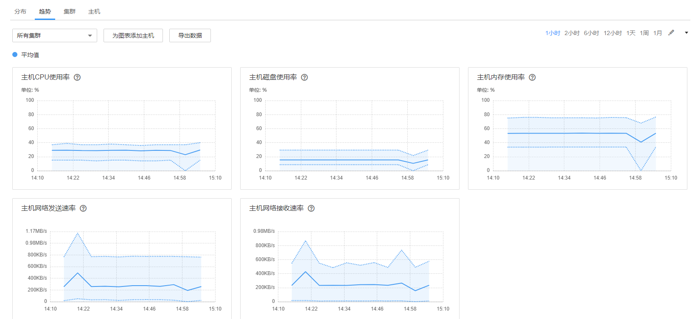

# 趋势

选择“主机 \> 资源概况 \> 趋势”，可查看所有集群或者单个集群的资源趋势监控页面，如[图1](#fig832355103111)所示。默认显示1小时的监控数据。用户可单击自定义时间区间，缺省时间区间包括：1小时、2小时、6小时、12小时、1天、1周、1月。各指标趋势图默认显示整个集群的最大值、最小值、平均值。

**图 1**  资源趋势  

-   单击“为图表添加主机“，可在定制显示的趋势指标图中，添加个别节点的指标趋势线，最多可添加12个主机。
-   单击，选择“定制”，可以自定义需要在页面上显示的指标项，详细指标项参考[分布](分布.md)中[表1](分布.md#table1190415121488)。
-   选择“导出数据”，可以导出集群中所有节点，在所有选中的指标项下，选中时间范围内的最大值、最小值、平均值。

