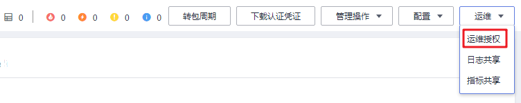

# 运维授权

当用户使用集群过程中出现问题需要华为云支持人员协助解决时，用户可先联系华为云支持人员，再通过“运维授权“功能授权华为云支持人员访问用户机器的权限用于定位问题。

## 操作步骤

1.  登录MRS管理控制台。
2.  在左侧导航栏中选择“集群列表  \>  现有集群“，选中一个运行中的集群并单击集群名称，进入集群信息页面。
3.  在页面右上角单击“运维“，选择“运维授权”，选择授权给华为云支持人员访问本机的权限的“截止时间”。在截止时间之前支持人员有临时访问本机的权限。

    **图 1**  运维授权  
    

4.  问题解决后，在页面右上角单击“运维“，选择“取消授权“为华为云支持人员取消访问权限。

