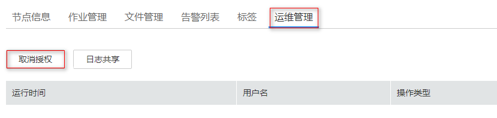

# 运维授权

当用户使用集群过程中出现问题需要技术支持人员协助解决时，用户可先联系技术支持人员，再通过“运维授权“功能授权技术支持人员访问用户机器的权限用于定位问题。

## 操作步骤

1.  登录MRS管理控制台。
2.  在左侧导航栏中选择“集群列表  \>  现有集群“，选中一运行中的集群并单击集群名，进入集群信息页面。
3.  单击“运维管理“，进入“运维管理“页面。
4.  单击“运维授权“，授权给技术支持人员访问本机的权限。

    **图 1**  运维授权  
    

5.  问题解决后，单击“取消授权“为技术支持人员取消访问权限。

    **图 2**  取消运维授权  
    

