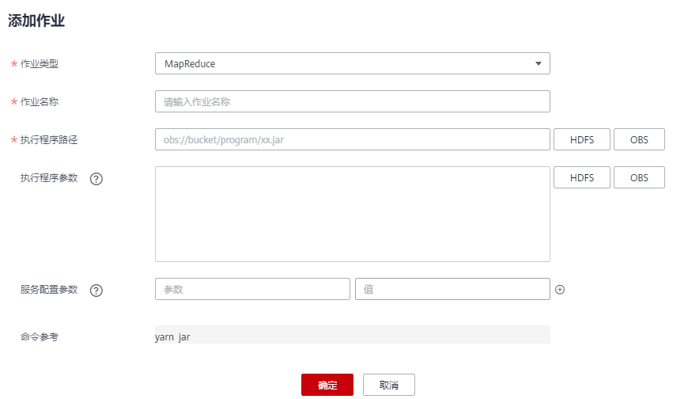

# 运行MapReduce作业

用户可将自己开发的程序提交到MRS中，执行程序并获取结果。本章节指导您在MRS集群页面如何提交一个新的MapReduce作业。MapReduce作业用于提交jar程序快速并行处理大量数据，是一种分布式数据处理模式和执行环境。

若在集群详情页面不支持“作业管理”和“文件管理”功能，请通过后台功能来提交作业。

## 前提条件

用户已经将运行作业所需的程序包和数据文件上传至OBS系统或HDFS中。

## 通过界面提交作业

1.  登录MRS管理控制台。
2.  选择“集群列表 \> 现有集群”，选中一个运行中的集群并单击集群名称，进入集群信息页面。
3.  若集群开启Kerberos认证时执行该步骤，若集群未开启Kerberos认证，请无需执行该步骤。

    在“概览“页签的基本信息区域，单击“IAM用户同步“右侧的“单击同步”进行IAM用户同步，具体介绍请参考[IAM用户同步MRS](IAM用户同步MRS.md)。

    > **说明：** 
    >-   当IAM用户的用户组的所属策略从MRS ReadOnlyAccess向MRS CommonOperations、MRS FullAccess、MRS Administrator变化时，由于集群节点的SSSD（System Security Services Daemon）缓存刷新需要时间，因此同步完成后，请等待5分钟，等待新修改策略生效之后，再进行提交作业。否则，会出现提交作业失败的情况。
    >-   当IAM用户的用户组的所属策略从MRS CommonOperations、MRS FullAccess、MRS Administrator向MRS ReadOnlyAccess变化时，由于集群节点的SSSD缓存刷新需要时间，因此同步完成后，请等待5分钟，新修改策略才能生效。

4.  单击“作业管理“，进入“作业管理“页签。
5.  单击“添加“，进入“添加作业“页面。
6.  “作业类型“选择“MapReduce“，并配置其他作业信息。

    

    -   请参考[表1](#table2037463920278)配置MapReduce作业信息。

    **表 1**  作业配置信息

    
    <table><thead align="left"><tr id="row8368193916278"><th class="cellrowborder" valign="top" width="20%" id="mcps1.2.3.1.1">
参数

    </th>
    <th class="cellrowborder" valign="top" width="80%" id="mcps1.2.3.1.2">
参数说明

    </th>
    </tr>
    </thead>
    <tbody><tr id="row6369739112710"><td class="cellrowborder" valign="top" width="20%" headers="mcps1.2.3.1.1 ">
作业名称

    </td>
    <td class="cellrowborder" valign="top" width="80%" headers="mcps1.2.3.1.2 ">
作业名称，只能由字母、数字、中划线和下划线组成，并且长度为1～64个字符。

    
 说明： 

建议不同的作业设置不同的名称。

    

    </td>
    </tr>
    <tr id="row1837003922716"><td class="cellrowborder" valign="top" width="20%" headers="mcps1.2.3.1.1 ">
执行程序路径

    </td>
    <td class="cellrowborder" valign="top" width="80%" headers="mcps1.2.3.1.2 ">
待执行程序包地址，需要满足如下要求：

    <ul id="ul33700396271"><li>最多为1023字符，不能包含;|&amp;&gt;,&lt;'$特殊字符，且不可为空或全空格。</li><li>执行程序路径可存储于HDFS或者OBS中，不同的文件系统对应的路径存在差异。<ul id="ul193701439132718"><li>OBS：以“obs://”开头。示例：obs://wordcount/program/xxx.jar。</li><li>HDFS：以“/user”开头。数据导入HDFS请参考<a href="管理数据文件.md#section6302178417377">导入数据</a>。</li></ul>
    </li><li>SparkScript和HiveScript需要以“.sql”结尾，MapReduce需要以“.jar”结尾，Flink和SparkSubmit需要以“.jar”或“.py”结尾。sql、jar、py不区分大小写。</li></ul>
    </td>
    </tr>
    <tr id="row43711339142713"><td class="cellrowborder" valign="top" width="20%" headers="mcps1.2.3.1.1 ">
执行程序参数

    </td>
    <td class="cellrowborder" valign="top" width="80%" headers="mcps1.2.3.1.2 ">
可选参数，程序执行的关键参数。多个参数间使用空格隔开。

    
配置方法：<em id="i134015424211">程序类名 数据输入路径 数据输出路径</em>

    <ul id="ul63716398279"><li>程序类名：由用户程序内的函数指定，MRS只负责参数的传入。</li><li>数据输入路径：通过单击“HDFS”或者“OBS”选择或者直接手动输入正确路径。</li><li>数据输出路径：输出路径请手动输入一个不存在的目录。
最多为150000字符，不能包含;|&amp;&gt;&lt;'$特殊字符，可为空。

    
 注意： 

若输入带有敏感信息（如登录密码）的参数可能在作业详情展示和日志打印中存在暴露的风险，请谨慎操作。

    

    </li></ul>
    </td>
    </tr>
    <tr id="row203713398279"><td class="cellrowborder" valign="top" width="20%" headers="mcps1.2.3.1.1 ">
服务配置参数

    </td>
    <td class="cellrowborder" valign="top" width="80%" headers="mcps1.2.3.1.2 ">
可选参数，用于为本次执行的作业修改服务配置参数。该参数的修改仅适用于本次执行的作业，如需对集群永久生效，请参考<a href="配置服务参数.md">配置服务参数</a>页面进行修改。

    
如需添加多个参数，请单击右侧增加，如需删除参数，请单击右侧“删除”。

    
常用服务配置参数如<a href="#table12538926589">表2</a>。

    </td>
    </tr>
    <tr id="row9373839142712"><td class="cellrowborder" valign="top" width="20%" headers="mcps1.2.3.1.1 ">
命令参考

    </td>
    <td class="cellrowborder" valign="top" width="80%" headers="mcps1.2.3.1.2 ">
用于展示提交作业时提交到后台执行的命令。

    </td>
    </tr>
    </tbody>
    </table>

    **表 2**  服务配置参数

    
    <table><thead align="left"><tr id="row95371726284"><th class="cellrowborder" valign="top" width="25%" id="mcps1.2.4.1.1">
参数

    </th>
    <th class="cellrowborder" valign="top" width="50%" id="mcps1.2.4.1.2">
参数说明

    </th>
    <th class="cellrowborder" valign="top" width="25%" id="mcps1.2.4.1.3">
取值样例

    </th>
    </tr>
    </thead>
    <tbody><tr id="row115378261381"><td class="cellrowborder" valign="top" width="25%" headers="mcps1.2.4.1.1 ">
fs.obs.access.key

    </td>
    <td class="cellrowborder" valign="top" width="50%" headers="mcps1.2.4.1.2 ">
访问OBS的密钥ID。

    </td>
    <td class="cellrowborder" valign="top" width="25%" headers="mcps1.2.4.1.3 ">
-

    </td>
    </tr>
    <tr id="row16537926882"><td class="cellrowborder" valign="top" width="25%" headers="mcps1.2.4.1.1 ">
fs.obs.secret.key

    </td>
    <td class="cellrowborder" valign="top" width="50%" headers="mcps1.2.4.1.2 ">
访问OBS与密钥ID对应的密钥。

    </td>
    <td class="cellrowborder" valign="top" width="25%" headers="mcps1.2.4.1.3 ">
-

    </td>
    </tr>
    </tbody>
    </table>

7.  确认作业配置信息，单击“确定“，完成作业的新增。

    作业新增完成后，可对作业进行管理。

## 通过后台提交作业

MRS 3.x及之后版本客户端默认安装路径为“/opt/Bigdata/client”，MRS 3.x之前版本为“/opt/client”。具体以实际为准。

1.  登录MRS管理控制台。
2.  选择“集群列表 \> 现有集群”，选中一个运行中的集群并单击集群名称，进入集群信息页面。
3.  在“节点管理”页签中单击某一Master节点名称，进入弹性云服务器管理控制台。
4.  单击页面右上角的“远程登录”。
5.  根据界面提示，输入Master节点的用户名和密码，用户名、密码分别为root和创建集群时设置的密码。
6.  执行如下命令初始化环境变量。

    **source /opt/Bigdata/client/bigdata\_env**

7.  如果当前集群已开启Kerberos认证，执行以下命令认证当前用户。如果当前集群未开启Kerberos认证，则无需执行该步骤。

    **kinit** **_MRS__集群用户_**

    例如,  **kinit admin**

8.  执行如下命令拷贝OBS文件系统中的程序到集群的Master节点。

    **hadoop fs -Dfs.obs.access.key=AK -Dfs.obs.secret.key=SK -copyToLocal source\_path.jar target\_path.jar**

    例如：**hadoop fs -Dfs.obs.access.key=XXXX -Dfs.obs.secret.key=XXXX -copyToLocal "obs://mrs-word/program/hadoop-mapreduce-examples-XXX.jar" "/home/omm/hadoop-mapreduce-examples-XXX.jar"**

    AK/SK可登录OBS控制台，请在集群控制台页面右上角的用户名下拉框中选择“我的凭证 \> 访问密钥”页面获取。

9.  执行如下命令提交wordcount作业，如需从OBS读取或向OBS输出数据，需要增加AK/SK参数。

    **source /opt/Bigdata/client/bigdata\_env;hadoop jar execute\_jar wordcount input\_path output\_path**

    例如：**source /opt/Bigdata/client/bigdata\_env;hadoop jar /home/omm/hadoop-mapreduce-examples-XXX.jar wordcount -Dfs.obs.access.key=XXXX -Dfs.obs.secret.key=XXXX "obs://mrs-word/input/\*" "obs://mrs-word/output/"**

    input\_path为OBS上存放作业输入文件的路径。output\_path为OBS上存放作业输出文件地址，请设置为一个不存在的目录。

