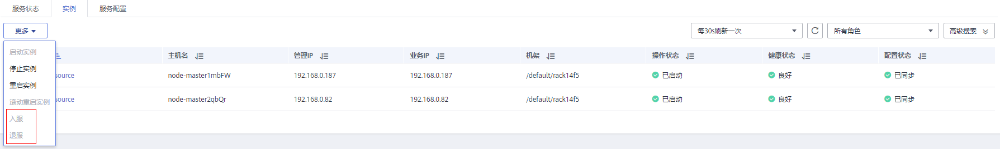

# 退服和入服角色实例

## 操作场景

某个Core或Task节点出现问题时，可能导致整个集群状态显示为“异常”。MRS集群支持将数据存储在不同Core节点，用户可以在MRS指定角色实例退服，使退服的角色实例不再提供服务。在排除故障后，可以将已退服的角色实例入服。

支持退服、入服的角色实例包括：

-   HDFS的DataNode角色实例
-   Yarn的NodeManager角色实例
-   HBase的RegionServer角色实例
-   ClickHouse的ClickHouseServer角色实例
-   Kafka的Broker角色实例

限制：

-   当DataNode数量少于或等于HDFS的副本数时，不能执行退服操作。例如HDFS副本数为3时，则系统中少于4个DataNode，将无法执行退服，MRS在执行退服操作时会等待30分钟后报错并退出执行。
-   Kafka Broker数量少于或等于副本数时，不能执行退服。例如Kafka副本数为2时，则系统中少于3个节点，将无法执行退服，MRS执行退服操作时会失败并退出执行。
-   已经退服的角色实例，必须执行入服操作启动该实例，才能重新使用。

## 前提条件

已完成IAM用户同步（在集群详情页的“概览”页签，单击“IAM用户同步“右侧的“单击同步”进行IAM用户同步）。

**图 1**  IAM用户同步（以MRS 1.9.2版本为例）  

## 操作步骤

1.  在集群详情页，单击“组件管理”。

    **图 2**  组件管理（以MRS 1.9.2版本为例）  
    

2.  单击服务列表中相应服务。
3.  单击“实例”页签。
4.  勾选指定角色实例名称前的复选框。
5.  选择“更多 \> 退服”或“入服”执行相应的操作。

    

    > **说明：** 
    >实例退服操作未完成时在其他浏览器窗口重启集群中相应服务，可能导致MRS提示停止退服，实例的“操作状态”显示为“已启动”。实际上后台已将该实例退服，请重新执行退服操作同步状态。

