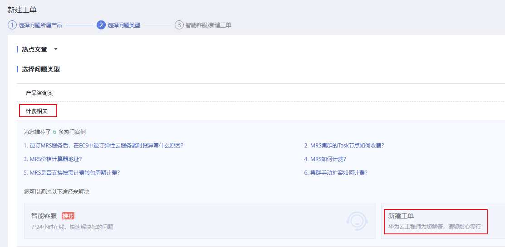
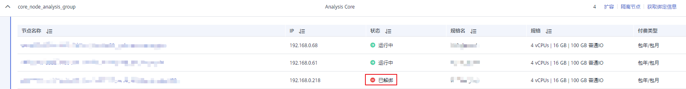
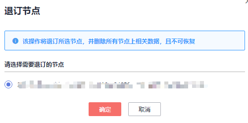

# 退订包周期集群指定节点

用户可以根据业务需求量，通过指定节点对集群进行缩容，以使MRS拥有更优的存储、计算能力，降低运维成本。

目前一次操作仅支持退订一个节点，如需退订多个节点，请等待1\~2分钟后，刷新页面查看集群状态，等待上一个节点完全退订成功后，参考本指导继续操作下一个节点。

目前仅安装了MRS 1.8.10.6补丁包的MRS 1.8.10版本集群、MRS 1.9.2版本集群支持该功能。

## 使用限制

-   当集群中分析Core节点个数小于等于HDFS副本数时，为了保证数据的可靠性MRS不支持退订节点。HDFS副本数可通过HDFS参数配置中的“dfs.replication“参数查询。
-   MRS不支持退订部署了ZooKeeper服务的节点。

## 退订包周期集群指定节点操作

1.  关闭待退订节点集群的自动续费功能，具体请参见[如何取消自动续费](https://support.huaweicloud.com/usermanual-billing/renewals_topic_20000005.html)。
2.  登录MRS服务控制台。
3.  选择“集群列表 \> 现有集群”，单击待退订节点的集群名称进入集群详情页面。
4.  在集群“概览”页单击“IAM用户同步”右侧的“单击同步”。
5.  选择“节点管理”，在待退订节点组对应的“操作”列单击“隔离节点”。
6.  选择需要退订的节点并单击“确定”对节点进行隔离。

    隔离节点过程的时长取决于节点中数据量，数据量越大则时间越长，请耐心等待。

    节点隔离成功后，节点状态显示为“已隔离”。

    

    > **说明：** 
    >若节点隔离失败，请登录Manager，单击在任务列表中查询并单击隔离主机失败的任务名，根据界面提示信息处理。

7.  在待退订节点组对应的“操作”列选择“更多 \> 获取解绑信息”。
8.  在“获取解绑信息”页面按提示复制对应内容。

    

9.  在页面右上角选择“工单\> 新建工单”。
10. 在搜索框搜索并选择“MapReduce服务 \(MRS\)”。

    **图 1**  选择MapReduce服务  
    

11. 选择问题类型“计费相关 \> 新建工单”。

    **图 2**  新建计费相关工单  
    

12. 在问题描述中填写[8](#li692410914211)中复制的信息。

    **图 3**  填写工单信息  
    

13. 按照新建工单页面提示填写其他信息，并单击“提交”。

    工单处理需要时间，请耐心等待。

14. 工单处理完成后，集群中节点状态显示为“已解绑”。

    **图 4**  已解绑节点  
    

15. 在集群详情页选择“节点管理 \> 退订节点”。

    **图 5**  退订节点  
    

16. 选择需要退订的节点并单击“确定”。

    **图 6**  选择要退订的节点  
    

17. 在退订资源页面确认相关信息，勾选“我已确认本次退订金额和相关费用”并单击“退订”。

    此时集群状态更新为“缩容中”，缩容完成后集群状态更新为“运行中”，指定节点已被删除。

    目前一次操作仅支持退订一个节点，如需退订多个节点，请等待1\~2分钟后，刷新页面查看集群状态，等待上一个节点完全退订成功后，参考本指导继续操作下一个节点。

    **图 7**  退订资源  
    

18. （可选）集群如需开通自动续费功能，请参见[如何开通自动续费](https://support.huaweicloud.com/usermanual-billing/renewals_topic_20000003.html)操作。

