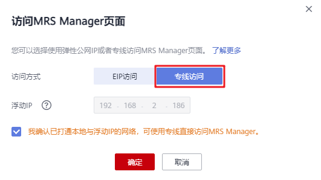
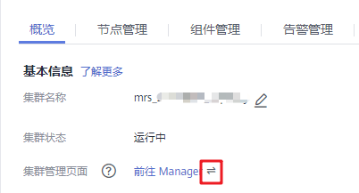
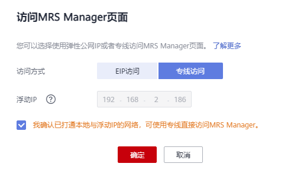

# 通过专线访问

MRS为您提供云专线（Direct Connect）方式访问MRS集群。云专线用于搭建用户本地数据中心与线上云VPC之间高速、低时延、稳定安全的专属连接通道，充分利用线上云服务优势的同时，继续使用现有的IT设施，实现灵活一体，可伸缩的混合云计算环境。

## 前提条件

云专线服务可用，并已打通本地数据中心到线上VPC的连接通道。云专线详情请参考[什么是云专线](https://support.huaweicloud.com/productdesc-dc/zh-cn_topic_0032053183.html)。

## 通过专线访问MRS集群

1.  登录MRS管理控制台。
2.  单击集群名称进入集群详情页。
3.  在集群详情页面的“概览”页签，单击“集群管理页面”右侧的“前往 Manager”。
4.  “访问方式”选择“专线访问”，并勾选“我确认已打通本地与浮动IP的网络，可使用专线直接访问MRS Manager。”。

    浮动IP为MRS为您访问MRS Manager页面自动分配的IP地址，使用专线访问MRS Manager之前您确保云专线服务已打通本地数据中心到线上VPC的连接通道。

    

5.  单击“确定“，进入MRS Manager登录页面，用户名使用“admin”，密码为创建集群时设置的admin密码。

## 切换MRS Manager访问方式

为了便于用户操作，浏览器缓存会记录用户所选择的访问Manager的方式，如需切换访问Manager方式，参考如下步骤操作。

1.  登录MRS管理控制台。
2.  单击集群名称进入集群详情页。
3.  在集群详情页面的“概览”页签，单击“集群管理页面”右侧的按钮。

    

4.  在弹出页面重新选择“访问方式”即可。
    -   若由“EIP访问”切换为“专线访问”，请在专线网路互通的前提下，在弹出页面的“访问方式”选择“专线访问”并勾选“我确认已打通本地与浮动IP的网络，可使用专线直接访问MRS Manager。”后单击“确定”。

        

    -   若由“专线访问”切换为“EIP访问”，在弹出页面的“访问方式”选择“EIP访问”并参考[通过弹性公网IP访问Manager](访问Manager-2.md#zh-cn_topic_0035209594_section1511920110246)配置EIP。若集群已配置过公网IP，直接单击“确定”以EIP方式访问Manager。

