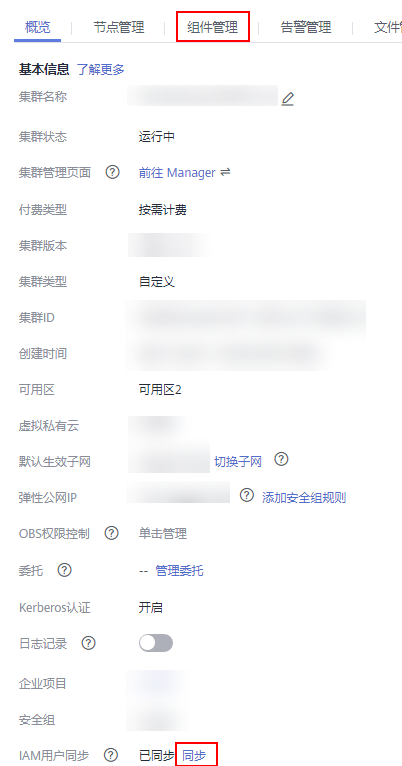
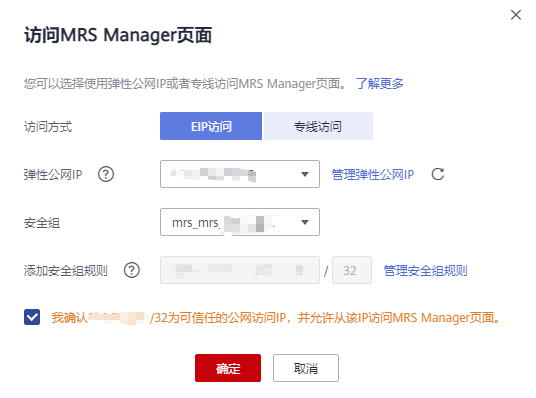

# 通过弹性公网IP访问

为了方便用户访问开源组件的Web站点，MRS集群支持通过为集群绑定弹性公网IP的方式，访问MRS集群上托管的开源组件。该方式更加简便易操作，推荐使用该方式访问开源组件的Web站点。

## 为集群绑定弹性公网IP并添加安全组规则

1.  在集群详情页的“概览”页签，单击“IAM用户同步“右侧的“单击同步”进行IAM用户同步，待IAM用户同步成功后，在集群详情页会出现“组件管理”页签。

    **图 1**  同步用户体现组件管理  
    

2.  单击“组件管理”。
3.  选择“HDFS \> NameNode WebUI \> NameNode \(主\)”，访问开源组件Web站点。此处仅以HDFS NameNode为例介绍，其他组件访问地址请参考[开源组件Web站点](开源组件Web站点.md)页面提供的站点地址。

    

4.  弹出访问MRS Manager页面，绑定弹性公网IP并添加安全组规则。仅首次访问该集群的组件开源站点时，需要如下配置。
    1.  绑定弹性公网IP，在弹性公网IP下拉框中选择可用的弹性公网IP。若没有可用的弹性公网IP，请单击“管理弹性公网IP“购买弹性公网IP后在该页面引用。若创建集群时已绑定弹性公网IP，请跳过该步骤。
    2.  选择待添加的安全组规则所在安全组，该安全组在创建群时配置。
    3.  添加安全组规则，默认填充的是用户访问公网IP地址9022端口的规则。如需对安全组规则进行查看，修改和删除操作，请单击“管理安全组规则“。

        > **说明：** 
        >-   自动获取的访问公网IP与用户本机IP不一致，属于正常现象，无需处理。
        >-   9022端口为knox的端口，需要开启访问knox的9022端口权限，才能访问MRS组件。

    4.  勾选“我确认xx.xx.xx.xx为可信任的公网访问IP，并允许从该IP访问MRS Manager页面。“

        **图 2**  访问MRS Manager页面  
        

    5.  单击“确定“，进入组件登录页面，用户名使用“admin”，密码为创建集群时设置的admin密码。

