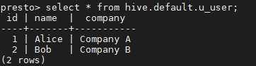

# 通过数据应用访问Alluxio<a name="ZH-CN_TOPIC_0207620792"></a>

访问Alluxio文件系统的端口号是19998，即地址为alluxio://<alluxio的master节点ip\>:19998/<PATH\>，本节将通过示例介绍如何通过数据应用（Spark、Hive、Hadoop MapReduce和Presto）访问Alluxio。

## 使用Alluxio作为Spark应用程序的输入和输出<a name="section450673117125"></a>

1.  以root用户登录集群的Master节点，密码为用户创建集群时设置的root密码。
2.  执行如下命令，配置环境变量。

    **source /opt/client/bigdata\_env**

3.  如果当前集群已启用Kerberos认证，执行如下命令认证当前用户。如果当前集群未启用Kerberos认证，则无需执行此命令。

    **kinit** **_MRS集群用户_**

    例如,  **kinit admin**

4.  准备输入文件，将本地数据复制到Alluxio文件系统中。

    如在本地/home目录下准备一个输入文件test\_input.txt，然后执行如下命令，将test\_input.txt文件放入Alluxio中。

    **alluxio fs copyFromLocal /home/test\_input.txt /input**

5.  执行如下命令启动spark-shell。

    **spark-shell**

6.  在spark-shell中运行如下命令（<alluxio的master节点ip\>请根据实际情况替换）。

    **val s = sc.textFile\("alluxio://<alluxio的master节点ip\>:19998/input"\)**

    **val double = s.map\(line =\> line + line\)**

    **double.saveAsTextFile\("alluxio://<alluxio的master节点ip\>:19998/output"\)**

7.  通过alluxio命令行**alluxio fs ls /**查看alluxio根目录下存在一个输出目录/output，其中包含了输入文件input的双倍内容。

## 在Alluxio上创建Hive表<a name="section7925727121811"></a>

1.  以root用户登录集群的Master节点，密码为用户创建集群时设置的root密码。
2.  执行如下命令，配置环境变量。

    **source /opt/client/bigdata\_env**

3.  如果当前集群已启用Kerberos认证，执行如下命令认证当前用户。如果当前集群未启用Kerberos认证，则无需执行此命令。

    **kinit** **_MRS集群用户_**

    例如,  **kinit admin**

4.  准备输入文件，如在本地/home目录下准备一个输入文件hive\_load.txt， 内容为

    ```
    1, Alice, company A
    2, Bob, company B
    ```

5.  执行如以下命令，将hive\_load.txt文件放入Alluxio中。

    **alluxio fs copyFromLocal /home/hive\_load.txt /hive\_input**

6.  执行如下命令启动hive beeline。

    **beeline**

7.  在beeline中运行如下命令（<alluxio的master节点ip\>，请根据实际情况替换）根据Alluxio中的输入文件进行创表。

    **\>CREATE TABLE u\_user\(id INT, name STRING, company STRING\) ROW FORMAT DELIMITED FIELDS TERMINATED BY ',';**

    **\>LOAD DATA INPATH 'alluxio://<alluxio的master节点ip\>:19998/hive\_input'  INTO TABLE u\_user;**

8.  执行如下命令查看创建的表。

    **select \* from u\_user;**


## 在Alluxio上运行Hadoop Wordcount<a name="section12420127102313"></a>

1.  以root用户登录集群的Master节点，密码为用户创建集群时设置的root密码。
2.  执行如下命令，配置环境变量。

    **source /opt/client/bigdata\_env**

3.  如果当前集群已启用Kerberos认证，执行如下命令认证当前用户。如果当前集群未启用Kerberos认证，则无需执行此命令。

    **kinit** **_MRS集群用户_**

    例如,  **kinit admin**

4.  准备输入文件，将本地数据复制到Alluxio文件系统中。

    如在本地/home目录下准备一个输入文件test\_input.txt，然后执行如下命令，将test\_input.txt文件放入Alluxio中。

    **alluxio fs copyFromLocal /home/test\_input.txt /input**

5.  通过yarn jar执行wordcount作业（<alluxio的master节点ip\>，<hadoop版本号\>，<mrs集群版本号\>，请根据实际情况替换）。

    **yarn jar /opt/share/hadoop-mapreduce-examples-<hadoop版本号\>-mrs-<mrs集群版本号\>/hadoop-mapreduce-examples-<hadoop版本号\>-mrs-<mrs集群版本号\>.jar wordcount alluxio://<alluxio的master节点ip\>:19998/input alluxio://<alluxio的master节点ip\>:19998/output**

6.  通过alluxio命令行**alluxio fs ls /**查看alluxio根目录下存在一个输出目录/output，包含了wordcount的结果。

## 使用Presto在Alluxio上查询表<a name="section494714103266"></a>

1.  以root用户登录集群的Master节点，密码为用户创建集群时设置的root密码。
2.  执行如下命令，配置环境变量。

    **source /opt/client/bigdata\_env**

3.  如果当前集群已启用Kerberos认证，执行如下命令认证当前用户。如果当前集群未启用Kerberos认证，则无需执行此命令。

    **kinit** **_MRS集群用户_**

    例如,  **kinit admin**

4.  启动hive beeline在alluxio上创建表（<alluxio的master节点ip\>请根据实际情况替换）。

    **beeline**

    **\>CREATE TABLE u\_user \(id int, name string, company string\) ROW FORMAT DELIMITED FIELDS TERMINATED BY ',' LOCATION 'alluxio://<alluxio的master节点ip\>:19998/u\_user';**

    **\>insert into u\_user values\(1,'Alice','Company A'\),\(2, 'Bob', 'Company B'\);**

5.  启动Presto客户端，具体请参见[使用客户端执行查询语句](使用客户端执行查询语句.md)的[2](使用客户端执行查询语句.md#li9368161132311)\~[8](使用客户端执行查询语句.md#li15202527183812)。
6.  在Presto客户端中执行查询语句**select \* from hive.default.u\_user;**查询alluxio上创建表。

    **图 1**  Presto查询alluxio上创建的表<a name="fig129013018357"></a>  
    


