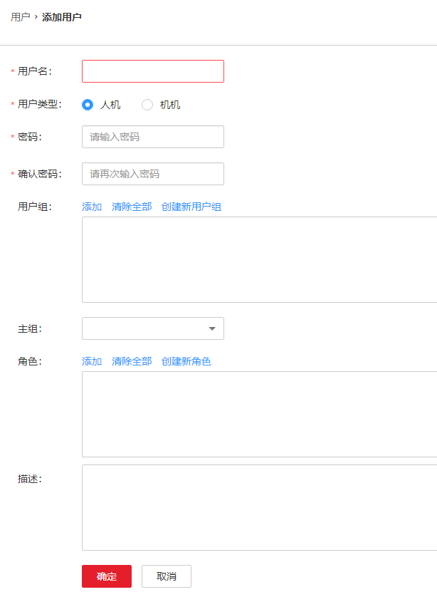

# 配置Hive权限

在开启Kerberos认证的安全集群中使用Hive组件，则需要先配置对应权限。

## Hive权限配置

1.  登录[MRS Manager](访问MRS-Manager.md)页面，选择“系统设置 \> 角色管理 \> 添加角色”。
2.  填写角色名称：配置角色名称，例如hiverole。
3.  编辑权限。
    -   选择“Hive \> Hive Admin Privilege”：Hive管理员权限。如需使用该权限，在执行SQL语句时需要先执行**set role admin**来设置权限。
    -   选择“Hive \> Hive Read Write Privileges”：Hive数据表管理权限，可设置与管理已创建的表的数据操作权限。

        根据需要勾选相应database的权限，如果要精确到表，可以单击database名称，勾选相应表的权限。

        **图 1**  添加角色  
        

4.  单击“确定”保存角色。
5.  选择“系统设置 \> 用户管理 \> 添加用户”。
6.  参考[创建用户](创建用户.md)，添加一个包含“hive”组并绑定新创建的hiverole角色的用户。

    **图 2**  添加用户  
    

7.  待用户生成后，即可使用该用户执行相应SQL语句。

## 相关参考

-   如果SQL语句中有操作HDFS文件的行为时，该用户需要有相应hdfs路径的owner权限，如果路径不存在时，需要有其父目录的读写权限具体可参考[Hive权限配置](#section1551435204716)的操作方式，给角色添加HDFS服务对应权限。
-   执行 load data local inpath 时要求此文件在HiveServer节点上。omm用户对此文件有读权限，对此文件的目录有读、执行权限。执行命令的用户需要对该文件有读、写权限。文件名不能以下横线（\_）或点（.）开头，以这些开头的文件会被忽略。
-   执行load data inpath 时执行命令的用户需要对该文件有读、写权限，对该文件的目录有执行权限。由于load操作会将该文件移动到表对应的目录中，所以要求当前用户需要对表的对应目录有写权限。文件名不能以下横线（\_）或点（.）开头，以这些开头的文件会被忽略。
-   执行SQL提交任务到指定队列时需要有YARN相应队列的提交权限（具体操作在MRS Manager中的“系统设置 \> 角色管理 \> 添加角色 \> 权限”的表格中选择“Yarn \> Scheduler Queue”，选择指定队列，然后勾选“Submit”和“Admin”，单击“确定”保存）。

