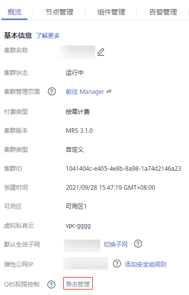

# 配置MRS多用户访问OBS细粒度权限

开启细粒度权限时，用户通过该指导配置访问OBS权限，实现MRS用户对OBS文件系统下的目录权限控制。

如需对MRS的用户访问OBS的资源进行详细控制，可通过该功能实现。例如，您只允许用户组A访问某一OBS文件系统中的日志文件，您可以执行以下操作来实现：

1.  为MRS集群配置OBS访问权限的委托，实现使用ECS自动获取的临时AK/SK访问OBS。避免了AK/SK直接暴露在配置文件中的风险。
2.  在IAM中创建一个只允许访问某一OBS文件系统中的日志文件的策略，并创建一个绑定该策略权限的委托。
3.  在MRS集群中，新建的委托与MRS集群中的用户组A进行绑定，即可实现用户组A只拥有访问某一OBS文件系统中的日志文件的权限。

在以下场景运行作业时，提交作业的用户名为内置用户名，无法实现MRS多用户访问OBS：

-   spark-beeline在安全集群中提交作业的内置用户名为spark，在普通集群中提交作业的内置用户名为omm。
-   hbase shell在安全集群提交作业的内置用户名为hbase，在普通集群中提交作业的内置用户名为omm。
-   Presto在安全集群提交作业的内置用户名为omm、hive，在普通集群提交作业的内置用户名为omm（当通过“组件管理 \> Presto \> 服务配置”，选择“全部配置”并搜索修改参数hive.hdfs.impersonation.enabled的值为true可以实现MRS多用户访问OBS细粒度权限功能）。

## 前提条件

-   开启细粒度权限控制的用户，权限管理请参考[创建用户并授权使用MRS](创建用户并授权使用MRS.md)。
-   需要对[IAM的委托](https://support.huaweicloud.com/usermanual-iam/iam_06_0004.html)和OBS细粒度策略有一定了解。

## 步骤一：给集群配置有OBS访问权限的委托

1.  请参考[配置存算分离集群（委托方式）](配置存算分离集群（委托方式）.md)配置OBS访问权限的委托。

    配置的委托对该集群上所有用户（包括内置用户）及用户组生效，如需对集群上的用户及用户组访问OBS的权限进行控制请继续执行后续步骤。

## 步骤二：在IAM服务创建策略及委托

创建拥有不同访问权限的策略，并将策略与委托进行绑定，具体操作请参考[在IAM服务创建策略及委托](#section163381225399)。

## 步骤三：在MRS集群详情页面配置OBS权限控制映射关系

1.  在MRS控制台，选择“集群列表 \> 现有集群”并单击集群名称。
2.  在“概览”页签的基本信息区域，单击“OBS权限控制”右侧的“单击管理”。

    

3.  单击“添加映射”，并参考[表1](#table175454305220)配置相关参数。

    **表 1**  OBS权限控制参数

    
    <table><thead align="left"><tr id="row1854693014215"><th class="cellrowborder" valign="top" width="50%" id="mcps1.2.3.1.1">
参数

    </th>
    <th class="cellrowborder" valign="top" width="50%" id="mcps1.2.3.1.2">
说明

    </th>
    </tr>
    </thead>
    <tbody><tr id="row1754663015219"><td class="cellrowborder" valign="top" width="50%" headers="mcps1.2.3.1.1 ">
IAM委托

    </td>
    <td class="cellrowborder" valign="top" width="50%" headers="mcps1.2.3.1.2 ">
选择<a href="#li1894924154514">2</a>中创建的委托。

    </td>
    </tr>
    <tr id="row0546183020219"><td class="cellrowborder" valign="top" width="50%" headers="mcps1.2.3.1.1 ">
类型

    </td>
    <td class="cellrowborder" valign="top" width="50%" headers="mcps1.2.3.1.2 "><ul id="ul63444112033"><li>User：在用户级别进行映射</li><li>Group：用户组级别进行映射</li></ul>
    
 说明： 
<ul id="ul13363161317615"><li>用户级别的映射优先级大于用户组级别的映射。若选择Group，建议在“MRS用户（组）”一栏，填写用户的主组名称。</li><li>请避免同个用户名（组）出现在多个映射记录上的情况。</li></ul>
    

    </td>
    </tr>
    <tr id="row154673019211"><td class="cellrowborder" valign="top" width="50%" headers="mcps1.2.3.1.1 ">
MRS 用户（组）

    </td>
    <td class="cellrowborder" valign="top" width="50%" headers="mcps1.2.3.1.2 ">
MRS中的用户（组）的名称，以英文逗号进行分隔。

    
 说明： 
<ul id="ul98411133014"><li>对于没有配置在OBS权限控制的用户，且没有配置AK、SK时，将以MRS_ECS_DEFAULT_AGENCY中的<a href="https://support.huaweicloud.com/usermanual-permissions/iam_01_0001.html" target="_blank" rel="noopener noreferrer">OBS OperateAccess</a>的权限访问OBS。对于组件内置用户不建议绑定在委托中。</li><li>如需对组件内置用户在以下场景提交作业时配置委托，要求如下：<ul id="ul8782537203412"><li>如需对spark-beeline的操作进行权限控制，安全集群时配置用户名“spark”，普通集群时配置用户名“omm”。</li><li>如需对hbase shell的操作进行权限控制，安全集群时配置用户名“hbase”，普通集群时配置用户名“omm”。</li><li>如需对Presto的操作进行权限控制，安全集群时配置用户名“omm”、“hive”和登录客户端的用户名，普通集群时配置用户名“omm”和登录客户端的用户名。</li><li>如需使用Hive在beeline模式下创建表时，配置内置用户“hive”。</li></ul>
    </li></ul>
    

    </td>
    </tr>
    </tbody>
    </table>

4.  单击“确定”。
5.  勾选“我同意授权MRS用户（组）与IAM委托之间的信任关系。”，并单击“确定”，完成MRS用户与OBS权限的映射关系。

    当集群详情页面“概览”页签的“OBS权限控制”后出现或OBS权限控制的映射表已刷新，表示映射生效（过程大约需要1分钟）。

    在关系列表的“操作”列可以对已添加的关系进行编辑和删除。

    > **说明：** 
    >-   对于没有配置在OBS权限控制的用户，且没有配置AK、SK时，将以集群配置的委托在“对象存储服务”项目下所拥有的权限访问OBS。
    >-   无论用户是否配置OBS权限控制，只要配置AK、SK时，将以AK、SK的权限访问OBS。
    >-   映射关系的修改、创建、删除需要用户有Security Administrator权限。
    >-   修改映射关系后，若想使之在spark-beeline中生效，需要重启Spark服务，若想使之在hive beeline中生效，需要退出beeline重新进入，若想使之在Presto服务中生效，需要重启Presto服务。

## 在开启OBS权限控制功能时各组件访问OBS的说明

1.  以root用户登录集群任意一个节点，密码为用户创建集群时设置的root密码。
2.  配置环境变量（MRS 3.x及之后版本客户端默认安装路径为“/opt/Bigdata/client”，MRS 3.x之前版本为“/opt/client”。具体以实际为准。）。

    **source /opt/Bigdata/client/bigdata\_env**

3.  如果当前集群已启用Kerberos认证，执行以下命令认证当前用户。如果当前集群未启用Kerberos认证，则无需执行此命令。

    **kinit** **_MRS__集群用户_**

    例如,  **kinit admin**

4.  如果当前集群未启用Kerberos认证，执行如下命令登录执行操作的用户，该用户需要属于supergroup组，创建用户可参考[创建用户](创建用户.md)，将XXXX替换成用户名。

    **mkdir /home/XXXX**

    **chown XXXX /home/XXXX**

    **su - XXXX**

5.  访问OBS。无需再配置AK、SK和endpoint。OBS路径格式：obs://buck\_name/XXX。

    例如：**hadoop fs -ls "obs://obs-example/job/hadoop-mapreduce-examples-3.1.2.jar"**

    > **说明：** 
    >-   如需使用hadoop fs删除OBS上文件，请使用**hadoop fs -rm -skipTrash**来删除文件。
    >-   spark-sql、spark-beeline在创建表时，若不涉及数据导入，则不会访问OBS。即若在一个无权限的OBS目录下创建表，CREATE TABLE仍会成功，但插入数据会报403 AccessDeniedException。

## 在IAM服务创建策略及委托

1.  在IAM服务创建策略。
    1.  登录IAM服务控制台。
    2.  单击“权限 \> 创建自定义策略”。
    3.  参考[表2](#table4781201918533)填写参数。常用的OBS自定义策略样例请参考[OBS自定义策略](https://support.huaweicloud.com/usermanual-obs/obs_03_0121.html)。

        **表 2**  策略参数

        
        <table><thead align="left"><tr id="row378191918534"><th class="cellrowborder" valign="top" width="50%" id="mcps1.2.3.1.1">
参数

        </th>
        <th class="cellrowborder" valign="top" width="50%" id="mcps1.2.3.1.2">
说明

        </th>
        </tr>
        </thead>
        <tbody><tr id="row07821119175313"><td class="cellrowborder" valign="top" width="50%" headers="mcps1.2.3.1.1 ">
策略名称

        </td>
        <td class="cellrowborder" valign="top" width="50%" headers="mcps1.2.3.1.2 ">
只能包含如下字符：大小写字母、中文、数字、空格和特殊字符（-_.,）。

        </td>
        </tr>
        <tr id="row147822196535"><td class="cellrowborder" valign="top" width="50%" headers="mcps1.2.3.1.1 ">
作用范围

        </td>
        <td class="cellrowborder" valign="top" width="50%" headers="mcps1.2.3.1.2 ">
选择全局级服务，OBS为全局服务。

        </td>
        </tr>
        <tr id="row1778211915534"><td class="cellrowborder" valign="top" width="50%" headers="mcps1.2.3.1.1 ">
配置策略方式

        </td>
        <td class="cellrowborder" valign="top" width="50%" headers="mcps1.2.3.1.2 ">
选择可视化视图。

        </td>
        </tr>
        <tr id="row978220194531"><td class="cellrowborder" valign="top" width="50%" headers="mcps1.2.3.1.1 ">
策略内容

        </td>
        <td class="cellrowborder" valign="top" width="50%" headers="mcps1.2.3.1.2 "><ol id="ol18796132610249"><li>“允许”选择“允许”。</li><li>“云服务”选择“对象存储服务 (OBS)”。</li><li>“操作”勾选所有“写”、“列表”和“只读”权限。</li><li>“特定资源”选择：<ol type="a" id="ol14442191517372"><li>“object”选择“通过资源路径指定”，并单击“添加资源路径”分别输入路径<strong id="b13351348172516"><em id="i16351194842512">obs_bucket_name</em>/tmp/</strong>和<strong id="b182416537256"><em id="i6824145362515">obs_bucket_name</em>/tmp/*</strong>。此处以<strong id="b51531146134913">/tmp</strong>目录为例，如需其他目录权限请参考该步骤添加对应目录及该目录下所有对象的资源路径。</li><li>“bucket”选择“通过资源路径指定”，并单击“添加资源路径”输入路径<strong id="b11997118132611"><em id="i1699719185265">obs_bucket_name</em></strong>。</li></ol>
        </li><li>（可选）请求条件，暂不添加。</li></ol>
        </td>
        </tr>
        <tr id="row6782319205314"><td class="cellrowborder" valign="top" width="50%" headers="mcps1.2.3.1.1 ">
策略描述

        </td>
        <td class="cellrowborder" valign="top" width="50%" headers="mcps1.2.3.1.2 ">
可选，对策略的描述。

        </td>
        </tr>
        </tbody>
        </table>

        > **说明：** 
        >各个组件的写数据操作若通过rename的方式实现时，写数据时要配置删除对象的权限。

    4.  单击“确定”保存策略。

2.  在IAM服务创建委托。
    1.  登录IAM服务控制台。
    2.  单击“委托 \> 创建委托”。
    3.  参考[表3](#table4901145420452)填写参数。

        **表 3**  委托参数

        
        <table><thead align="left"><tr id="row10901854144517"><th class="cellrowborder" valign="top" width="50%" id="mcps1.2.3.1.1">
参数

        </th>
        <th class="cellrowborder" valign="top" width="50%" id="mcps1.2.3.1.2">
说明

        </th>
        </tr>
        </thead>
        <tbody><tr id="row1290111548457"><td class="cellrowborder" valign="top" width="50%" headers="mcps1.2.3.1.1 ">
委托名称

        </td>
        <td class="cellrowborder" valign="top" width="50%" headers="mcps1.2.3.1.2 ">
只能包含如下字符：大小写字母、中文、数字、空格和特殊字符（-_.,）。

        </td>
        </tr>
        <tr id="row49011544454"><td class="cellrowborder" valign="top" width="50%" headers="mcps1.2.3.1.1 ">
委托类型

        </td>
        <td class="cellrowborder" valign="top" width="50%" headers="mcps1.2.3.1.2 ">
选择普通账号。

        </td>
        </tr>
        <tr id="row490116542458"><td class="cellrowborder" valign="top" width="50%" headers="mcps1.2.3.1.1 ">
委托的账号

        </td>
        <td class="cellrowborder" valign="top" width="50%" headers="mcps1.2.3.1.2 ">
填写本用户的云账号，即使用手机号开通的账号，不能是联邦用户或者IAM用户。

        </td>
        </tr>
        <tr id="row9901165414513"><td class="cellrowborder" valign="top" width="50%" headers="mcps1.2.3.1.1 ">
持续时间

        </td>
        <td class="cellrowborder" valign="top" width="50%" headers="mcps1.2.3.1.2 ">
根据需要选择一天或永久。

        </td>
        </tr>
        <tr id="row1902954134511"><td class="cellrowborder" valign="top" width="50%" headers="mcps1.2.3.1.1 ">
描述

        </td>
        <td class="cellrowborder" valign="top" width="50%" headers="mcps1.2.3.1.2 ">
可选，对委托的描述。

        </td>
        </tr>
        <tr id="row744075754616"><td class="cellrowborder" valign="top" width="50%" headers="mcps1.2.3.1.1 ">
权限选择

        </td>
        <td class="cellrowborder" valign="top" width="50%" headers="mcps1.2.3.1.2 "><ol id="ol17127325134910"><li>在“项目”列对应的“对象存储服务”行，单击“操作”列的“修改”。</li><li>勾选<a href="#li20781191935317">1</a>中创建的策略，使之出现在“已选择策略中”。</li><li>单击“确定”。</li></ol>
        </td>
        </tr>
        </tbody>
        </table>

    4.  单击“确定”保存委托。

        > **说明：** 
        >当使用该委托访问过OBS后，再修改该委托及其绑定的策略时，最长需要等待15分钟，修改的内容才能生效。

