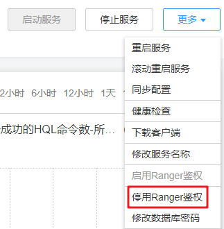
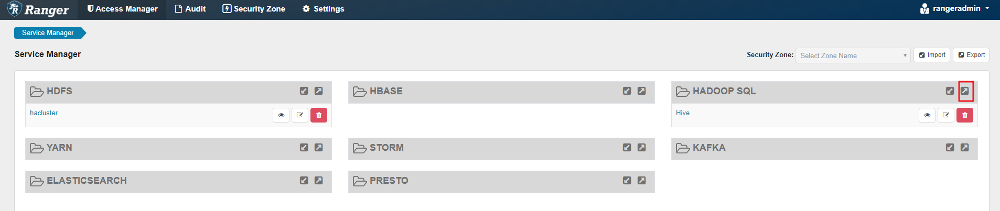
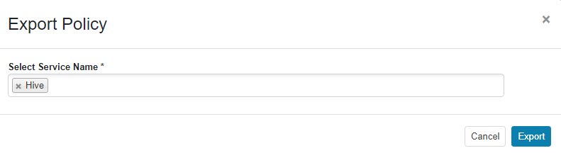
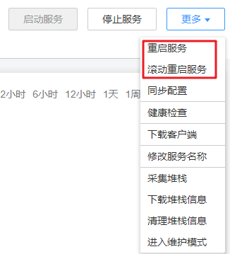
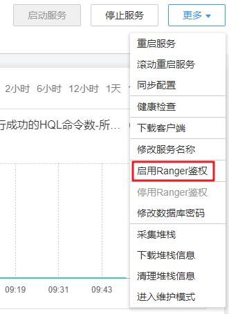
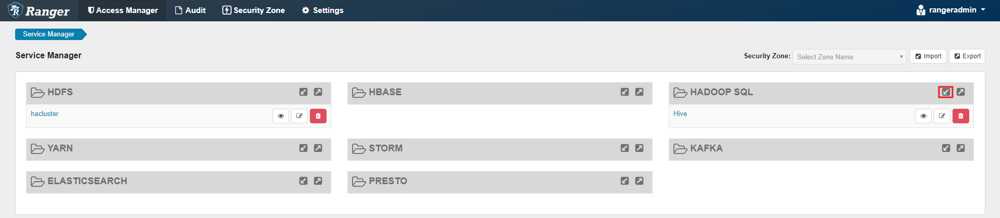
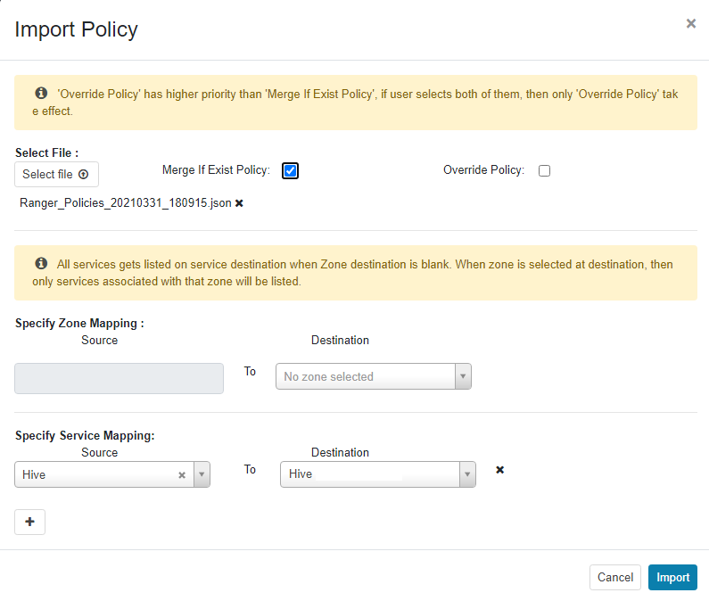

# 配置Ranger数据连接

本指导旨在指导用户将现有集群的Ranger元数据切换为RDS数据库中存储的元数据。该操作可以使多个MRS集群共用同一份元数据，且元数据不随集群的删除而删除。也能够避免集群迁移时Ranger元数据的迁移。

## 前置条件

已创建RDS服务MySQL数据库的实例，请参考[创建数据连接](配置数据连接.md#section813712431913)。

> **说明：** 
>-   对于MRS 3.x之前版本，当用户选择的数据连接为“RDS服务MySQL数据库“时，请确保使用的数据库用户为root用户。如果为非root用户，请参考[数据连接前置操作](配置数据连接.md#section311713549458)新建用户并为该用户进行赋权。
>-   对于MRS 3.x及之后版本，当用户选择的数据连接为“RDS服务MySQL数据库“时，数据库用户不允许为root用户，请参考[数据连接前置操作](配置数据连接.md#section311713549458)新建用户并为该用户进行赋权。

## Ranger元数据外置到Mysql前置操作

该前置操作仅在**MRS 3.1.0及之后版本**需要执行。

1.  登录FusionInsight Manager页面，具体请参见[访问FusionInsight Manager（MRS 3.x及之后版本）](访问FusionInsight-Manager（MRS-3-x及之后版本）.md)。选择“集群 \> 服务 \>  _服务名称_”。

    当前MRS 3.1.0集群支持Ranger鉴权的组件为: HDFS、HBase、Hive、Spark、Impala、Storm、Kafka组件。

2.  在服务“概览”页面右上角单击“更多 \> 停用Ranger鉴权”，如果“停用Ranger鉴权”是灰色，则表示未开启Ranger鉴权无需停用Ranger鉴权，如[图1](#fig14437127109)所示。

    **图 1**  停用Ranger鉴权  
    

3.  （可选）如需使用已有鉴权策略请执行该步骤在Ranger Web页面导出已有组件的鉴权策略，切换Ranger元数据完成后可重新导入已有的鉴权策略。此处以Hive为例，导出后会生成本地的json格式的策略文件。
    1.  登录FusionInsight Manager页面。
    2.  选择“集群 \> 服务 \> Ranger”，进入Ranger服务概览页面。
    3.  单击“基本信息”区域中的“RangerAdmin”，进入Ranger WebUI界面。

        admin用户在Ranger中的用户类型为“User”，如需查看所有管理页面，可点击右上角用户名后，选择“Log Out”，退出当前用户后使用rangeradmin用户或者其他用户重新登录。

    4.  单击Hive组件对应行的导出按钮，导出鉴权策略。

        **图 2**  导出鉴权策略  
        

    5.  单击“Export”，导出后会生成本地的json格式的策略文件。

        **图 3**  导出Hive鉴权策略  
        

## 为MRS集群配置数据连接

1.  登录MRS控制台。
2.  单击集群名称进入集群详情页面。
3.  单击“数据连接”右侧的“单击管理”，进入数据连接配置界面。
4.  单击“配置数据连接”，并配置相关参数。
    -   组件名称：Ranger
    -   模块类型：Ranger元数据
    -   连接类型：RDS服务MySQL数据库
    -   连接实例：请选择已创建的到RDS服务MySQL数据库的实例，如需创建新的数据连接，请参考[创建数据连接](配置数据连接.md#section813712431913)。

5.  勾选“我已经阅读上述信息，并了解具体影响。”并单击“测试”。
6.  测试成功后，单击“确定”完成数据连接配置。
7.  登录FusionInsight Manager页面。
8.  选择“集群 \> 服务 \> Ranger”，进入Ranger服务概览页面。
9.  单击“更多 \> 重启服务”或“更多 \> 滚动重启服务”。

    重启服务会造成业务中断，滚动重启可以尽量减少或者不影响业务运行。

    重启Ranger组件会影响所有受Ranger控制组件的权限，可能影响业务的正常运行，请在集群空闲或业务量较少时时执行重启。重启Ranger组件前，Ranger中的策略依然生效。

    **图 4**  重启服务  
    

10. 启用需要鉴权的组件的Ranger鉴权。此处以Hive组件为例。

    当前MRS 3.1.0集群支持Ranger鉴权的组件为: HDFS、HBase、Hive、Spark、Impala、Storm、Kafka组件。

    1.  登录FusionInsight Manager页面，选择“集群 \> 服务 \>  _服务名称_”。
    2.  在服务“概览”页面右上角单击“更多 \> 启用Ranger鉴权”。

        **图 5**  启用Ranger鉴权  
        

11. 登录Ranger WebUI界面，单击Hive组件对应行的导入按钮。

    

12. 配置导入参数。

    -   Select file：选择[3.e](#li1947954718720)中下载的鉴权策略文件。
    -   Merge If Exist Policy：勾选。

    **图 6**  导入鉴权策略  
    

13. 重启启用Ranger鉴权的组件。
    1.  登录FusionInsight Manager页面。
    2.  选择“集群 \> 服务 \> Hive”，进入Hive服务概览页面。
    3.  单击“更多 \> 重启服务”或“更多 \> 滚动重启服务”。

        **图 7**  重启服务  
        

        重启服务会造成业务中断，滚动重启可以尽量减少或者不影响业务运行。

