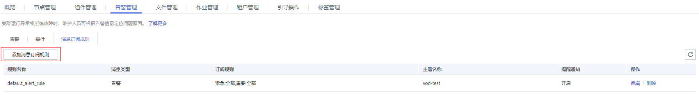

# 配置作业消息通知

MRS联合消息通知服务（SMN），采用主题订阅模型，提供一对多的消息订阅以及通知功能，能够实现一站式集成多种推送通知方式（短信和邮件通知）。通过配置作业消息通知可以实现您在作业执行成功或作业执行失败时能立即接收到通知。

## 操作步骤

1.  登录管理控制台。
2.  单击“服务列表”选择“管理与监管 \> 消息通知服务”，进入消息通知服务页面。
3.  创建主题并向主题中添加订阅，具体请参考[配置消息通知](配置消息通知.md)。
4.  进入MRS管理控制台，单击集群名称进入集群详情页面。
5.  选择“告警管理 \> 消息订阅规则 \> 添加消息订阅规则”。

    

6.  配置向订阅者发送作业执行结果消息的规则。

    **表 1**  消息订阅规则参数说明

    
    <table><thead align="left"><tr id="row14744124125013"><th class="cellrowborder" valign="top" width="34.54%" id="mcps1.2.3.1.1">
参数

    </th>
    <th class="cellrowborder" valign="top" width="65.46%" id="mcps1.2.3.1.2">
说明

    </th>
    </tr>
    </thead>
    <tbody><tr id="row6744162419509"><td class="cellrowborder" valign="top" width="34.54%" headers="mcps1.2.3.1.1 ">
规则名称

    </td>
    <td class="cellrowborder" valign="top" width="65.46%" headers="mcps1.2.3.1.2 ">
用户自定义发送订阅消息的规则名称，只能包含数字、英文字符、中划线和下划线。

    </td>
    </tr>
    <tr id="row674516249506"><td class="cellrowborder" valign="top" width="34.54%" headers="mcps1.2.3.1.1 ">
提醒通知

    </td>
    <td class="cellrowborder" valign="top" width="65.46%" headers="mcps1.2.3.1.2 ">
选择开启，将向订阅者发送对应订阅消息。

    </td>
    </tr>
    <tr id="row074582465011"><td class="cellrowborder" valign="top" width="34.54%" headers="mcps1.2.3.1.1 ">
主题名称

    </td>
    <td class="cellrowborder" valign="top" width="65.46%" headers="mcps1.2.3.1.2 ">
选择已创建的主题，也可以单击“创建主题”重新创建。

    </td>
    </tr>
    <tr id="row13745102414504"><td class="cellrowborder" valign="top" width="34.54%" headers="mcps1.2.3.1.1 ">
消息类型

    </td>
    <td class="cellrowborder" valign="top" width="65.46%" headers="mcps1.2.3.1.2 ">
选择“事件”。

    </td>
    </tr>
    <tr id="row87451524185016"><td class="cellrowborder" valign="top" width="34.54%" headers="mcps1.2.3.1.1 ">
订阅规则

    </td>
    <td class="cellrowborder" valign="top" width="65.46%" headers="mcps1.2.3.1.2 "><ol id="ol789082718916"><li>单击“提示”前的。</li><li>单击“Manager”前的。</li><li>勾选“作业执行成功”和“作业执行失败”。</li></ol>
    </td>
    </tr>
    </tbody>
    </table>

