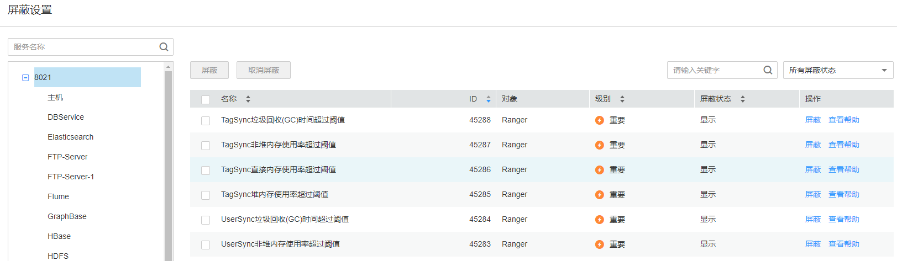

# 配置告警屏蔽状态

## 操作场景

如果如下特定场景中不希望看到FusionInsight Manager上报指定的告警，可以手动设置屏蔽。

-   使用过程中，不想关注某些不重要的告警，屏蔽次要告警。
-   第三方产品集成FusionInsight产品时，部分告警与产品自身的告警信息重复，屏蔽重复告警。
-   部署环境特殊时，可能存在特定告警误报，屏蔽误报的告警。

某种告警被屏蔽后，与该告警ID相同的新告警将不再出现在“告警管理”页面中，也不会被统计。已经上报的告警仍然显示。

## 操作步骤

1.  登录FusionInsight Manager。
2.  选择“运维  \>  告警  \>  屏蔽设置“。
3.  在“屏蔽设置”区域，选择指定的服务或模块。
4.  在告警列表中选择指定的告警。

    **图 1**  屏蔽告警  
    

    界面显示此告警的信息，包含名称、ID、级别、屏蔽状态和操作：

    -   屏蔽状态包含：“屏蔽“和“显示“。
    -   操作包含：“屏蔽“和“查看帮助“。

    > **说明：** 
    >在屏蔽列表上方可筛选指定的告警。

5.  设置已选中告警的屏蔽状态：
    -   单击“屏蔽”后在弹出的对话框中单击“确定”，修改告警的屏蔽状态为“屏蔽”。
    -   单击“取消屏蔽”后在弹出的对话框中单击“确定”，修改告警的屏蔽状态为“显示”。

