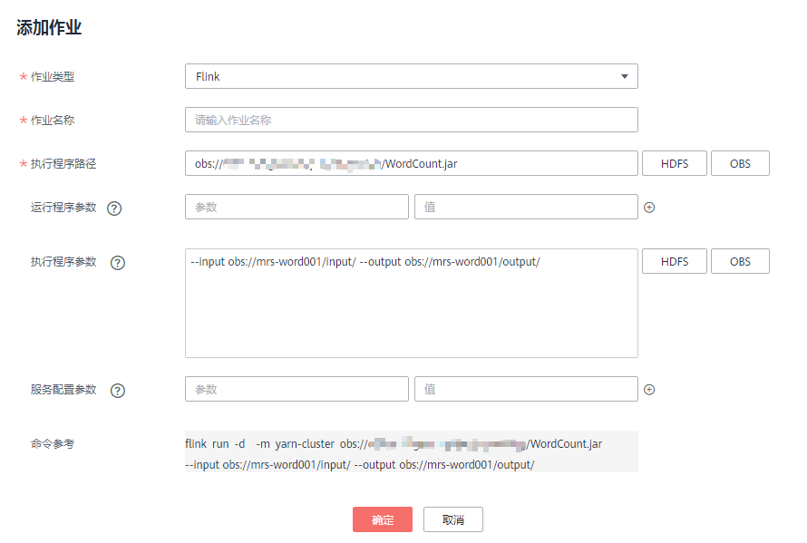
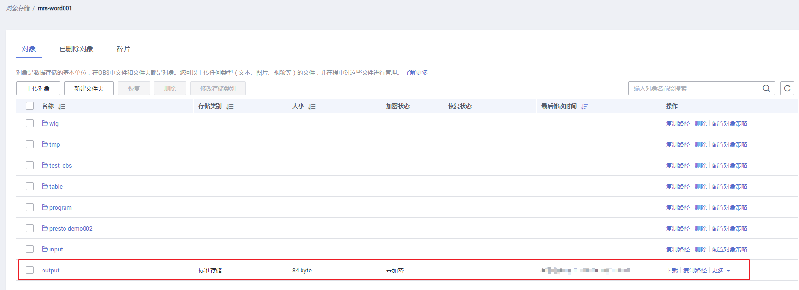

# 配置存算分离集群

MRS支持用户将数据存储在OBS服务中，使用MRS集群仅做数据计算处理的存算模式。MRS通过IAM服务的“委托”机制进行简单配置， 实现使用ECS自动获取的临时AK/SK访问OBS。避免了AK/SK直接暴露在配置文件中的风险。

MRS 2.0.5及之后版本集群的Hadoop、Hive、Spark、HBase、Presto、Flink组件支持该功能。

## 步骤一：创建具有访问OBS权限的ECS委托

> **说明：**   
>MRS在IAM的委托列表中预置了**MRS\_ECS\_DEFAULT\_AGENCY**委托，可在集群创建过程中可以选择该委托，该委托拥有对象存储服务的OBS Operator权限和在集群所在区域拥有CES Admin（对开启细粒度策略的用户）、CES Administrator和KMS Administrator权限。同时请勿在IAM修改**MRS\_ECS\_DEFAULT\_AGENCY**委托。  
>如需使用预置的委托，请跳过创建委托步骤。如需使用自定义委托，请参考如下步骤进行创建委托。  

1.  登录IAM服务控制台。
2.  选择“委托 \> 创建委托”。
3.  设置“委托名称”。例如：mrs\_ecs\_obs。
4.  “委托类型”选择“云服务”，在“云服务”中选择“弹性云服务器ECS 裸金属服务器BMS”，授权ECS或BMS调用OBS服务，如[图1](#zh-cn_topic_0205775032_fig123019182510)所示。
5.  “持续时间”选择“永久”。

    **图 1**  创建委托  
    

6.  在“权限选择”区域中，单击“配置权限”。
7.  在弹出页面中搜索“OBS Operator”策略，勾选“OBS Operator”策略并单击“确定”如[图2](#zh-cn_topic_0205775032_fig2430193414432)所示。

    **图 2**  配置权限  
    

8.  单击“确定”完成委托创建。

## 步骤二：创建存算分离集群

配置存算分离支持在新建集群中配置委托实现，也可以通过为已有集群绑定委托实现。本示例以开启Kerberos认证的集群为例介绍。

**新创建存算分离集群**：

1.  登录MRS服务控制台。
2.  单击“购买集群”，在页面右上角切换至新版购买界面。

    **图 3**  切换新版购买页面  
    

3.  选择“自定义购买”页签。

    **图 4**  自定义购买集群  
    

4.  在“自定义购买”页签，填写“软件配置”参数。
    -   当前区域：默认即可。
    -   集群名称：可以设置为系统默认名称，但为了区分和记忆，建议带上项目拼音缩写或者日期等。
    -   集群版本：请选择MRS 2.0.5及之后版本（MRS 2.0.5及之后版本支持委托方式访问OBS）。
    -   集群类型：选择“分析集群”或“混合集群”并勾选所有组件。
    -   Kerberos认证：默认开启，请根据自身需要选择。
    -   用户名：默认为“admin”，用于登录集群管理页面。
    -   密码：设置admin用户密码。
    -   确认密码：再次输入设置的admin用户密码。

5.  单击“下一步: 硬件配置”，并配置硬件相关参数。
    -   计费模式：选择“按需计费”。
    -   可用区：默认即可。
    -   虚拟私有云：默认即可。
    -   子网：默认即可。
    -   安全组：默认即可。
    -   弹性公网IP：默认即可。
    -   企业项目：默认即可。
    -   CPU架构：默认即可。
    -   集群节点：请根据自身求选择节点规格和数量。
    -   登录方式：选择登录ECS节点的登录方式，本例选择密码方式。
    -   用户名：默认为“root”，用于远程登录ECS机器。
    -   密码：设置root用户密码。
    -   确认密码：再次输入设置的root用户密码。

6.  单击“下一步: 高级配置”，并配置相关参数。
7.  本例以配置委托为例介绍，其他参数暂不配置，如需配置请参考[高级配置（可选）](自定义购买集群.md#section15766698552)。

    委托：选择[步骤一：创建具有访问OBS权限的ECS委托](#section092413322482)所创建的委托或MRS在IAM服务中预置的委托MRS\_ECS\_DEFAULT\_AGENCY。

    **图 5**  配置委托  
    

8.  单击“立即购买“，等待集群创建成功。

**为已有集群配置存算分离功能**：

1.  登录MRS控制台，在导航栏选择“集群列表 \> 现有集群”。
2.  单击集群名称，进入集群详情页面。
3.  在集群详情页的“概览”页签，单击“IAM用户同步“右侧的进行IAM用户同步。
4.  在集群详情页的“概览”页签，单击委托右侧的选择需要绑定的委托并单击进行绑定，或单击“新建委托”进入IAM控制台进行创建后再在此处进行绑定。

    **图 6**  绑定委托  
    

## 步骤三：创建OBS桶用于存放数据

1.  登录OBS控制台。
2.  单击页面右上角“创建桶”。
3.  填写OBS桶名称，例如“mrs-word001”。

    其他参数保持默认值。

4.  单击“立即创建”。
5.  在OBS控制台桶列表中，单击桶名称进入桶详情页面。
6.  在左侧导航栏选择“对象”，创建program、input文件夹。
    -   program：用于存放程序包。
    -   input：用于存放输入数据。

## 步骤四：验证集群访问OBS功能

1.  用root用户登录集群Master节点，具体请参见[登录集群节点](登录集群节点.md)。
2.  配置环境变量。

    **source /opt/client/bigdata\_env**

3.  验证Hadoop访问OBS。
    1.  查看桶obs-test下面的文件列表。

        **hadoop fs -ls obs://mrs-word001/**

    2.  返回文件列表即表示访问OBS成功。

        **图 7**  Hadoop验证返回文件列表  
        

4.  验证Hive访问OBS。
    1.  如果当前集群已启用Kerberos认证，执行以下命令认证当前用户，当前用户需要具有创建Hive表的权限，具体请参见[创建角色](创建角色.md)配置拥有对应权限的角色，参考[创建用户](创建用户.md)创建用户并为用户绑定对应角色。如果当前集群未启用Kerberos认证，则无需执行此命令。

        **kinit MRS集群用户**

        例如，kinit hiveuser

    2.  执行Hive组件的客户端命令。

        **beeline**

    3.  在beeline中直接使用obs的目录进行访问。例如，执行如下命令创建Hive表并指定数据存储在obs-test桶的test\_obs目录中。

        **create table test\_obs\(a int, b string\) row format delimited fields terminated by "," stored as textfile location "obs://mrs-word001/test\_obs";**

    4.  执行如下命令查询所有表，返回结果中存在表test\_obs，即表示访问OBS成功。

        **show tables;**

        **图 8**  Hive验证返回已创建的表名  
        

    5.  使用“Ctrl + C”退出退出hive beeline。

5.  验证Spark访问OBS。
    1.  执行Spark组件的客户端命令。

        **spark-beeline**

    2.  在spark-beeline中访问OBS，例如在obs://mrs-word001/table/目录中创建表test。

        **create table test\(id int\) location 'obs://mrs-word001/table/';**

    3.  执行如下命令查询所有表，返回结果中存在表test，即表示访问OBS成功。

        **show tables;**

        **图 9**  Spark验证返回已创建的表名  
        

    4.  使用“Ctrl + C”退出退出spark beeline。

6.  验证Presto访问OBS。
    -   未开启Kerberos认证的普通集群
        1.  执行如下命令连接客户端。

            **presto\_cli.sh**

        2.  在Presto客户端中执行语句创建schema，指定location为OBS路径，例如：

            **CREATE SCHEMA hive.demo01 WITH \(location = 'obs://mrs-word001/presto-demo002/'\);**

        3.  在该schema中建表，该表的数据即存储在OBS桶内，例如：

            **CREATE TABLE hive.demo.demo\_table WITH \(format = 'ORC'\) AS SELECT \* FROM tpch.sf1.customer;**

            **图 10**  普通集群Presto验证返回结果  
            

        4.  执行**exit**退出客户端。

    -   开启Kerberos认证的安全集群
        1.  登录MRS Manager创建一个拥有“Hive Admin Privilege”权限的角色，例如prestorole，创建角色请参考[创建角色](创建角色.md)。
        2.  创建一个属于“Presto”和“Hive”组的用户，同时为该用户绑定[6.a](#li251015403210)中创建的角色，例如presto001，创建用户请参考[创建用户](创建用户.md)。
        3.  认证当前用户。

            **kinit presto001**

        4.  在MRS Manager页面，选择“系统设置 \> 用户管理 ”，单击新增用户所在行的“更多 \> 下载认证凭据”。

            **图 11**  下载Presto用户认证凭据  
            

        5.  解压下载的用户凭证文件，得到“krb5.conf“和“user.keytab“两个文件并放入客户端目录，例如“/opt/client/Presto/“。
        6.  执行如下命令获取用户principal。

            **klist -kt /opt/client/Presto/user.keytab**

        7.  启用Kerberos认证的集群，执行以下命令连接本集群的Presto Server。

            **presto\_cli.sh --krb5-config-path \{krb5.conf文件路径\} --krb5-principal \{用户principal\} --krb5-keytab-path \{user.keytab文件路径\} --user \{presto用户名\}**

            -   krb5.conf文件路径：请替换为[6.e](#li65281811161910)中设置的文件存放路径，例如“/opt/client/Presto/krb5.conf“
            -   user.keytab文件路径：请替换为[6.e](#li65281811161910)中设置的文件存放路径，例如“/opt/client/Presto/user.keytab“
            -   用户principal：请替换为[6.f](#li165280118198)中返回的结果
            -   presto用户名：请替换为[6.b](#li55542531841)中创建的用户名，例如“presto001“

            例如：presto\_cli.sh --krb5-config-path /opt/client/Presto/krb5.conf --krb5-principal prest001@xxx\_xxx\_xxx\_xxx.COM --krb5-keytab-path /opt/client/Presto/user.keytab --user presto001

        8.  在Presto客户端中执行语句创建schema，指定location为OBS路径，例如：

            **CREATE SCHEMA hive.demo01 WITH \(location = 'obs://mrs-word001/presto-demo002/'\);**

        9.  在该schema中建表，该表的数据即存储在OBS桶内，例如：

            **CREATE TABLE hive.demo01.demo\_table WITH \(format = 'ORC'\) AS SELECT \* FROM tpch.sf1.customer;**

            **图 12**  安全集群Presto验证返回结果  
            

        10. 执行**exit**退出客户端。

7.  验证Flink访问OBS。
    1.  在集群详情页的“概览”页签，单击“IAM用户同步“右侧的进行IAM用户同步。
    2.  用户同步完成后，在集群详情页选择“作业管理 \> 添加”提交Flink作业，在“执行程序参数”中按照“--input <作业输入路径\> --output <作业输出路径\>”格式填写，其中作业输入路径选择OBS，输出路径请手动输入一个不存在的目录，例如obs://mrs-word001/output/，如[图13](#fig14972145731816)所示。

        **图 13**  添加Flink作业  
        

    3.  在OBS控制台，进入提交作业时选择的输出路径，即可查看到输出目录已经自动创建并存放着作业执行结果，表示访问OBS成功。

        **图 14**  Flink作业执行结果  
        

