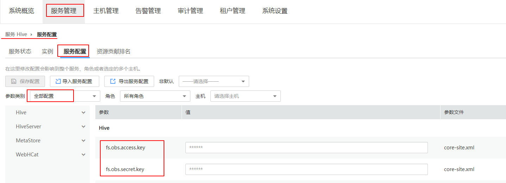
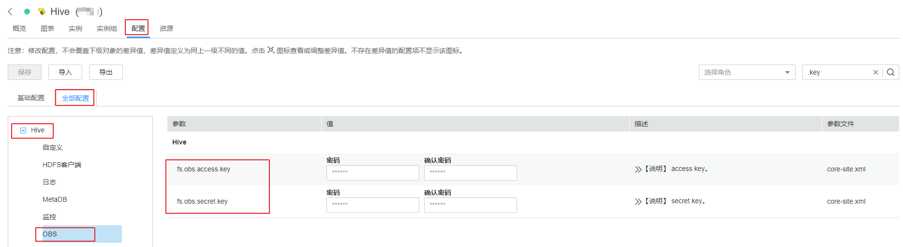
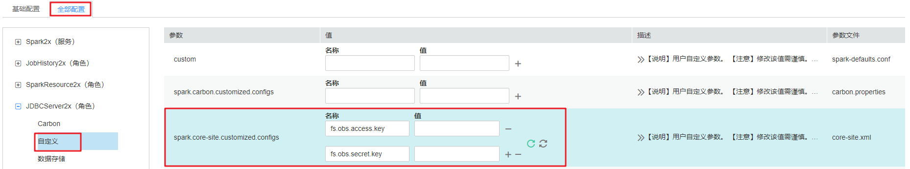

# 配置存算分离集群（AKSK方式）<a name="mrs_01_0468"></a>

MRS1.9.2及之后的版本支持使用**obs://**的方式对接OBS服务，当前主要支持的组件为Hadoop、Hive、Spark、Presto、Flink。其中HBase组件使用**obs://**的方式对接OBS服务暂不支持。

MRS提供如下访问OBS的配置方式，请选择其中一种配置即可（推荐使用委托方式）：

-   通过为MRS集群绑定ECS委托方式访问OBS，避免了AK/SK直接暴露在配置文件中的风险，具体请参考[配置存算分离集群（委托方式）](配置存算分离集群（委托方式）.md)。
-   在MRS集群中配置AK/SK，AK/SK会明文暴露在配置文件中，请谨慎使用，具体请参考本章节。
-   若集群迁移HDFS数据到OBS后，需要实现不变动业务逻辑中的数据地址的情况下完成数据访问，可参考[配置HDFS映射方式对接OBS文件系统](配置HDFS映射方式对接OBS文件系统.md)实现。

> **说明：** 
>为了提高数据写入性能，可以修改对应服务的配置参数fs.obs.buffer.dir的值为数据盘目录。

## Hadoop访问OBS<a name="section12944172353219"></a>

-   在MRS客户端的HDFS目录\($client\_home/ HDFS/hadoop/etc/hadoop\)中修改core-site.xml文件，增加如下内容。

    ```
    <property>
        <name>fs.obs.access.key</name>
        <value>ak</value>
    </property>
    <property>
        <name>fs.obs.secret.key</name>
        <value>sk</value>
    </property>
    <property>
        <name>fs.obs.endpoint</name>
        <value>obs endpoint</value>
    </property>
    ```

    > **须知：** 
    >在文件中设置AK/SK会明文暴露在配置文件中，请谨慎使用。

    添加配置后无需手动添加AK/SK、endpoint就可以直接访问OBS上的数据。例如执行如下命令查看文件系统obs-test下面的文件夹test\_obs\_orc的文件列表。

    **hadoop fs -ls "obs://obs-test/test\_obs\_orc"**

-   每次在命令行中手动添加AK/SK、endpoint访问OBS上的数据。

    **hadoop fs -Dfs.obs.endpoint=xxx -Dfs.obs.access.key=xx -Dfs.obs.secret.key=xx -ls "obs://obs-test/ test\_obs\_orc"**


## Hive访问OBS<a name="section1164714235144"></a>

1.  登录服务配置页面。
    -   针对MRS 3.x之前版本，登录集群详情页面，选择“组件管理 \> Hive \> 服务配置”。
    -   针对MRS 3.x及之后版本，登录FusionInsight Manager页面，具体请参见[访问FusionInsight Manager（MRS 3.x及之后版本）](访问FusionInsight-Manager（MRS-3-x及之后版本）.md)，选择“集群 \> 服务 \> Hive \> 配置”。

2.  将“基础配置”切换为“全部配置”。
3.  搜索“fs.obs.access.key”和“fs.obs.secret.key”参数，并分别配置为OBS的AK和SK。

    若当前集群中搜索不到如上两个参数，请在左侧导航选择“Hive \> 自定义”，在自定义参数“core.site.customized.configs”中增加如上两个参数。

    **图 1**  MRS Manager上配置OBS的AK/SK<a name="fig977314434324"></a>  
    

    **图 2**  FusionInsight Manager上配置OBS的AK/SK<a name="fig6195192722516"></a>  
    

4.  单击“保存配置”，并勾选“重新启动受影响的服务或实例。”重启Hive服务。
5.  在beeline中直接使用obs的目录进行访问。例如，执行如下命令创建Hive表并指定数据存储在test-bucket文件系统的test\_obs目录中。

    **create table test\_obs\(a int, b string\) row format delimited fields terminated by "," stored as textfile location "obs://test-bucket/test\_obs";**


## Spark访问OBS<a name="section19812102810147"></a>

> **说明：** 
>由于SparkSQL依赖Hive，所以在Spark上配置OBS时，需要同时修改[Hive访问OBS](#section1164714235144)的OBS配置。

-   spark-beeline和spark-sql

    可以通过在shell中增加如下OBS的属性实现访问OBS。

    ```
    set fs.obs.endpoint=xxx
    set fs.obs.access.key=xxx
    set fs.obs.secret.key=xxx
    ```

-   spark-beeline

    spark-beeline也可以通过在Manager中配置服务参数实现访问OBS。操作如下：

    1.  登录服务配置页面。
        -   针对MRS 3.x之前版本，登录集群详情页面，选择“组件管理 \> Spark \> 服务配置”。
        -   针对MRS 3.x及之后版本，登录FusionInsight Manager页面，具体请参见[访问FusionInsight Manager（MRS 3.x及之后版本）](访问FusionInsight-Manager（MRS-3-x及之后版本）.md)，选择“集群 \> 服务 \> Spark2x \> 配置”。

    2.  将“基础配置”切换为“全部配置”。
    3.  选择“JDBCServer \> OBS”配置fs.obs.access.key、fs.obs.secret.key参数。

        若当前集群中没有如上两个参数，请在左侧导航选择“JDBCServer \> 自定义”，在自定义参数“spark.core-site.customized.configs”中增加如上两个参数。

        **图 3**  自定义添加OBS参数<a name="fig682855911157"></a>  
        

    4.  单击“保存配置”，并勾选“重新启动受影响的服务或实例。”重启Spark服务。
    5.  在spark-beeline中访问OBS，例如访问obs://obs-demo-input/table/目录：

        **create table test\(id int\) location 'obs://obs-demo-input/table/';**


-   spark-sql和spark-submit

    spark-sql也可以通过修改core-site.xml配置文件实现访问OBS。

    使用spark-sql和使用spark-submit提交任务访问OBS时，配置文件修改方法一致。

    修改MRS客户端中Spark配置文件夹（$client\_home/Spark/spark/conf）中的core-site.xml，增加如下内容：

    ```
    <property>
        <name>fs.obs.access.key</name>
        <value>ak</value>
    </property>
    <property>
        <name>fs.obs.secret.key</name>
        <value>sk</value>
    </property>
    <property>
        <name>fs.obs.endpoint</name>
        <value>obs endpoint</value>
    </property>
    ```


## Presto访问OBS<a name="section1974614263315"></a>

1.  登录集群详情页面，选择“组件管理 \> Presto \> 服务配置”。
2.  将“基础配置”切换为“全部配置”。
3.  搜索并配置如下参数。

    -   fs.obs.access.key配置为用户AK
    -   fs.obs.secret.key配置为用户SK

    若当前集群中搜索不到如上两个参数，请在左侧导航选择“Presto \> Hive”，在自定义参数“core.site.customized.configs”中增加如上两个参数。

4.  单击“保存配置”，并勾选“重新启动受影响的服务或实例。”重启Presto服务。
5.  选择“组件管理 \> Hive \> 服务配置”。
6.  将“基础配置”切换为“全部配置”。
7.  搜索并配置如下参数。
    -   fs.obs.access.key配置为用户AK
    -   fs.obs.secret.key配置为用户SK

8.  单击“保存配置”，并勾选“重新启动受影响的服务或实例。”重启Hive服务。
9.  在Presto客户端中执行语句创建schema，指定location为OBS路径，例如：

    **CREATE SCHEMA hive.demo WITH \(location = 'obs://obs-demo/presto-demo/'\);**

10. 在该schema中建表，该表的数据即存储在OBS文件系统内，例如：

    **CREATE TABLE hive.demo.demo\_table WITH \(format = 'ORC'\) AS SELECT \* FROM tpch.sf1.customer;**


## Flink访问OBS<a name="section269994210283"></a>

在MRS客户端的Flink配置文件“客户端安装路径/Flink/flink/conf/flink-conf.yaml”中，增加如下内容。

```
fs.obs.access.key：ak  
fs.obs.secret.key: sk  
fs.obs.endpoint: obs endpoint
```

> **须知：** 
>在文件中设置AK/SK会明文暴露在配置文件中，请谨慎使用。

添加配置后无需手动添加AK/SK、endpoint就可以直接访问OBS上的数据。

