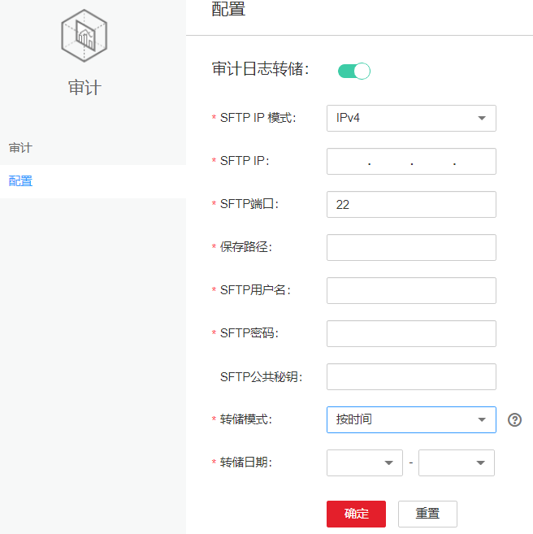

# 配置审计日志转储

## 操作场景

Manager的审计日志默认保存在数据库中，如果长期保留可能引起数据目录的磁盘空间不足问题，管理员如果需要将审计日志保存到其他归档服务器，可以在FusionInsight Manager设置转储参数及时自动转储，便于管理审计日志信息。

若用户未配置审计日志转储，当审计日志达到十万条，系统自动将这十万条审计日志保存到文件中。保存路径为主管理节点“$\{BIGDATA\_DATA\_HOME\}/dbdata\_om/dumpData/iam/operatelog”，保存的文件名格式为“OperateLog\_store\_YY\_MM\_DD\_HH\_MM\_SS.csv”，保存的审计日志历史文件数最大为50。

## 操作步骤

1.  登录FusionInsight Manager。
2.  选择“审计  \>  配置“。
3.  单击“审计日志转储”右侧的开关。

    “审计日志转储”默认为不启用，开关显示为表示启用。

4.  根据[表1](#zh-cn_topic_0263899367_table61365090)填写转储参数。

    **图 1**  转储参数  
    

    **表 1**  审计日志转储参数

    
    <table><thead align="left"><tr id="zh-cn_topic_0263899367_row64025225"><th class="cellrowborder" valign="top" width="25%" id="mcps1.2.4.1.1">
参数名

    </th>
    <th class="cellrowborder" valign="top" width="60%" id="mcps1.2.4.1.2">
参数解释

    </th>
    <th class="cellrowborder" valign="top" width="15%" id="mcps1.2.4.1.3">
参数值

    </th>
    </tr>
    </thead>
    <tbody><tr id="zh-cn_topic_0263899367_row6644528171420"><td class="cellrowborder" valign="top" width="25%" headers="mcps1.2.4.1.1 ">
SFTP IP 模式

    </td>
    <td class="cellrowborder" valign="top" width="60%" headers="mcps1.2.4.1.2 ">
目标IP的IP地址模式，可选择“IPv4”或者“IPv6”。

    </td>
    <td class="cellrowborder" valign="top" width="15%" headers="mcps1.2.4.1.3 ">
IPv4

    </td>
    </tr>
    <tr id="zh-cn_topic_0263899367_row42983324"><td class="cellrowborder" valign="top" width="25%" headers="mcps1.2.4.1.1 ">
SFTP IP

    </td>
    <td class="cellrowborder" valign="top" width="60%" headers="mcps1.2.4.1.2 ">
必选参数，指定审计日志转储后存放的SFTP服务器，建议使用基于SSH v2的SFTP服务，否则存在安全风险。

    </td>
    <td class="cellrowborder" valign="top" width="15%" headers="mcps1.2.4.1.3 ">
192.168.10.51（举例）

    </td>
    </tr>
    <tr id="zh-cn_topic_0263899367_row36842501"><td class="cellrowborder" valign="top" width="25%" headers="mcps1.2.4.1.1 ">
SFTP端口

    </td>
    <td class="cellrowborder" valign="top" width="60%" headers="mcps1.2.4.1.2 ">
必选参数，指定审计日志转储后存放的SFTP服务器连接端口。

    </td>
    <td class="cellrowborder" valign="top" width="15%" headers="mcps1.2.4.1.3 ">
22（举例）

    </td>
    </tr>
    <tr id="zh-cn_topic_0263899367_row8893924"><td class="cellrowborder" valign="top" width="25%" headers="mcps1.2.4.1.1 ">
保存路径

    </td>
    <td class="cellrowborder" valign="top" width="60%" headers="mcps1.2.4.1.2 ">
必选参数，指定SFTP服务器上保存审计日志的路径。

    </td>
    <td class="cellrowborder" valign="top" width="15%" headers="mcps1.2.4.1.3 ">
/opt/omm/oms/auditLog（举例）

    </td>
    </tr>
    <tr id="zh-cn_topic_0263899367_row63447679"><td class="cellrowborder" valign="top" width="25%" headers="mcps1.2.4.1.1 ">
SFTP用户名

    </td>
    <td class="cellrowborder" valign="top" width="60%" headers="mcps1.2.4.1.2 ">
必选参数，指定登录SFTP服务器的用户名。

    </td>
    <td class="cellrowborder" valign="top" width="15%" headers="mcps1.2.4.1.3 ">
root（举例）

    </td>
    </tr>
    <tr id="zh-cn_topic_0263899367_row54865253"><td class="cellrowborder" valign="top" width="25%" headers="mcps1.2.4.1.1 ">
SFTP密码

    </td>
    <td class="cellrowborder" valign="top" width="60%" headers="mcps1.2.4.1.2 ">
必选参数，指定登录SFTP服务器的密码。

    </td>
    <td class="cellrowborder" valign="top" width="15%" headers="mcps1.2.4.1.3 ">
<em id="zh-cn_topic_0263899367_i16219221790">SFTP服务器的密码</em>

    </td>
    </tr>
    <tr id="zh-cn_topic_0263899367_row62763565"><td class="cellrowborder" valign="top" width="25%" headers="mcps1.2.4.1.1 ">
SFTP公共秘钥

    </td>
    <td class="cellrowborder" valign="top" width="60%" headers="mcps1.2.4.1.2 ">
可选参数，指定SFTP服务器的公共密钥，建议配置SFTP的公共密钥，否则可能存在安全风险。

    </td>
    <td class="cellrowborder" valign="top" width="15%" headers="mcps1.2.4.1.3 ">
-

    </td>
    </tr>
    <tr id="zh-cn_topic_0263899367_row16742131916488"><td class="cellrowborder" valign="top" width="25%" headers="mcps1.2.4.1.1 ">
转储模式

    </td>
    <td class="cellrowborder" valign="top" width="60%" headers="mcps1.2.4.1.2 ">
必选参数，指定转储模式

    <ul id="zh-cn_topic_0263899367_ul85323224486"><li>“按数量”：日志到达指定条数（默认10万条）时开始转储</li><li>“按时间”：指定某一日期开始转储，转储频率为一年一次。</li></ul>
    </td>
    <td class="cellrowborder" valign="top" width="15%" headers="mcps1.2.4.1.3 "><ul id="zh-cn_topic_0263899367_ul8534322154810"><li>按数量</li><li>按时间</li></ul>
    </td>
    </tr>
    <tr id="zh-cn_topic_0263899367_row53250102"><td class="cellrowborder" valign="top" width="25%" headers="mcps1.2.4.1.1 ">
转储日期

    </td>
    <td class="cellrowborder" valign="top" width="60%" headers="mcps1.2.4.1.2 ">
必选参数，当选择“按时间”转储模式时可用。选择一个转储日期后，系统将在此日期开始转储。转储的日志范围为当前年份1月1日0时之前的所有审计日志。

    </td>
    <td class="cellrowborder" valign="top" width="15%" headers="mcps1.2.4.1.3 ">
11月06（举例）

    </td>
    </tr>
    </tbody>
    </table>

    > **说明：** 
    >SFTP公共密钥为空时，系统将进行安全风险提示，确定安全风险后再保存配置。

5.  单击“确定”，设置完成。

    > **说明：** 
    >审计日志转储文件关键字段参考：
    >-   “USERTYPE”表示用户类型，“0”表示“人机”用户，“1”表示“机机”用户。
    >-   “LOGLEVEL”表示安全级别，“0”表示高危，“1”表示危险，“2”表示一般，“3”表示提示。
    >-   “OPERATERESULT”表示操作结果，“0”表示成功，“1”表示失败。

