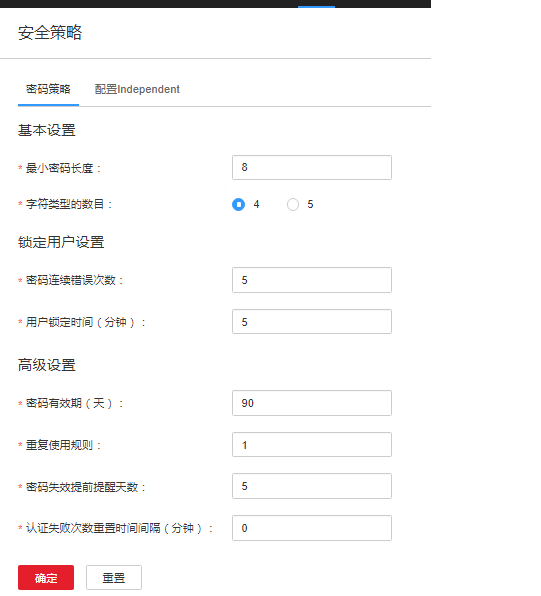

# 配置密码策略

## 操作场景

根据业务安全需要，管理员可以在FusionInsight Manager设置密码安全规则、用户登录安全规则及用户锁定规则。

> **须知：** 
>-   密码策略涉及用户管理的安全性，请根据企业安全要求谨慎修改，否则会有安全性风险。
>-   修改密码策略之后，再修改用户密码，此时新的密码策略才会生效。

## 操作步骤

1.  登录FusionInsight Manager。
2.  选择“系统  \>  权限  \>  安全策略 \> 密码策略“。
3.  具体参数参见[表1](#table_1)。

    **图 1**  修改密码策略  
    

    **表 1**  密码策略参数说明

    
    <table><thead align="left"><tr id="row31118786"><th class="cellrowborder" valign="top" width="26.26%" id="mcps1.2.3.1.1">
参数名称

    </th>
    <th class="cellrowborder" valign="top" width="73.74000000000001%" id="mcps1.2.3.1.2">
描述

    </th>
    </tr>
    </thead>
    <tbody><tr id="row27228238"><td class="cellrowborder" valign="top" width="26.26%" headers="mcps1.2.3.1.1 ">
最小密码长度

    </td>
    <td class="cellrowborder" valign="top" width="73.74000000000001%" headers="mcps1.2.3.1.2 ">
密码包含的最小字符个数，取值范围为8～64。默认值为“8”。

    </td>
    </tr>
    <tr id="row6095280"><td class="cellrowborder" valign="top" width="26.26%" headers="mcps1.2.3.1.1 ">
字符类型的数目

    </td>
    <td class="cellrowborder" valign="top" width="73.74000000000001%" headers="mcps1.2.3.1.2 ">
密码字符包含大写字母、小写字母、数字和特殊符号（包含~`!?,.:;-_'(){}[]/&lt;&gt;@#$%^&amp;*+|\=和空格）的最小种类。可选择数值为“4”和“5”。默认值“4”表示可使用大写字母、小写字母、数字、特殊符号，选择“5”表示可使用全部。

    </td>
    </tr>
    <tr id="row17452141010341"><td class="cellrowborder" valign="top" width="26.26%" headers="mcps1.2.3.1.1 ">
密码连续错误次数

    </td>
    <td class="cellrowborder" valign="top" width="73.74000000000001%" headers="mcps1.2.3.1.2 ">
用户输入错误密码超过配置值后将锁定，取值范围为3～30。默认值为“5”。

    </td>
    </tr>
    <tr id="row06451269341"><td class="cellrowborder" valign="top" width="26.26%" headers="mcps1.2.3.1.1 ">
用户锁定时间（分钟）

    </td>
    <td class="cellrowborder" valign="top" width="73.74000000000001%" headers="mcps1.2.3.1.2 ">
满足用户锁定条件时，用户被锁定的时长，取值范围为5～120。默认值为“5”。

    </td>
    </tr>
    <tr id="row15374269"><td class="cellrowborder" valign="top" width="26.26%" headers="mcps1.2.3.1.1 ">
密码有效期（天）

    </td>
    <td class="cellrowborder" valign="top" width="73.74000000000001%" headers="mcps1.2.3.1.2 ">
密码有效使用天数：取值范围0～90，0表示永久有效，默认值为“90”。

    </td>
    </tr>
    <tr id="row173051658181720"><td class="cellrowborder" valign="top" width="26.26%" headers="mcps1.2.3.1.1 ">
重复使用规则

    </td>
    <td class="cellrowborder" valign="top" width="73.74000000000001%" headers="mcps1.2.3.1.2 ">
修改密码时，不允许使用最近N次使用过的密码，N=1～5，默认为“1”。此策略只影响“人机”用户。

    </td>
    </tr>
    <tr id="row53627266"><td class="cellrowborder" valign="top" width="26.26%" headers="mcps1.2.3.1.1 ">
密码失效提前提醒天数

    </td>
    <td class="cellrowborder" valign="top" width="73.74000000000001%" headers="mcps1.2.3.1.2 ">
密码失效提前提醒天数：表示提醒密码失效到密码真正失效的天数。提前一段时间提醒密码即将失效。设置后，若集群时间和该用户密码失效时间的差小于该值，则说明用户进入密码失效提醒期。用户登录FusionInsight Manager界面时会提示用户密码即将过期，是否需要修改密码。取值范围为“0”-“X”，（“X”为密码有效期的一半，向下取整）。“0”表示不提醒，默认值为“5”。

    </td>
    </tr>
    <tr id="row37598356"><td class="cellrowborder" valign="top" width="26.26%" headers="mcps1.2.3.1.1 ">
认证失败次数重置时间间隔（分钟）

    </td>
    <td class="cellrowborder" valign="top" width="73.74000000000001%" headers="mcps1.2.3.1.2 ">
密码输入错误次数保留的时间间隔，取值范围为0～1440。“0”表示永远有效，“1440”表示1天。默认值为“5”。

    </td>
    </tr>
    </tbody>
    </table>

4.  单击“确定”保存配置。

