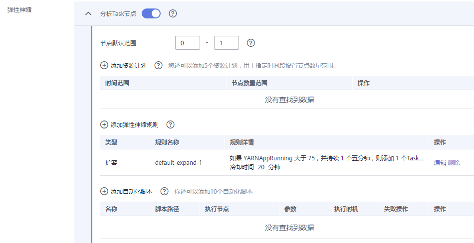

# 配置弹性伸缩规则

## 背景信息

在大数据应用，尤其是实时分析处理数据的场景中，常常需要根据数据量的变化动态调整集群节点数量以增减资源。MRS的弹性伸缩规则功能支持根据集群负载对集群的Task节点进行弹性伸缩。如果数据量是按照周期进行有规律的变化，用户可以按照固定时间段来自动调整Task节点数量范围，从而在数据量变化前提前完成集群的扩缩容。

-   弹性伸缩规则：根据集群实时负载指标对Task节点数量进行调整，数据量变化后触发扩缩容，有一定的延后性。
-   资源计划：按时间段设置Task节点数量范围，若数据量变化存在周期性规律，则可通过资源计划在数据量变化前提前完成集群的扩缩容，避免出现增加或减少资源的延后。

弹性伸缩规则与资源计划均可触发弹性伸缩，两者必须至少配置其中一种，也可以叠加使用。资源计划与基于负载的弹性伸缩规则叠加使用可以使得集群节点的弹性更好，足以应对偶尔超出预期的数据峰值出现。

当某些业务场景要求在集群扩缩容之后，根据节点数量的变化对资源分配或业务逻辑进行更改时，手动扩缩容的场景客户可以登录集群节点进行操作。对于弹性伸缩场景，MRS支持通过自定义弹性伸缩自动化脚本来解决。自动化脚本可以在弹性伸缩前后执行相应操作，自动适应业务负载的变化，免去了人工操作。同时，自动化脚本给用户实现个性需求提供了途径，完全自定义的脚本与多个可选的执行时机基本可以满足用户的各项需求，使弹性伸缩更具灵活性。

-   弹性伸缩规则：
    -   用户对于一个集群，可以同时设置扩容、缩容最多各5条弹性伸缩规则。
    -   系统根据用户的配置顺序从前到后依次判断规则，先扩容，后缩容。请尽量把重要的策略放在前面，以防一次扩容或缩容无法达到预期效果而进行反复触发。
    -   比对因子包括大于、大于等于、小于、小于等于。
    -   集群连续5n（n默认值为1）分钟持续满足配置的指标阈值后才能触发扩容或者缩容。
    -   每次扩容或者缩容后，存在一个冷却时间，冷却时间默认为20分钟，最小值为0。
    -   单次扩容或者缩容的节点数，最小1个节点，最大100个节点。

-   资源计划（按时间段设置Task节点数量范围）：
    -   用户可以按时间段设置集群Task节点的最大数量和最小数量，当集群Task节点数不满足当前时间资源计划节点范围要求时，系统触发扩容或缩容。
    -   用户最多可以为一个集群设置5条资源计划。
    -   资源计划周期以天为单位，起始时间与结束时间可以设置为00:00-23:59之间的任意时间点。起始时间早于结束时间至少30分钟。不同资源计划配置的时间段不可交叉。
    -   资源计划触发扩容或缩容后，存在10分钟的冷却时间，冷却时间内不会再次触发弹性伸缩。
    -   当启用资源计划时，在除配置资源计划配置时间段的其他时间内，集群Task节点数量会被限定在用户配置的默认节点数量范围内。
    -   当不启用资源计划时，集群不会将Task节点数量限制在默认节点数量范围内。

-   自动化脚本：
    -   用户可以设置自定义脚本，当弹性伸缩触发时，在集群节点上自动运行。
    -   用户最多可以为一个集群设置10个自动化脚本。
    -   可以指定自动化脚本某种或多种类型的节点上执行。
    -   脚本执行时机可以是扩容前、扩容后、缩容前或缩容后。
    -   使用自动化脚本前，请先将脚本上传到集群虚拟机或与集群同region的OBS文件系统中。集群虚拟机上的脚本只能在已有节点上执行，若脚本需要在新扩容的节点上执行，请将脚本上传到OBS。

## 进入弹性伸缩配置界面

弹性伸缩功能可以创建集群时，在高级配置参数中进行配置，也可以集群创建成功后通过管理控制台对集群内的Task节点组配置相关规则。

**创建集群时配置弹性伸缩：**

1.  登录MRS管理控制台。
2.  在购买包含有Task类型节点组件的集群时，参考[购买自定义集群](购买自定义集群.md)配置集群软件配置和硬件配置信息后，在“高级配置“页签的弹性伸缩栏，打开对应Task节点类型后的开关按钮，即可进行弹性伸缩规则及资源计划的配置或修改。

    **图 1**  创建集群时配置弹性伸缩  
    

    您可以参考以下场景进行配置：

    -   [场景1：单独配置弹性伸缩规则](#section15610431184420)
    -   [场景2：单独使用资源计划](#section1127519214291)
    -   [场景3：弹性伸缩规则与资源计划叠加使用](#section10800203113299)

**为已有集群配置弹性伸缩：**

1.  登录MRS管理控制台。
2.  选择“集群列表 \> 现有集群”，选中一个运行中的集群并单击集群名称。进入集群详情页面。
3.  在“节点管理”页签Task类型节点组的“操作”列单击“弹性伸缩“，即可进入“弹性伸缩“页面。

    > **说明：** 
    >-   弹性伸缩仅用于Task节点组，当集群内没有Task节点时，先单击“配置Task节点”增加Task节点后再继续配置。
    >-   对于MRS 3.x及之后版本，“配置Task节点”仅适用于分析集群、流试集群和混合集群。
    >-   弹性伸缩规则可调控节点数量，也会对实际价格有影响，请谨慎操作。

4.  打开弹性伸缩开关按钮，即可进行弹性伸缩规则及资源计划的配置或修改。

    **图 2**  弹性伸缩  
    

    您可以参考以下场景进行配置：

    -   [场景1：单独配置弹性伸缩规则](#section15610431184420)
    -   [场景2：单独使用资源计划](#section1127519214291)
    -   [场景3：弹性伸缩规则与资源计划叠加使用](#section10800203113299)

## 场景1：单独配置弹性伸缩规则

例如业务场景如下：

需要根据Yarn资源使用情况动态调整节点数，在Yarn可用内存低于20%时扩容5个节点，可用内存高于70%时缩容5个节点。Task节点组最高不超过10个节点，最低不少于1个节点。

1.  进入弹性伸缩配置界面后，配置弹性伸缩规则。
    -   配置节点默认范围

        输入Task实例弹性伸缩的数量范围，此约束应用于所有扩容缩容规则，取值范围为0～500。

        例如本业务场景中，配置为1\~10。

    -   配置弹性伸缩规则

        需要配置扩容或者缩容规则，否则弹性伸缩将不会启用。

        1.  规则类型选择“扩容“或者“缩容“。
        2.  单击“添加规则“，进入规则编辑页面。

            **图 3**  添加规则  
            

        3.  配置“规则名称“、“如果“、“持续“、“添加“、“冷却时间“。
        4.  单击“确定“。

            您可以在弹性伸缩页面，扩容或者缩容区域查看、编辑或删除配置的规则。您可以继续添加并配置多条规则。

2.  （可选）配置自动化脚本。

    在“高级配置“项选择“现在配置 \> 添加“或者单击“添加自动化脚本”按钮，进入“自动化脚本“配置页面。

    MRS 3.x版本集群不支持该操作。

    **图 4**  自动化脚本  
    

    1.  配置“名称”、“脚本路径”、“执行节点类型”、“参数”、“执行时机”、“失败操作”。参数详情请参考[表3](#table15644113520578)。
    2.  单击“确定“保存自动化脚本配置。

3.  单击“确定“，完成弹性伸缩规则设置。

    > **说明：** 
    >如果是为已有集群配置弹性伸缩的场景，需勾选“我同意授权MRS服务根据以上策略自动进行节点扩容/缩容操作。“。

## 场景2：单独使用资源计划

当数据量以天为周期有规律的变化，并且希望在数据量变化前提前完成集群的扩缩容，可以使用MRS的资源计划配置在规定时间内按计划调整Task节点数量。

例如：

某项实时处理业务数据量在每天7:00\~13:00出现高峰，其他时间保持平稳低水平。假设我们使用MRS流式集群来处理该业务数据，在7:00\~13:00时，为应对数据量高峰需要5个Task节点的资源，其他时间只需要2个Task节点。

1.  进入弹性伸缩配置界面后，配置资源计划。

    资源计划可调控节点数量，也会对实际价格有影响，请谨慎操作。

    1.  节点数量范围的“默认范围“设置为“2-2“，表示除资源计划规定时间范围外，其他时间Task节点数量固定为2个。
    2.  单击默认范围下方的“配置指定时间段的节点数量范围“或者“添加资源计划”。
    3.  配置“时间范围“和“节点数量范围“。

        例如此处“时间范围“设置为“07:00-13:00“，“节点数量范围“设置为“5-5“，表示在该时间范围内，Task节点数量固定为5个。

        参数详情请参考[表2](#table1846575414619)，可以单击“配置指定时间段的节点数量范围“配置多条资源计划。

        > **说明：** 
        >-   如果没有配置指定时间段的节点数量范围，则节点数量范围以“默认范围”为准。
        >-   如果配置了指定时间段的节点数量范围，则在这个时间范围内，以配置的“节点数量范围”为准。不在配置的时间范围时，则以“默认范围”为准。

2.  （可选）配置自动化脚本。

    在“高级配置“项选择“现在配置 \> 添加“或者单击“添加自动化脚本”按钮，进入“自动化脚本“配置页面。

    MRS 3.x版本集群不支持该操作。

    **图 5**  自动化脚本  
    

    1.  配置“名称”、“脚本路径”、“执行节点类型”、“参数”、“执行时机”、“失败操作”。参数详情请参考[表3](配置弹性伸缩规则.md#table15644113520578)。
    2.  单击“确定“保存自动化脚本配置。

3.  单击“确定“，完成弹性伸缩规则设置。

    > **说明：** 
    >如果是为已有集群配置弹性伸缩的场景，需勾选“我同意授权MRS服务根据以上策略自动进行节点扩容/缩容操作。“。

## 场景3：弹性伸缩规则与资源计划叠加使用

假如数据量并非非常平稳，有可能出现超出预期的波动，因此并不能保证固定Task节点范围一定可以满足业务场景，我们需要在资源计划的基础上根据实时负载对Task节点数量进行调整。

例如业务场景如下：

某项实时处理业务数据量在每天7:00-13:00出现规律性变化，但是数据量变化并非非常平稳。假设在7:00-13:00期间，需要Task节点的数量范围是5\~8个，其他时间需要Task节点数量外围为2\~4个。因此可以在资源计划的基础上，设置基于负载的弹性伸缩规则，以实现当数据量超出预期后，Task节点数量可以在资源计划规定的范围内根据负载情况进行浮动，但不会超出该规定范围。资源计划触发时，会以变化最小的方式使节点数量满足计划规定范围，即如果需要扩容则扩容到计划节点数量范围的下限，如果需要缩容则缩容到计划节点数量范围的上限。

1.  进入弹性伸缩配置界面后，配置弹性伸缩规则。

    弹性伸缩规则可调控节点数量，也会对实际价格有影响，请谨慎操作。

    -   节点数量范围的默认范围：

        输入Task实例弹性伸缩的数量范围，此约束应用于所有扩容缩容规则。

        例如本场景中，配置为2\~4个。

    -   伸缩规则：

        需要配置扩容或者缩容，否则弹性伸缩将不会启用。

        1.  规则类型选择“扩容“或者“缩容“。
        2.  单击“添加规则“，进入“添加规则“页面。

            **图 6**  添加规则  
            

        3.  配置“规则名称“、“如果“、“持续“、“添加“、“冷却时间“。
        4.  单击“确定“。

            您可以在弹性伸缩页面，扩容或者缩容区域查看配置的规则。

2.  配置资源计划。
    1.  单击节点默认范围下方的“配置指定时间段的节点数量范围“或者“添加资源计划”。
    2.  配置“时间范围“和“节点数量范围“。

        例如此处“时间范围“设置为“07:00-13:00“，“节点数量范围“设置为“5\~8“。

        参数详情请参考[表2](#table1846575414619)，可以单击“配置指定时间段的节点数量范围“或者“添加资源计划”按钮配置多条资源计划。

        > **说明：** 
        >-   如果没有配置指定时间段的节点数量范围，则节点数量范围以“默认范围”为准。
        >-   如果配置了指定时间段的节点数量范围，则在这个时间范围内，以配置的“节点数量范围”为准。不在配置的时间范围时，则以“默认范围”为准。

3.  （可选）配置自动化脚本。

    在“高级配置“项选择“现在配置 \> 添加“或者单击“添加自动化脚本”按钮，进入“自动化脚本“配置页面。

    MRS 3.x版本集群不支持该操作。

    **图 7**  自动化脚本  
    

    1.  配置“名称”、“脚本路径”、“执行节点类型”、“参数”、“执行时机”、“失败操作”。参数详情请参考[表3](配置弹性伸缩规则.md#table15644113520578)。
    2.  单击“确定“保存自动化脚本配置。

4.  单击“确定“，完成弹性伸缩规则设置。

    > **说明：** 
    >如果是为已有集群配置弹性伸缩的场景，需勾选“我同意授权MRS服务根据以上策略自动进行节点扩容/缩容操作。“。

## 相关信息

在添加规则时，可以参考[表1](#table15133845184415)配置相应的指标。

**表 1**  弹性伸缩指标列表

<table><thead align="left"><tr id="row3139114513449"><th class="cellrowborder" valign="top" width="15.598440155984402%" id="mcps1.2.5.1.1">
集群类型

</th>
<th class="cellrowborder" valign="top" width="24.437556244375564%" id="mcps1.2.5.1.2">
指标名称

</th>
<th class="cellrowborder" valign="top" width="15.22847715228477%" id="mcps1.2.5.1.3">
数值类型

</th>
<th class="cellrowborder" valign="top" width="44.73552644735527%" id="mcps1.2.5.1.4">
说明

</th>
</tr>
</thead>
<tbody><tr id="row13152845204413"><td class="cellrowborder" rowspan="7" valign="top" width="15.598440155984402%" headers="mcps1.2.5.1.1 ">
流式集群

</td>
<td class="cellrowborder" valign="top" width="24.437556244375564%" headers="mcps1.2.5.1.2 ">
StormSlotAvailable

</td>
<td class="cellrowborder" valign="top" width="15.22847715228477%" headers="mcps1.2.5.1.3 ">
整型

</td>
<td class="cellrowborder" valign="top" width="44.73552644735527%" headers="mcps1.2.5.1.4 ">
Storm组件的可用slot数。

取值范围为[0～2147483646]。

</td>
</tr>
<tr id="row1815919453445"><td class="cellrowborder" valign="top" headers="mcps1.2.5.1.1 ">
StormSlotAvailablePercentage

</td>
<td class="cellrowborder" valign="top" headers="mcps1.2.5.1.2 ">
百分比

</td>
<td class="cellrowborder" valign="top" headers="mcps1.2.5.1.3 ">
Storm组件可用slot百分比。是可用slot数与总slot数的比值。

取值范围为[0～100]。

</td>
</tr>
<tr id="row1916634511445"><td class="cellrowborder" valign="top" headers="mcps1.2.5.1.1 ">
StormSlotUsed

</td>
<td class="cellrowborder" valign="top" headers="mcps1.2.5.1.2 ">
整型

</td>
<td class="cellrowborder" valign="top" headers="mcps1.2.5.1.3 ">
Storm组件的已用slot数。

取值范围为[0～2147483646]。

</td>
</tr>
<tr id="row5171045114416"><td class="cellrowborder" valign="top" headers="mcps1.2.5.1.1 ">
StormSlotUsedPercentage

</td>
<td class="cellrowborder" valign="top" headers="mcps1.2.5.1.2 ">
百分比

</td>
<td class="cellrowborder" valign="top" headers="mcps1.2.5.1.3 ">
Storm组件已用slot百分比。是已用slot数与总slot数的比值。

取值范围为[0～100]。

</td>
</tr>
<tr id="row850819572024"><td class="cellrowborder" valign="top" headers="mcps1.2.5.1.1 ">
StormSupervisorMemAverageUsage

</td>
<td class="cellrowborder" valign="top" headers="mcps1.2.5.1.2 ">
整形

</td>
<td class="cellrowborder" valign="top" headers="mcps1.2.5.1.3 ">
Storm组件Supervisor的内存平均使用量。

取值范围为[0～2147483646]。

</td>
</tr>
<tr id="row7820013318"><td class="cellrowborder" valign="top" headers="mcps1.2.5.1.1 ">
StormSupervisorMemAverageUsagePercentage

</td>
<td class="cellrowborder" valign="top" headers="mcps1.2.5.1.2 ">
百分比

</td>
<td class="cellrowborder" valign="top" headers="mcps1.2.5.1.3 ">
Storm组件Supervisor进程使用的内存占系统总内存的平均百分比。

取值范围[0 ~ 100]。

</td>
</tr>
<tr id="row89487213316"><td class="cellrowborder" valign="top" headers="mcps1.2.5.1.1 ">
StormSupervisorCPUAverageUsagePercentage

</td>
<td class="cellrowborder" valign="top" headers="mcps1.2.5.1.2 ">
百分比

</td>
<td class="cellrowborder" valign="top" headers="mcps1.2.5.1.3 ">
Storm组件Supervisor进程使用的CPU占系统总CPU的平均百分比。

取值范围[0 ~ 6000]。

</td>
</tr>
<tr id="row8177124511442"><td class="cellrowborder" rowspan="14" valign="top" width="15.598440155984402%" headers="mcps1.2.5.1.1 ">
分析集群

</td>
<td class="cellrowborder" valign="top" width="24.437556244375564%" headers="mcps1.2.5.1.2 ">
YARNAppPending

</td>
<td class="cellrowborder" valign="top" width="15.22847715228477%" headers="mcps1.2.5.1.3 ">
整型

</td>
<td class="cellrowborder" valign="top" width="44.73552644735527%" headers="mcps1.2.5.1.4 ">
YARN组件挂起的任务数。

取值范围为[0～2147483646]。

</td>
</tr>
<tr id="row1218715459446"><td class="cellrowborder" valign="top" headers="mcps1.2.5.1.1 ">
YARNAppPendingRatio

</td>
<td class="cellrowborder" valign="top" headers="mcps1.2.5.1.2 ">
比率

</td>
<td class="cellrowborder" valign="top" headers="mcps1.2.5.1.3 ">
YARN组件挂起的任务数比例。是YARN挂起的任务数与YARN运行中的任务数比值。

取值范围为[0～2147483646]。

</td>
</tr>
<tr id="row141968455447"><td class="cellrowborder" valign="top" headers="mcps1.2.5.1.1 ">
YARNAppRunning

</td>
<td class="cellrowborder" valign="top" headers="mcps1.2.5.1.2 ">
整型

</td>
<td class="cellrowborder" valign="top" headers="mcps1.2.5.1.3 ">
YARN组件运行中的任务数。

取值范围为[0～2147483646]。

</td>
</tr>
<tr id="row6203164554413"><td class="cellrowborder" valign="top" headers="mcps1.2.5.1.1 ">
YARNContainerAllocated

</td>
<td class="cellrowborder" valign="top" headers="mcps1.2.5.1.2 ">
整型

</td>
<td class="cellrowborder" valign="top" headers="mcps1.2.5.1.3 ">
YARN组件中已分配的container个数。

取值范围为[0～2147483646]。

</td>
</tr>
<tr id="row16210134594419"><td class="cellrowborder" valign="top" headers="mcps1.2.5.1.1 ">
YARNContainerPending

</td>
<td class="cellrowborder" valign="top" headers="mcps1.2.5.1.2 ">
整型

</td>
<td class="cellrowborder" valign="top" headers="mcps1.2.5.1.3 ">
YARN组件挂起的container个数。

取值范围为[0～2147483646]。

</td>
</tr>
<tr id="row5214174574414"><td class="cellrowborder" valign="top" headers="mcps1.2.5.1.1 ">
YARNContainerPendingRatio

</td>
<td class="cellrowborder" valign="top" headers="mcps1.2.5.1.2 ">
比率

</td>
<td class="cellrowborder" valign="top" headers="mcps1.2.5.1.3 ">
YARN组件挂起的container比率。是挂起的container数与运行中的container数的比值。

取值范围为[0～2147483646]。

</td>
</tr>
<tr id="row14219845174419"><td class="cellrowborder" valign="top" headers="mcps1.2.5.1.1 ">
YARNCPUAllocated

</td>
<td class="cellrowborder" valign="top" headers="mcps1.2.5.1.2 ">
整型

</td>
<td class="cellrowborder" valign="top" headers="mcps1.2.5.1.3 ">
YARN组件已分配的虚拟CPU核心数。

取值范围为[0～2147483646]。

</td>
</tr>
<tr id="row12229144554419"><td class="cellrowborder" valign="top" headers="mcps1.2.5.1.1 ">
YARNCPUAvailable

</td>
<td class="cellrowborder" valign="top" headers="mcps1.2.5.1.2 ">
整型

</td>
<td class="cellrowborder" valign="top" headers="mcps1.2.5.1.3 ">
YARN组件可用的虚拟CPU核心数。

取值范围为[0～2147483646]。

</td>
</tr>
<tr id="row42352045144414"><td class="cellrowborder" valign="top" headers="mcps1.2.5.1.1 ">
YARNCPUAvailablePercentage

</td>
<td class="cellrowborder" valign="top" headers="mcps1.2.5.1.2 ">
百分比

</td>
<td class="cellrowborder" valign="top" headers="mcps1.2.5.1.3 ">
YARN组件可用虚拟CPU核心数百分比。是可用虚拟CPU核心数与总虚拟CPU核心数比值。

取值范围为[0～100]。

</td>
</tr>
<tr id="row1324204594415"><td class="cellrowborder" valign="top" headers="mcps1.2.5.1.1 ">
YARNCPUPending

</td>
<td class="cellrowborder" valign="top" headers="mcps1.2.5.1.2 ">
整型

</td>
<td class="cellrowborder" valign="top" headers="mcps1.2.5.1.3 ">
YARN组件挂起的虚拟CPU核心数。

取值范围为[0～2147483646]。

</td>
</tr>
<tr id="row82511445154420"><td class="cellrowborder" valign="top" headers="mcps1.2.5.1.1 ">
YARNMemoryAllocated

</td>
<td class="cellrowborder" valign="top" headers="mcps1.2.5.1.2 ">
整型

</td>
<td class="cellrowborder" valign="top" headers="mcps1.2.5.1.3 ">
YARN组件已分配内存大小。单位为MB。

取值范围为[0～2147483646]。

</td>
</tr>
<tr id="row6256114512445"><td class="cellrowborder" valign="top" headers="mcps1.2.5.1.1 ">
YARNMemoryAvailable

</td>
<td class="cellrowborder" valign="top" headers="mcps1.2.5.1.2 ">
整型

</td>
<td class="cellrowborder" valign="top" headers="mcps1.2.5.1.3 ">
YARN组件可用内存大小。单位为MB。

取值范围为[0～2147483646]。

</td>
</tr>
<tr id="row11261164517449"><td class="cellrowborder" valign="top" headers="mcps1.2.5.1.1 ">
YARNMemoryAvailablePercentage

</td>
<td class="cellrowborder" valign="top" headers="mcps1.2.5.1.2 ">
百分比

</td>
<td class="cellrowborder" valign="top" headers="mcps1.2.5.1.3 ">
YARN组件可用内存百分比。是YARN组件可用内存大小与YARN组件总内存大小的比值。

取值范围为[0～100]。

</td>
</tr>
<tr id="row2271154524410"><td class="cellrowborder" valign="top" headers="mcps1.2.5.1.1 ">
YARNMemoryPending

</td>
<td class="cellrowborder" valign="top" headers="mcps1.2.5.1.2 ">
整型

</td>
<td class="cellrowborder" valign="top" headers="mcps1.2.5.1.3 ">
YARN组件挂起的内存大小。

取值范围为[0～2147483646]。

</td>
</tr>
</tbody>
</table>

> **说明：** 
>-   [表1](#table15133845184415)中指标数值类型为百分比或比率时，有效数值可精确到百分位。其中百分比类型指标数值为去除百分号（%）后的小数值，如16.80即代表16.80%。
>-   混合集群的支持分析集群和流式集群的所有指标。

在添加资源计划时，可以参考[表2](#table1846575414619)配置相应的参数。

**表 2**  资源计划配置项说明

<table><thead align="left"><tr id="row5465205454613"><th class="cellrowborder" valign="top" width="22.720000000000002%" id="mcps1.2.3.1.1">
配置项

</th>
<th class="cellrowborder" valign="top" width="77.28%" id="mcps1.2.3.1.2">
说明

</th>
</tr>
</thead>
<tbody><tr id="row16466185474616"><td class="cellrowborder" valign="top" width="22.720000000000002%" headers="mcps1.2.3.1.1 ">
时间范围

</td>
<td class="cellrowborder" valign="top" width="77.28%" headers="mcps1.2.3.1.2 ">
资源计划的起始时间和结束时间，精确到分钟，取值范围[00:00, 23:59]。例如资源计划开始于早上8:00，结束于10:00，则配置为8:00-10:00。结束时间必须晚于开始时间至少30分钟。

</td>
</tr>
<tr id="row84668549466"><td class="cellrowborder" valign="top" width="22.720000000000002%" headers="mcps1.2.3.1.1 ">
节点数量范围

</td>
<td class="cellrowborder" valign="top" width="77.28%" headers="mcps1.2.3.1.2 ">
资源计划内的节点数量上下限，取值范围[0,500]，在资源计划时间内，集群Task节点数量小于最小节点数时，弹性伸缩会将集群Task节点一次性扩容到最小节点数。在资源计划时间内，集群Task节点数量大于最大节点数时，弹性伸缩会将集群Task节点一次性缩容到最大节点数。最小节点数必须小于或等于最大节点数。

</td>
</tr>
</tbody>
</table>

> **说明：** 
>-   当启用资源计划时，弹性伸缩配置中的“默认节点数量范围”将在资源计划外的时间段内强制生效。例如“默认节点数量范围”配置为1-2，配置资源计划：08:00-10:00之间节点数量范围为4-5，则在一天中的非资源计划时间段（0:00-8:00以及10:00-23:59）内，Task节点会被强制限制在1个到2个中间，若节点数量大于2则触发自动缩容，若节点数量小于1则触发自动扩容。
>-   当不启用资源计划时，节点数量范围的“默认范围“会在全部时间范围生效，如果节点数量不在“节点数量范围”的默认范围，主动增减Task节点数量到默认范围内。
>-   资源计划间时间段不可交叉，时间段交叉意为某个时间点存在两个生效的资源计划，例如配置资源计划1在08:00-10:00生效，资源计划2在09:00-11:00生效，则两个资源计划存在时间段交叉，交叉时间段09:00-10:00。
>-   资源计划不能跨天配置，例如如果要配置23:00至次日01:00的资源计划，请配置时间段为23:00-00:00和00:00-01:00的两个资源计划。

在添加自动化脚本时，可以参考[表3](#table15644113520578)配置相应参数。

**表 3**  自动化脚本配置说明

<table><thead align="left"><tr id="row064413565714"><th class="cellrowborder" valign="top" width="22.720000000000002%" id="mcps1.2.3.1.1">
配置项

</th>
<th class="cellrowborder" valign="top" width="77.28%" id="mcps1.2.3.1.2">
说明

</th>
</tr>
</thead>
<tbody><tr id="row864418357576"><td class="cellrowborder" valign="top" width="22.720000000000002%" headers="mcps1.2.3.1.1 ">
名称

</td>
<td class="cellrowborder" valign="top" width="77.28%" headers="mcps1.2.3.1.2 ">
自动化脚本的名称。

只能由数字、英文字符、空格、中划线和下划线组成，且不能以空格开头。

可输入的字符串长度为1～64个字符。

 说明： 

同一集群内，不允许配置相同的名称。不同集群之间，可以配置相同的名称。

</td>
</tr>
<tr id="row1664573505711"><td class="cellrowborder" valign="top" width="22.720000000000002%" headers="mcps1.2.3.1.1 ">
脚本路径

</td>
<td class="cellrowborder" valign="top" width="77.28%" headers="mcps1.2.3.1.2 ">
脚本的路径。路径可以是OBS文件系统的路径或虚拟机本地的路径。

<ul id="ul129121753017"><li>OBS文件系统的路径，必须以s3a://开头，以.sh结尾。例如：s3a://mrs-samples/xxx.sh</li><li>虚拟机本地的路径，脚本所在的路径必须以‘/’开头，以.sh结尾。例如，安装Zepelin的示例脚本路径如下：/opt/bootstrap/zepelin/zepelin_install.sh</li></ul>
</td>
</tr>
<tr id="row96451235185718"><td class="cellrowborder" valign="top" width="22.720000000000002%" headers="mcps1.2.3.1.1 ">
执行节点类型

</td>
<td class="cellrowborder" valign="top" width="77.28%" headers="mcps1.2.3.1.2 ">
选择自动化脚本所执行的节点类型。

 说明： 
<ul id="ul26783219257"><li>如果选择Master节点，您可以通过开关选择是否只在Active Master节点执行此脚本。</li><li>如果选择开启此功能，表示只在Active Master节点上执行。如果选择关闭，表示在所有Master节点执行。默认关闭。</li></ul>

</td>
</tr>
<tr id="row4645163515578"><td class="cellrowborder" valign="top" width="22.720000000000002%" headers="mcps1.2.3.1.1 ">
参数

</td>
<td class="cellrowborder" valign="top" width="77.28%" headers="mcps1.2.3.1.2 ">
自动化脚本参数，支持通过传入以下预定义变量获得弹性伸缩相关信息：

<ul id="ul20469526946"><li>${mrs_scale_node_num} ：弹性伸缩节点数量，总是正数</li><li>${mrs_scale_type} ：弹性伸缩类型，扩容为“scale_out”，缩容为“scale_in”</li><li>${mrs_scale_node_hostnames} ：弹性伸缩节点的主机名，多个主机名之间以“,”隔开</li><li>${mrs_scale_node_ips} ：弹性伸缩节点的IP，多个IP之间以“,”隔开</li><li>${mrs_scale_rule_name}：触发弹性伸缩的规则名，如果是资源计划则为“resource_plan”</li></ul>
</td>
</tr>
<tr id="row784105918817"><td class="cellrowborder" valign="top" width="22.720000000000002%" headers="mcps1.2.3.1.1 ">
执行时机

</td>
<td class="cellrowborder" valign="top" width="77.28%" headers="mcps1.2.3.1.2 ">
选择自动化脚本执行的时间。支持“扩容前”、“扩容后”、“缩容前”、“缩容后”四种类型。

 说明： 

假设执行节点类型中包含Task节点：

<ul id="ul206920341113"><li>执行时机为扩容前的脚本不会在将要扩容出的Task节点上执行。</li><li>执行时机为扩容后的脚本会在扩容出的Task节点上执行。</li><li>执行时机为缩容前的脚本会在即将被删除的Task节点上执行。</li><li>执行时机为缩容后的脚本不会在已经被删除的Task节点上执行。</li></ul>

</td>
</tr>
<tr id="row764024151416"><td class="cellrowborder" valign="top" width="22.720000000000002%" headers="mcps1.2.3.1.1 ">
失败操作

</td>
<td class="cellrowborder" valign="top" width="77.28%" headers="mcps1.2.3.1.2 ">
该脚本执行失败后，是否继续执行后续脚本和扩缩容操作。
 说明： 
<ul id="ul101241115164910"><li>建议您在调试阶段设置为“继续”，无论此脚本是否执行成功，则集群都能继续扩缩容操作。</li><li>若脚本执行失败，请到集群虚拟机机的“/var/log/Bootstrap”路径下查看失败日志。</li><li>由于缩容成功不可回滚，缩容后执行的脚本失败操作只能选择“继续”。</li></ul>

</td>
</tr>
</tbody>
</table>

> **说明：** 
>自动化脚本只在弹性伸缩时触发，手动调整集群节点时不会运行。

