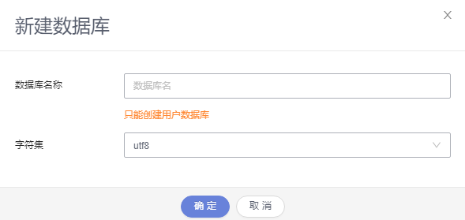
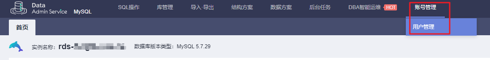
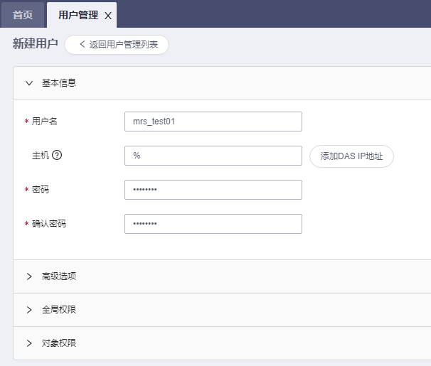
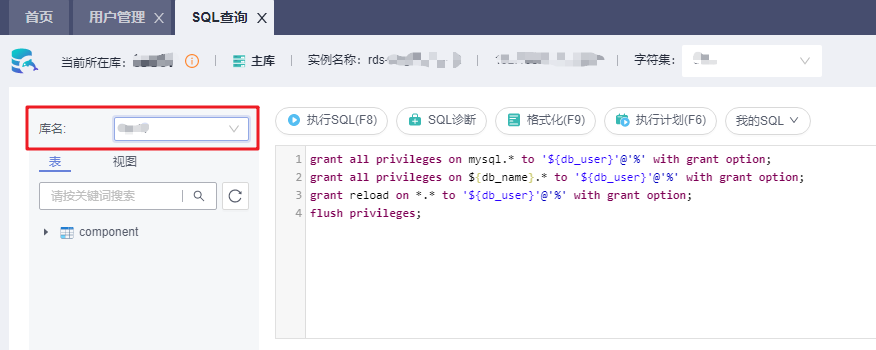
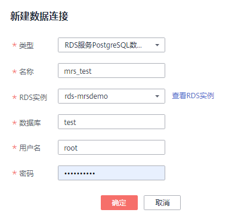
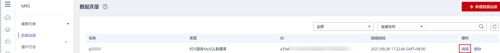
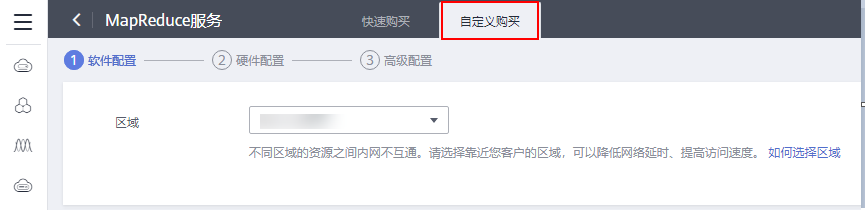
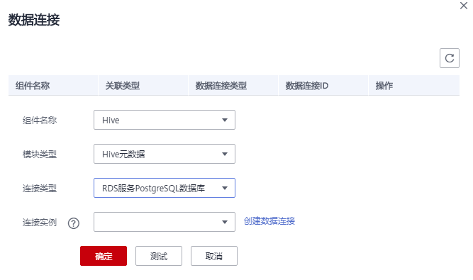

# 配置数据连接<a name="mrs_01_0633"></a>

MRS的数据连接是用来管理集群中组件使用的外部源连接，如Hive的元数据使用外部的关系型数据库，可以通过数据连接来关联Hive组件实现。

-   本地元数据：元数据存储于集群内的本地GaussDB中，当集群删除时元数据同时被删除，如需保存元数据，需提前前往数据库手动保存元数据。
-   数据连接：可选择关联与当前集群同一虚拟私有云和子网的RDS服务中的PostgresDB或MySQL数据库，元数据将存储于关联的数据库中，不会随当前集群的删除而删除，多个MRS集群可共享同一份元数据。

> **说明：** 
>不同集群间Hive元数据切换时，MRS当前只对Hive组件自身的元数据数据库中的权限进行同步。这是由于当前MRS上的权限模型是在Manager上维护的，所以不同集群间的Hive元数据切换，不能自动把用户/用户组的权限同步到另一个集群的Manager上。

## 数据连接前置操作<a name="section311713549458"></a>

1.  登录RDS管理控制台。
2.  选择“实例管理”，单击MRS数据连接使用的RDS实例名称。
3.  单击右上角的“登录”，以root用户登录该实例。

    

4.  在实例“首页”即可单击“新建数据库”创建新的数据库。

    

5.  <a name="li21521634318"></a>在页面顶部选择“账号管理 \> 用户管理”。

    > **说明：** 
    >当用户选择的数据连接为“RDS服务MySQL数据库“时，请确保使用的数据库用户为root用户。如果为非root用户，请参考[5](#li21521634318)-[7](#li18495111377)操作。

    

6.  单击“新建用户”，创建一个非root用户。

    

7.  <a name="li18495111377"></a>在页面顶部选择“SQL操作 \> SQL查询”，在“库名”处切换对应数据库，然后执行如下SQL命令为该数据库用户进行赋权，其中$\{db\_name\}与$\{db\_user\}为MRS待连接的数据库名和新建的用户名。

    ```
    grant all privileges on mysql.* to '${db_user}'@'%' with grant option;
    grant all privileges on ${db_name}.* to '${db_user}'@'%' with grant option;
    grant reload on *.* to '${db_user}'@'%' with grant option;
    flush privileges;
    ```

    

8.  参考[创建数据连接](#section813712431913)创建数据连接。

## 创建数据连接<a name="section813712431913"></a>

1.  登录MRS控制台，在导航栏选择“数据连接”。
2.  单击“新建数据连接 ”。
3.  参考[表1](#table1146019253265)配置相关参数。

    **表 1**  数据连接

    <a name="table1146019253265"></a>
    <table><thead align="left"><tr id="row2461825102615"><th class="cellrowborder" valign="top" width="50%" id="mcps1.2.3.1.1"><p id="p1846162582611"><a name="p1846162582611"></a><a name="p1846162582611"></a>参数</p>
    </th>
    <th class="cellrowborder" valign="top" width="50%" id="mcps1.2.3.1.2"><p id="p74611825182610"><a name="p74611825182610"></a><a name="p74611825182610"></a>说明</p>
    </th>
    </tr>
    </thead>
    <tbody><tr id="row9461202572619"><td class="cellrowborder" valign="top" width="50%" headers="mcps1.2.3.1.1 "><p id="p24611025162618"><a name="p24611025162618"></a><a name="p24611025162618"></a>类型</p>
    </td>
    <td class="cellrowborder" valign="top" width="50%" headers="mcps1.2.3.1.2 "><p id="p16608115810263"><a name="p16608115810263"></a><a name="p16608115810263"></a>选择外部源连接的类型。</p>
    <a name="ul5373134715535"></a><a name="ul5373134715535"></a><ul id="ul5373134715535"><li>RDS服务PostgreSQL数据库，MRS 支持Hive组件的集群支持连接该类型数据库。</li><li>RDS服务MySQL数据库，支持Hive或Ranger组件的集群支持连接该类型数据库。</li></ul>
    </td>
    </tr>
    <tr id="row0461152515266"><td class="cellrowborder" valign="top" width="50%" headers="mcps1.2.3.1.1 "><p id="p17461102511265"><a name="p17461102511265"></a><a name="p17461102511265"></a>名称</p>
    </td>
    <td class="cellrowborder" valign="top" width="50%" headers="mcps1.2.3.1.2 "><p id="p13461325182618"><a name="p13461325182618"></a><a name="p13461325182618"></a>数据连接的名称。</p>
    </td>
    </tr>
    <tr id="row646112532618"><td class="cellrowborder" valign="top" width="50%" headers="mcps1.2.3.1.1 "><p id="p246102515266"><a name="p246102515266"></a><a name="p246102515266"></a>RDS实例</p>
    </td>
    <td class="cellrowborder" valign="top" width="50%" headers="mcps1.2.3.1.2 "><p id="p194611625132614"><a name="p194611625132614"></a><a name="p194611625132614"></a>RDS服务数据库实例，该实例需要先在RDS服务创建后在此处引用，且已创建数据库，具体请参考<a href="#section311713549458">数据连接前置操作</a>。单击“查看RDS实例”查看已创建的实例。</p>
    <div class="note" id="note16171254135412"><a name="note16171254135412"></a><a name="note16171254135412"></a><span class="notetitle"> 说明： </span><div class="notebody"><a name="ul1115183217303"></a><a name="ul1115183217303"></a><ul id="ul1115183217303"><li>为了保证集群和PostgreSQL数据库的网络访问，建议该实例与MRS集群的虚拟私有云和子网一致。</li><li>该实例的安全组入方向规则需要放通3306端口（可通过在RDS控制台单击实例名称进入实例基本信息页面，在“连接信息”区域单击“内网安全组”名称进入安全组控制台，在入方向规则页签中添加一个“协议端口”为TCP 3306，“源地址”为Hive的MetaStore实例所在的所有节点IP的规则）。</li><li>当前MRS支持的RDS上Postgres数据库版本号为<strong id="b621012431304"><a name="b621012431304"></a><a name="b621012431304"></a>PostgreSQL9.5/PostgreSQL9.6</strong>。</li><li>当前MRS仅支持RDS上MySQL数据库版本为<strong id="b1132802333717"><a name="b1132802333717"></a><a name="b1132802333717"></a>MySQL 5.7.x</strong>。</li></ul>
    </div></div>
    </td>
    </tr>
    <tr id="row146122532613"><td class="cellrowborder" valign="top" width="50%" headers="mcps1.2.3.1.1 "><p id="p1046112253268"><a name="p1046112253268"></a><a name="p1046112253268"></a>数据库</p>
    </td>
    <td class="cellrowborder" valign="top" width="50%" headers="mcps1.2.3.1.2 "><p id="p14611225172611"><a name="p14611225172611"></a><a name="p14611225172611"></a>待连接的数据库的名称。</p>
    </td>
    </tr>
    <tr id="row1646182562610"><td class="cellrowborder" valign="top" width="50%" headers="mcps1.2.3.1.1 "><p id="p146112512265"><a name="p146112512265"></a><a name="p146112512265"></a>用户名</p>
    </td>
    <td class="cellrowborder" valign="top" width="50%" headers="mcps1.2.3.1.2 "><p id="p24611225102612"><a name="p24611225102612"></a><a name="p24611225102612"></a>登录待连接的数据库的用户名。</p>
    </td>
    </tr>
    <tr id="row7461325102620"><td class="cellrowborder" valign="top" width="50%" headers="mcps1.2.3.1.1 "><p id="p946117252263"><a name="p946117252263"></a><a name="p946117252263"></a>密码</p>
    </td>
    <td class="cellrowborder" valign="top" width="50%" headers="mcps1.2.3.1.2 "><p id="p1846142513269"><a name="p1846142513269"></a><a name="p1846142513269"></a>登录待连接的数据库的密码。</p>
    </td>
    </tr>
    </tbody>
    </table>

    **图 1**  新建数据连接<a name="fig1161711396440"></a>  
    

    > **说明：** 
    >当用户选择的数据连接为“RDS服务MySQL数据库“时，请确保使用的数据库用户为root用户。如果为非root用户，请参考[数据连接前置操作](#section311713549458)操作。

4.  单击“确定”完成创建。

## 编辑数据连接<a name="section1363818514227"></a>

1.  登录MRS控制台，在导航栏选择“数据连接”。
2.  在数据连接列表的“操作列”，单击待编辑数据连接所在行的“编辑 ”。

    **图 2**  编辑数据连接<a name="fig1233855432015"></a>  
    

3.  参考[表1](#table1146019253265)修改参数。

    如果选择的数据连接已经关联了集群，编辑后会将修改后的配置同步到对应的集群中。


## 删除数据连接<a name="section9432162702219"></a>

1.  登录MRS控制台，在导航栏选择“数据连接”。
2.  在数据连接列表的操作列，单击待删除数据连接所在行的“删除 ”。

    如果选择的数据连接已经关联了集群，删除动作不会影响对应的集群。


## 创建集群时配置数据连接<a name="section17190135162417"></a>

1.  登录MRS管理控制台。
2.  单击“购买集群”，进入“购买集群“页面。
3.  在购买集群页面，选择“自定义购买”。

    **图 3**  购买自定义集群<a name="fig1962815012341"></a>  
    

4.  在软件配置中，参考[表2](#table151701643153311)配置“元数据 ”，其他参数请参考[自定义购买集群](自定义购买集群.md)进行配置并创建集群。

    **表 2**  数据连接参数说明

    <a name="table151701643153311"></a>
    <table><thead align="left"><tr id="row0171194318334"><th class="cellrowborder" valign="top" width="30%" id="mcps1.2.3.1.1"><p id="p13171743123311"><a name="p13171743123311"></a><a name="p13171743123311"></a>参数</p>
    </th>
    <th class="cellrowborder" valign="top" width="70%" id="mcps1.2.3.1.2"><p id="p1517134312332"><a name="p1517134312332"></a><a name="p1517134312332"></a>参数说明</p>
    </th>
    </tr>
    </thead>
    <tbody><tr id="row12171134317334"><td class="cellrowborder" valign="top" width="30%" headers="mcps1.2.3.1.1 "><p id="p09151334184818"><a name="p09151334184818"></a><a name="p09151334184818"></a>元数据</p>
    </td>
    <td class="cellrowborder" valign="top" width="70%" headers="mcps1.2.3.1.2 "><p id="p1410015113405"><a name="p1410015113405"></a><a name="p1410015113405"></a>是否使用外部数据源存储元数据。</p>
    <a name="ul29591116184013"></a><a name="ul29591116184013"></a><ul id="ul29591116184013"><li>本地元数据： 元数据存储在集群本地。</li><li>数据连接：使用外部数据源元数据，若集群异常或删除时将不影响元数据，适用于存储计算分离的场景。</li></ul>
    <p id="p1929716115717"><a name="p1929716115717"></a><a name="p1929716115717"></a>支持Hive或Ranger组件的集群支持该功能。</p>
    </td>
    </tr>
    <tr id="row1171204312338"><td class="cellrowborder" valign="top" width="30%" headers="mcps1.2.3.1.1 "><p id="p1729315532557"><a name="p1729315532557"></a><a name="p1729315532557"></a>组件名</p>
    </td>
    <td class="cellrowborder" valign="top" width="70%" headers="mcps1.2.3.1.2 "><p id="p34213569566"><a name="p34213569566"></a><a name="p34213569566"></a>当“使用外部数据源存储元数据”功能开启时，该参数有效。用于表示可以设置外部数据源的组件类型。</p>
    <a name="ul13894124220567"></a><a name="ul13894124220567"></a><ul id="ul13894124220567"><li>Hive</li><li>Ranger</li></ul>
    </td>
    </tr>
    <tr id="row838035163310"><td class="cellrowborder" valign="top" width="30%" headers="mcps1.2.3.1.1 "><p id="p1321713413482"><a name="p1321713413482"></a><a name="p1321713413482"></a>数据连接类型</p>
    </td>
    <td class="cellrowborder" valign="top" width="70%" headers="mcps1.2.3.1.2 "><p id="p93371537165616"><a name="p93371537165616"></a><a name="p93371537165616"></a>当“使用外部数据源存储元数据”功能开启时，该参数有效。用于表示外部数据源的类型。</p>
    <a name="ul63391753163318"></a><a name="ul63391753163318"></a><ul id="ul63391753163318"><li>Hive组件支持的数据连接类型：<a name="ul1133912531334"></a><a name="ul1133912531334"></a><ul id="ul1133912531334"><li>RDS服务PostgreSQL数据库</li><li>RDS服务MySQL数据库</li><li>本地数据库</li></ul>
    </li><li>Ranger组件支持的数据连接类型：<a name="ul73391953163317"></a><a name="ul73391953163317"></a><ul id="ul73391953163317"><li>RDS服务MySQL数据库</li><li>本地数据库</li></ul>
    </li></ul>
    </td>
    </tr>
    <tr id="row86272519338"><td class="cellrowborder" valign="top" width="30%" headers="mcps1.2.3.1.1 "><p id="p12108183315483"><a name="p12108183315483"></a><a name="p12108183315483"></a>数据连接实例</p>
    </td>
    <td class="cellrowborder" valign="top" width="70%" headers="mcps1.2.3.1.2 "><p id="p3108173364815"><a name="p3108173364815"></a><a name="p3108173364815"></a>当“数据连接类型”选择“RDS服务PostgreSQL数据库”或“RDS服务MySQL数据库”时，该参数有效。用于表示MRS集群与RDS服务数据库连接的名称，该实例必需先创建才能在此处引用。可单击“创建数据连接”进行创建，具体请参考<a href="#section311713549458">数据连接前置操作</a>和<a href="#section813712431913">创建数据连接</a>进行操作。</p>
    </td>
    </tr>
    </tbody>
    </table>

    **图 4**  创建集群时配置数据连接<a name="fig9351101015315"></a>  
    


## 在现有集群中管理数据连接<a name="section1156893132212"></a>

该功能在MRS 3.0.5版本暂不支持。

1.  登录MRS控制台，在导航栏选择“集群列表 \> 现有集群”。
2.  单击集群名称，进入集群详情页面。
3.  在集群详情页的“概览”页签，单击“数据连接“右侧的“单击管理”。
4.  在“数据连接”页面显示集群已关联的数据连接，单击“编辑”或“删除”可对数据连接进行编辑或删除。
5.  若“数据连接”页面没有关联连接，单击“配置数据连接”进行增加。

    > **说明：** 
    >一种模块类型只能配置一个数据连接，如在Hive元数据上配置了数据连接后，不能再配置其他的数据连接。当没有可用的模块类型时，“配置数据连接”按钮不可用。

    **表 3**  配置数据连接

    <a name="table177672515456"></a>
    <table><thead align="left"><tr id="row17777825184511"><th class="cellrowborder" valign="top" width="50%" id="mcps1.2.3.1.1"><p id="p14777125174511"><a name="p14777125174511"></a><a name="p14777125174511"></a>参数</p>
    </th>
    <th class="cellrowborder" valign="top" width="50%" id="mcps1.2.3.1.2"><p id="p197771625204518"><a name="p197771625204518"></a><a name="p197771625204518"></a>说明</p>
    </th>
    </tr>
    </thead>
    <tbody><tr id="row5777162512457"><td class="cellrowborder" valign="top" width="50%" headers="mcps1.2.3.1.1 "><p id="p1377711259455"><a name="p1377711259455"></a><a name="p1377711259455"></a>组件名称</p>
    </td>
    <td class="cellrowborder" valign="top" width="50%" headers="mcps1.2.3.1.2 "><a name="ul112114258107"></a><a name="ul112114258107"></a><ul id="ul112114258107"><li>Hive</li><li>Ranger</li></ul>
    </td>
    </tr>
    <tr id="row1377762511452"><td class="cellrowborder" valign="top" width="50%" headers="mcps1.2.3.1.1 "><p id="p1677713254455"><a name="p1677713254455"></a><a name="p1677713254455"></a>模块类型</p>
    </td>
    <td class="cellrowborder" valign="top" width="50%" headers="mcps1.2.3.1.2 "><p id="p8777122534511"><a name="p8777122534511"></a><a name="p8777122534511"></a>当<span class="parmname" id="parmname1013365351117"><a name="parmname1013365351117"></a><a name="parmname1013365351117"></a>“组件名称”</span>选择<span class="parmvalue" id="parmvalue18315812113"><a name="parmvalue18315812113"></a><a name="parmvalue18315812113"></a>“Hive”</span>时，支持<span class="parmvalue" id="parmvalue15513455111"><a name="parmvalue15513455111"></a><a name="parmvalue15513455111"></a>“Hive元数据”</span>。</p>
    <p id="p5497202191217"><a name="p5497202191217"></a><a name="p5497202191217"></a>当<span class="parmname" id="parmname923017431210"><a name="parmname923017431210"></a><a name="parmname923017431210"></a>“组件名称”</span>选择<span class="parmvalue" id="parmvalue82307441211"><a name="parmvalue82307441211"></a><a name="parmvalue82307441211"></a>“Ranger”</span>时，支持<span class="parmvalue" id="parmvalue7231245128"><a name="parmvalue7231245128"></a><a name="parmvalue7231245128"></a>“Ranger元数据”</span>。</p>
    </td>
    </tr>
    <tr id="row17771425104517"><td class="cellrowborder" valign="top" width="50%" headers="mcps1.2.3.1.1 "><p id="p12777625204510"><a name="p12777625204510"></a><a name="p12777625204510"></a>连接类型</p>
    </td>
    <td class="cellrowborder" valign="top" width="50%" headers="mcps1.2.3.1.2 "><a name="ul162477143598"></a><a name="ul162477143598"></a><ul id="ul162477143598"><li>Hive组件支持的数据连接类型：<a name="mrs_01_0633_ul1133912531334"></a><a name="mrs_01_0633_ul1133912531334"></a><ul id="mrs_01_0633_ul1133912531334"><li>RDS服务PostgreSQL数据库</li><li>RDS服务MySQL数据库</li><li>本地数据库</li></ul>
    </li><li>Ranger组件支持的数据连接类型：<a name="mrs_01_0633_ul73391953163317"></a><a name="mrs_01_0633_ul73391953163317"></a><ul id="mrs_01_0633_ul73391953163317"><li>RDS服务MySQL数据库</li><li>本地数据库</li></ul>
    </li></ul>
    </td>
    </tr>
    <tr id="row87774259452"><td class="cellrowborder" valign="top" width="50%" headers="mcps1.2.3.1.1 "><p id="p16777142554510"><a name="p16777142554510"></a><a name="p16777142554510"></a>连接实例</p>
    </td>
    <td class="cellrowborder" valign="top" width="50%" headers="mcps1.2.3.1.2 "><p id="p89712242483"><a name="p89712242483"></a><a name="p89712242483"></a>当“连接类型”参数选择“RDS服务PostgreSQL数据库”或“RDS服务MySQL数据库”时有效。选择MRS集群与RDS服务数据库连接名称，该连接必选先创建才能在此处引用。可单击“创建数据连接”进行创建，具体请参考<a href="#section813712431913">创建数据连接</a>。</p>
    </td>
    </tr>
    </tbody>
    </table>

    **图 5**  配置数据连接<a name="fig89919017811"></a>  
    

6.  单击“测试”，测试此数据连接和集群的连通性。
7.  连接成功后单击“确定” 完成配置数据连接。

    > **说明：** 
    >配置了Hive/Ranger元数据后，请重启Hive/Ranger服务，Hive/Ranger会在指定的数据库下创建Hive/Ranger必须的数据库表（如表已经存在则不会创建）。


