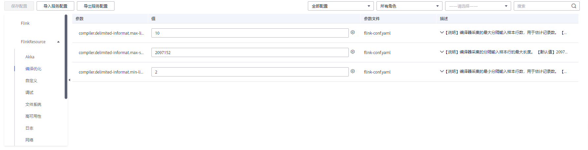

# 配置服务参数

用户可以根据实际业务场景，在MRS中快速查看和修改服务默认的配置，及导出或导入配置。

## 对系统的影响

-   配置HBase、HDFS、Hive、Spark、Yarn、Mapreduce服务属性后，需要重新下载并更新客户端配置文件。
-   集群中只剩下一个DBService角色实例时，不支持修改DBService服务的参数。

## 前提条件

已完成IAM用户同步（在集群详情页的“概览”页签，单击“IAM用户同步“右侧的“同步”进行IAM用户同步）。

**图 1**  IAM用户同步  

## 修改服务参数

1.  在集群详情页，单击“组件管理”。

    **图 2**  组件管理（以MRS 1.9.2版本为例）  
    

2.  单击服务列表中指定的服务名称。
3.  单击“服务配置”。
4.  将页面右侧“基础配置”切换为“全部配置”，界面上将显示该服务的全部配置参数导航树，导航树从上到下的根节点分别为服务名称和角色名称。
5.  在导航树选择指定的参数，修改参数值。支持在“搜索”输入参数名直接搜索并显示结果。

    

    修改某个参数的值后需要取消修改，可以单击恢复。

6.  单击“保存配置”，勾选“重新启动受影响的服务或实例。”并单击“确定”重启服务。

    > **说明：** 
    >更新YARN服务队列的配置且不重启服务时，在服务状态页签选择“更多 \> 刷新队列”更新队列使配置生效。

